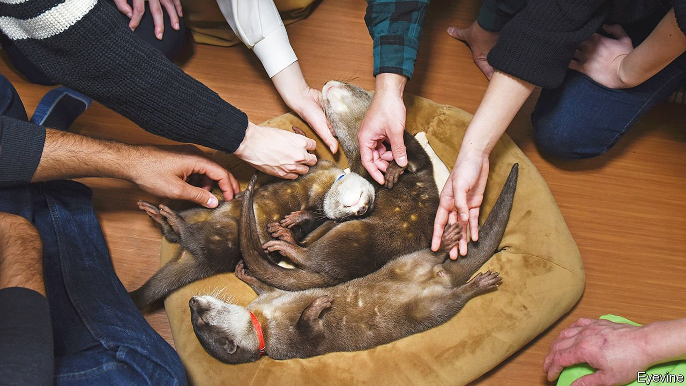

###### Some like it otter

# Demand for pet otters is driving a harmful trade 

##### The creatures are cute but make lousy pets 

 

> Jan 13th 2022 

OTTERS ARE cute, this no one can deny. They have big eyes and snub snouts and paws like tiny leedle hands. They look even cuter when they wear jaunty hats and toss food pellets into their mouths as if they were bar snacks, like Takechiyo, a pet otter in Japan. Documenting Takechiyo’s antics has earned his owner nearly 230,000 followers on Instagram, a photo-sharing app.

Takechiyo’s fame reflects a craze across east and South-East Asia for keeping the cuddly creatures as pets. Enthusiasts in Japan visit cafés where they pay to cuddle them; Indonesian owners parade their pets around on leads or go swimming with them, then share their pictures online. But these jolly photos mask a trade that is doing a lot of damage. Even before they became fashionable companions for humans, Asia’s wild otters faced plenty of threats. Their habitats are disappearing. They have long been hunted for their coats, or culled by farmers who wish to prevent them feasting on fisheries. The pet trade, which began picking up in the early 2000s but appeared to accelerate a few years ago, has made things worse. The numbers of wild Asian small-clawed otters and smooth-coated otters, two species that are in highest demand, have declined by at least 30% in the three decades to 2019.


The international agreement that governs trade in wildlife, known as CITES, now prohibits cross-border trade in these species. But laws banning ownership are often poorly enforced, as in Thailand, or riddled with holes, as in Indonesia. And the otter-keeping fad has been turbocharged by the internet, says Vincent Nijman of Oxford Brookes University. In 2017 TRAFFIC, a British charity that monitors the wildlife trade, spent nearly five months looking at Facebook and other social-media sites in five South-East Asian countries. During that time it found around 1,000 otters advertised for sale online.

In any case, otters do not even make particularly good pets. Every year the Jakarta Animal Aid Network, a charity in Indonesia’s capital, receives some ten otters from people who have struggled to look after them. Faizul Duha, the founder of an Indonesian otter-owners’ group, admits that his two animals emit a “very specific” (read: fishy) smell. They bite humans and gnaw at furniture. Their screeching can be heard blocks away. And their cages need cleaning every two-to-three hours. That is how often they evacuate their bowels.

