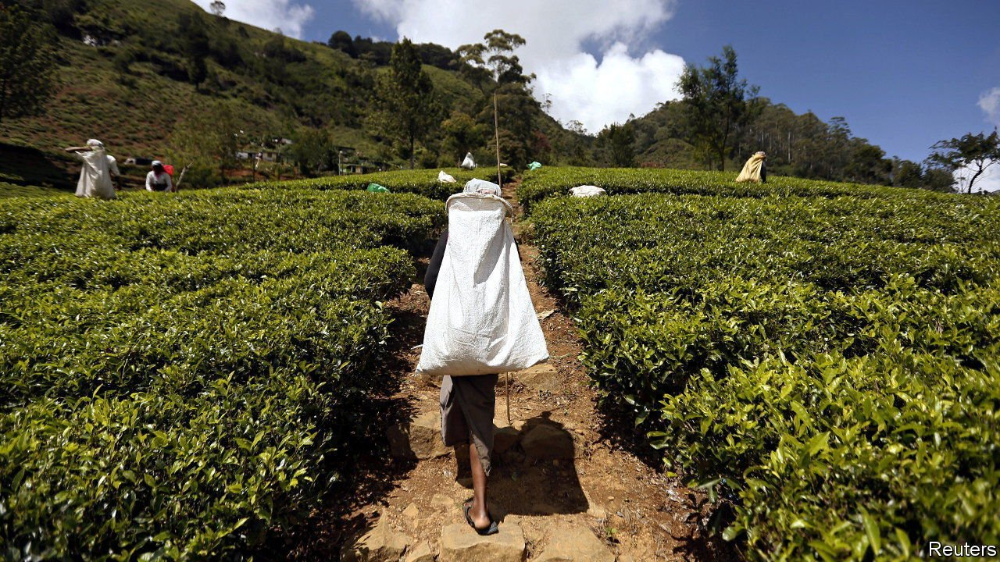
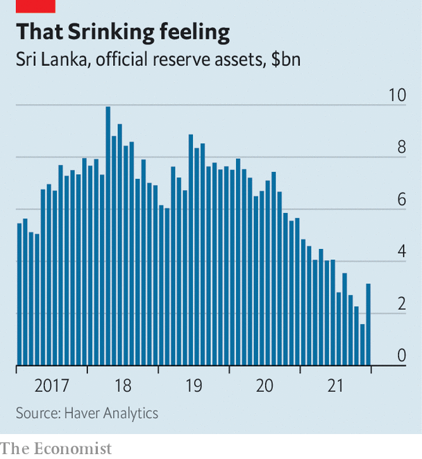

###### Thanks, but no thanks

# Sri Lanka is flirting with default 

##### Gotabaya Rajapaksa’s government is reluctant to go to the IMF 

 

> Jan 13th 2022 

ALMOST THREE years since terrorists blew up hotels along Colombo’s lovely beaches and two years since covid-19 shut down international travel, tourists have begun returning to Sri Lanka, providing sorely needed foreign exchange. The country’s stockmarket has been bounding along, up by more than 80% in 2021, trailing only commodity-rich Mongolia among global bourses. Corporate profits have been strong, too. GDP growth last year was somewhere between 3.5% (by private estimates) and 5% (by the government’s). This suggests a thriving economy. Yet alarm bells are clanging.

Encouraging though the renewed tourist arrivals may be, they are still barely a fifth of the pre-pandemic peak. Exports grew strongly in the fourth quarter of 2021 but are still too meagre to prevent a looming financial crisis. Years of heavy foreign debt and current-account deficits have taken a toll. Foreign reserves have collapsed (see chart). Supplies of oil, cooking gas, milk, wheat and medicine are running short. A rapidly depreciating currency has helped the country’s exporters, including clothing manufacturers and tea growers. But it has made servicing foreign-denominated debt more costly and has stoked inflation, which jumped during 2021 to 12% and appears to be accelerating.


The numbers are sobering. Interest obligations on government debt in 2021 amounted to 72% of total revenues, while public-sector salaries and pensions came to 80%. Multiple downgrades have in effect locked it out of the international private-credit market. On January 12th S&amp;P, a credit-rating agency, downgraded Sri Lanka’s debt further, citing “increasingly likely default scenarios without unforeseen significant positive developments”.

 


So Sri Lanka finds itself looking down the barrel of a gun. On January 18th $500m in foreign-currency-denominated debt will come due. Another $5.4bn in principal and interest will need to be paid by the end of the year. Similar payments are required for years to come. That has provoked a series of complex financial manoeuvres. In January the central bank disclosed that it had sold off half the country’s $382m of gold reserves. Rumours abound that the rest has been liquidated too. One obligation—an oil bill of $251m owed to Iran—was paid in tea. The government has also taken a series of heavy-handed actions to preserve foreign currency. It has banned the import of cars. It briefly tried to ban foreign chemical fertiliser in the name of going organic, until crashing agricultural yields forced it to change its mind.

Other measures include a currency swap with China, nominally expanding the central bank’s foreign-currency reserves from $1.6bn to $3.1bn. It is unclear whether the money can be used for anything except Chinese goods. A similarly complex deal has been announced with India, along with—perhaps not coincidentally—the resolution of a long-running dispute over India’s stake in a Sri Lankan oil-storage facility. State assets, including prime property, have been put up for sale. No one has so far been keen to buy them.

A bigger problem is that Sri Lanka’s increasingly desperate deals do not address the real reason for its current travails. After Gotabaya Rajapaksa was elected president in 2019, he abandoned the fiscal and monetary-policy conditions imposed by the IMF three years earlier after another financial upheaval. Taxes were cut and interest rates pushed down. The approach was not without merit. It may have softened the harsh consequences of the post-covid global economy and reawakened the animal spirits of businesses that are now reflected by the soaring stockmarket. But it has proved to be unaffordable. Deficit financing on this scale is unfeasible.

Were the IMF to arrange a restructuring of the country’s finances, interest rates and taxes would probably rise, government spending decline, and bondholders would have to take losses. In exchange there would be stability and new funds. But Mr Rajapaksa’s government has vocally opposed IMF intervention, calling it an infringement of sovereignty. Still, some kind of restructuring seems inevitable, either under the oversight of a multilateral agency or with a more comprehensive government plan that has yet to be presented. The alternative is default—and the risk of higher inflation, fewer imported goods and an end to the current recovery. ■

