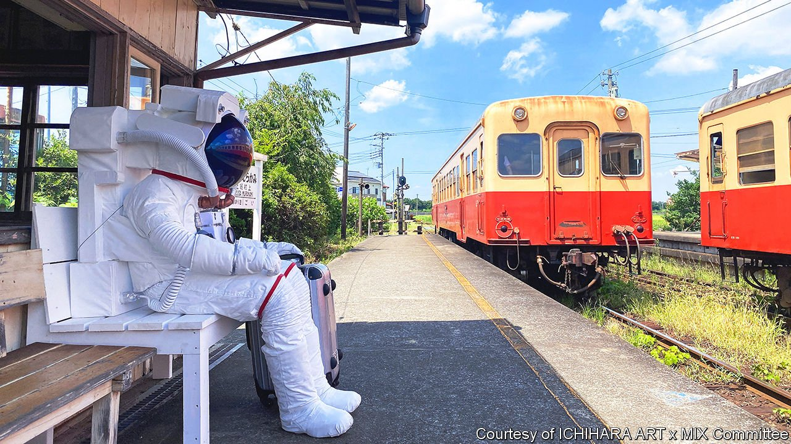

###### The purpose of art

# In Japan, festivals are boldly taking art into the countryside 

##### The trend represents a reappraisal of what art can do—and whom it is for 

 

> Jan 15th 2022 

A COSMONAUT SAT for most of the winter on a platform at Kazusa-Murakami station in Chiba, a rural Japanese prefecture next to Tokyo. As they waited for trains, local grandmothers would chat with the inanimate installation, the work of the Russian artist Leonid Tishkov. Visitors to an abandoned clothing factory in the nearby village of Ushiku found a multimedia labyrinth assembled by the Japanese artist Nakazaki Toru, using objects and memories retrieved from the site: old sewing machines, mannequins draped in fabric samples and recorded interviews with the family that once ran the place. These were two of over 90 pieces created for a triennial festival known as Ichihara Art x Mix, held in the Ichihara area of Chiba in late 2021.

Abroad, Japan’s best-known contemporary art is the manga-inflected work of painters such as Murakami Takashi, whose colourful flowers feature on Louis Vuitton bags and in Billie Eilish’s music videos. Inside the country, however, social and community-centred art, often in the form of festivals in rural areas, is the dominant trend. Kitagawa Fram, the art director behind the Ichihara event, organises four other big ones in as many prefectures. The Echigo-Tsumari triennale draws more than half a million people, about the same as the Venice biennale; they wander across 760 square kilometres of remote villages in Niigata prefecture, in search of sculptures and installations hidden in fields, forests and old buildings. A million people flock to the remote “art islands” of Japan’s Inland Sea for the Setouchi triennale.


Hundreds of other smaller art events are held each year under the banner of “regional revitalisation”. This strain of art grapples with the key challenges facing Japan (and, increasingly, much of the developed world): an ageing, shrinking population; hollowed-out regions; the climate catastrophe. The works make use of the new spaces and resources that those forces have spawned, such as abandoned buildings and idle elderly residents. As Adrian Favell, a sociologist and art critic, writes: “The leading edge of the contemporary can be found in collective community works.”

In Japanese, such efforts are known as ato purojekuto (from the English “art project”). “We call it a ‘project’ because it is not an ‘artwork’,” says Tomii Reiko, an art historian. The ato purojekuto are by nature collaborative endeavours without a single author. Many include pieces of public art or sculpture, but the “project” is what happens around them: workshops and other initiatives that prioritise communication and engagement with communities. “The process is more important than the outcome,” explains Mori Yoshitaka of Tokyo University of the Arts. In short, the artists create links not between elements of a composition, but between people.

The ato purojekuto have their roots in Japanese avant-garde collectives of the 1960s. They have parallels abroad in what Grant Kester, an American art historian, calls “socially engaged art”. But the ato purojekuto are a distinct form that responds to particular socioeconomic conditions. Some operate in big cities, such as 3331 Arts Chiyoda, an art space in a former high school in north-east Tokyo that hosts everything from exhibits of experimental sound art, to disaster-prevention round tables, to wheat-growing workshops. Many others unfold far from the bright lights.

The case of Echigo-Tsumari has been “pivotal”, says Kumakura Sumiko, also of Tokyo University of the Arts. The region is a conservative enclave in the mountains of central Japan, filled with derelict homes, rice paddies and old people—objectively, a terrible place to host a contemporary-art festival. When it started in 2000, many arty observers wondered who would bother to go; many in the local community questioned the expense, Ms Kumakura remembers. But over time, attitudes changed. Young volunteers established lasting ties with local residents; many came to help when a big earthquake hit the region in 2004. Though some locals remain hostile to using funds on incomprehensible installations instead of roads or clinics, many have come around. This year’s will be the festival’s eighth edition.

For rural venues, the projects are an alternative to the infrastructure-driven regeneration initiatives the national government favours. They have come to relish their new status as tourist destinations: ordinary villages now boast attractions from world-renowned names such as James Turrell, an American light artist, and Marina Abramovic, a Serbian performance artist. But for Mr Kitagawa, changing attitudes are the true dividend.

Young at art

With art as a catalyst, he says, the elderly have grown “more energetic”, young people have begun to visit, and local administrations have become “more global in terms of their mindset”. One study of Echigo-Tsumari found that some 60% of the population had worked at or attended the festival. Those who did were more trusting of strangers, and had higher levels of both social capital and life satisfaction than those who did not.

For urban Japanese, the events seem to give shape to an “unformed yearning” to escape office life, reckons Justin Jesty of the University of Washington: “They’re on to something with respect to the direction of people’s imaginations.” Government surveys suggest nearly 40% of city-dwellers aged between 18 and 29 would like to live in a village; for many, the pandemic seems to have heightened the appeal.

The ato purojekuto can feel sanitised. Organisers must maintain close relationships with local governments, which tend to be dominated by the ruling Liberal Democratic Party, so there is rarely any overt political critique. Critics say that robs the art of its ability to shock and challenge viewers. The installations tend towards the abstract and visually pleasing—in contrast to many big European and American art jamborees, where, these days, politics has to be “visible and explicit, you have to raise your fist, to slap the face, metaphorically speaking”, as Ms Tomii puts it.

Yet the projects are radical in their own way. By bringing art into rural regions, they pose political questions of a subtler but no less essential sort—about whom art is for and its role in an ageing society. At their best, says Mr Favell, the ato purojekuto highlight ways of coping with economic and demographic stagnation, and of living in “the ruins of the Anthropocene”. ■

