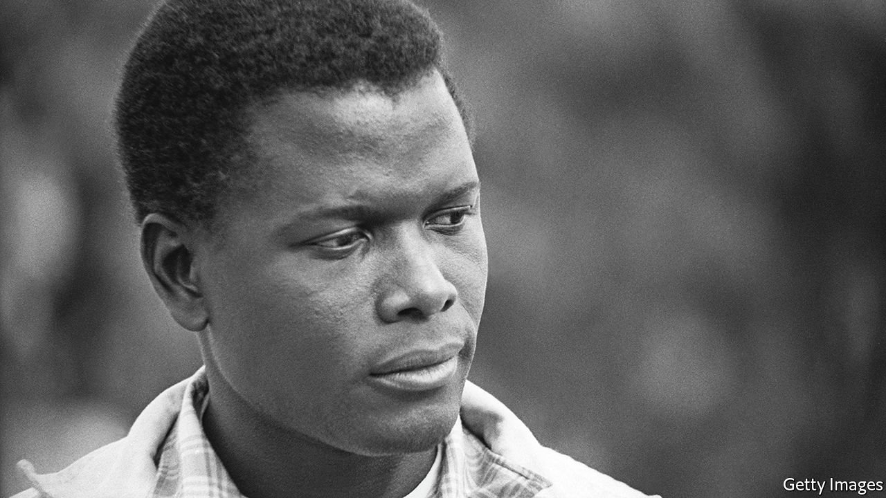

###### Hollywood legends

# It was hard for any viewer to look away from Sidney Poitier 

##### Or down on him 

 

> Jan 15th 2022 

HE SHOWED THE world that black actors could be Hollywood heroes. In films such as “To Sir, With Love”, “Guess Who’s Coming to Dinner” and “In the Heat of the Night”, all released in 1967, Sir Sidney Poitier was not a loyal sidekick or a servant. He was a blisteringly handsome, nuanced and charismatic leading man. His talent, elegance and class made him a superstar, and, in 1964, they made him the first ever black actor to win an Academy Award for a leading role, in “Lilies of the Field”.

Many in the film industry and beyond revered him as a trailblazer who refused to play any part that might reflect badly on black people. A few critics called him bland and ingratiating. In the New York Times in 1967 Clifford Mason defined his benign on-screen persona as “a good guy in a totally white world…helping the white man solve the white man’s problem”. But no one could mistake the determination and skill it took for Sir Sidney, who died last week at the age of 94, to become Hollywood’s exemplar of African-American dignity.


Born in 1927, he was the seventh child of farmers who grew tomatoes in the Bahamas. At 15 his parents sent him to live in Miami; the following year he moved to New York, where he worked on his diction by listening to radio announcers, and improved his literacy by poring over newspapers with a kind Jewish waiter at the restaurant where he washed dishes. He joined the American Negro Theatre, and by the time he was cast in his first film, “No Way Out” (1950), he was as authoritative as any actor of any background, with a fiery glare, an imposing physical presence, exquisite poise and a penetrating voice. It was hard for any viewer to look away from him, or down on him.

Most of his films tackled racism. In the 1950s they included “Cry, the Beloved Country”, the filming of which let him see South African apartheid first-hand (he later played Nelson Mandela in a made-for-television biopic); “Blackboard Jungle”, a seminal rock ’n’ roll high-school drama; and “Porgy and Bess”, Otto Preminger’s film of George Gershwin’s musical. In “The Defiant Ones”, his chain-gang fugitive was manacled to a southern bigot played by Tony Curtis. Both were nominated for Oscars.

Still, the criticisms hurt. Tired of being a figurehead, Sir Sidney switched to lighter comic roles in the 1970s and directed several raucous comedies; “Stir Crazy” (1980) was his biggest hit. Knighted in 1974, he took a decade-long break from acting in his 50s, returning to the screen all too rarely afterwards. But he had already achieved as much as anyone in Hollywood history. It wasn’t until 2002 that a second black star, Denzel Washington, received an Oscar for his performance in a leading role. On the same evening, Mr Washington presented Sir Sidney with an honorary award for his extraordinary life’s work.

