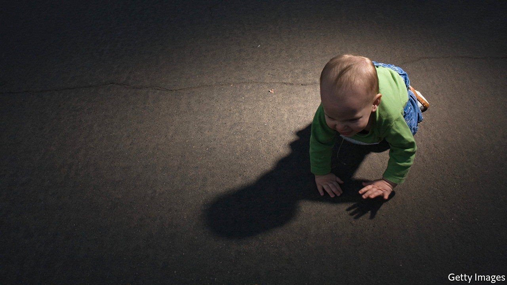

###### Dystopian fiction

# Jessamine Chan’s gripping debut novel sends up modern parenting 

##### “The School for Good Mothers” also sounds the alarm about surveillance 

 

> Jan 15th 2022 

The School for Good Mothers. By Jessamine Chan. Simon &amp; Schuster; 336 pages; $27. To be published in Britain by Hutchinson Heinemann in March; £12.99

ALL PARENTS make mistakes, especially when harried or exhausted. Jessamine Chan’s haunting debut novel unspools from one of them. Sleep-deprived, under pressure at work and divorced from her child’s father, Frida leaves Harriet in a baby-bouncer and heads to the office in Philadelphia to run a quick errand. But she loses track of time; two hours later the police call to say that her neighbours heard crying and the toddler is now in their care.


This lapse has devastating costs. Harriet is placed indefinitely in the custody of her father and his new partner. Frida is put under surveillance. The Child Protective Services have been given wide-ranging new powers; they scour her house as if it were a crime scene and install cameras in every room. In the following months Frida mostly mopes about and looks at pictures of Harriet on her phone. Yet the footage is used as evidence that she is an unfit parent. She is sent to a rehabilitation facility for a year to “demonstrate her capacity for genuine maternal feeling and attachment”.

Frida and the other negligent mums are judged in categories including “Fundamentals of Play” and “The Moral Universe”. To measure their improvement, they work with eerily lifelike androids designed to mimic their offspring, which collect information via sensors and eyeball cameras. “They’ll gauge the mothers’ love,” an administrator explains. “The mothers’ heart rates will be monitored to judge anger.”

The novel is a brilliant satire of helicopter parenting. Frida is criticised for using “insufficiently empowering” motherese and telling bedtime stories that “lack depth”. (“You can’t just have the cow jump over the moon, Frida. You need to have the cow consider his place in society.”) The book also sounds the alarm about modern surveillance technology and the misuse of data, as qualitative conclusions are drawn from quantitative inputs. The institution’s metrical idea of a competent parent seems impossible to attain.

Failing, however, is not an option: it means custodial rights are lost for ever. Ms Chan’s story skilfully dramatises the lengths to which loving parents go for the sake of their offspring. It joins a pantheon of dystopian novels that have parent-child relationships at their heart, including “The Handmaid’s Tale” and “The Road”. And it announces its author as an astute observer of both intrusive 21st-century authority and strained family dynamics. ■

