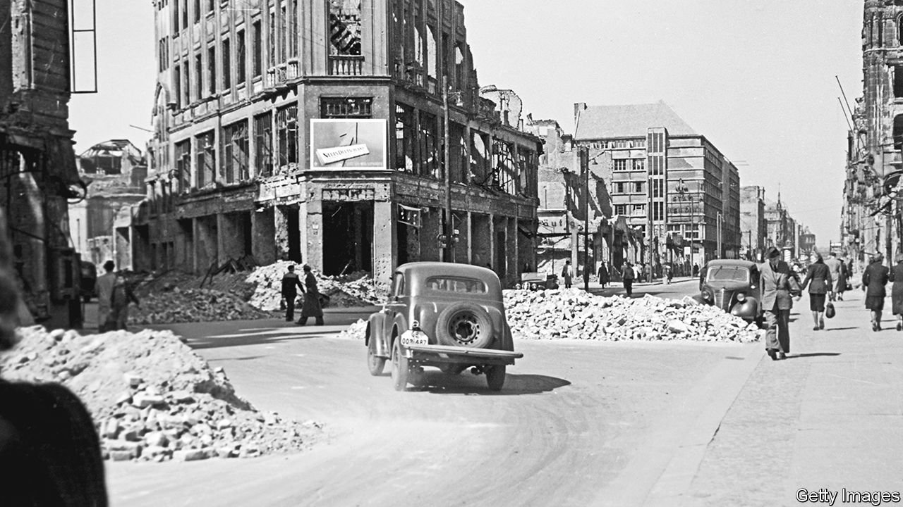

###### Out of the abyss

# “Aftermath” is a piercing study of Germany after 1945 

##### The road from the Third Reich to modern Germany began in a field of rubble 

 

> Jan 13th 2022 

Aftermath. By Harald Jähner. Translated by Shaun Whiteside. Knopf; 416 pages; $30. WH Allen; £20

THE ROAD from the Third Reich to modern Germany began in a field of rubble. The second world war had left behind enough of it to form a mountain 4,000 metres high, if it were piled up on the Nazi party rally grounds in Nuremberg. When the war ended, citizens began clearing it all up. Several towns forced ex-Nazis to do the heavy lifting. Famously, “rubble women”, wearing frocks, boots and headscarves, formed bucket chains and made salty faces for Allied cameras as they worked. Some dressed elegantly, having taken only their best clothes to the air-raid shelters.


Manual labour forestalled soul-searching, writes Harald Jähner in “Aftermath”, an erudite account of the post-war decade in Germany, now published in English. “How does a nation in whose name many millions of people were murdered talk about culture and morality?” he asks. “Would it be better, for decency’s sake, to avoid talking about decency altogether?” The philosopher Hannah Arendt noticed Germans squirming to change the subject on learning she was Jewish. Instead of asking after her family, they described their own wartime suffering. Mr Jähner notes Germany’s “extraordinary feat of repression”, but wonders if “behind the wounding obduracy of [Arendt’s] German acquaintances, rather than pure heartlessness, there might not have been a degree of shame”.

Shame’s hue varied with experience. German women were recovering from a plague of sexual assaults by Soviet troops. German soldiers, starving and humiliated, came home to find unrecognisable children and emboldened wives who had assumed control of society. In a queasy stopgap measure, many of the few surviving Jews were separated again, in part for their own protection, this time in repatriation camps administered by the Allies.

Meanwhile a total of 40m people displaced in Germany had to find their way home, or start again somewhere new. Mr Jähner memorably portrays the crushed and guilty nation as a busy crossroads: “Footage from the summer of 1945 in Berlin shows everyone charging about in all directions: Russian and American soldiers, German police, gangs of youths, families dragging their belongings through streets on handcarts, scruffy homecomers, invalids on crutches, smart-suited men, cyclists in collar and tie, women with empty rucksacks, women with full rucksacks, and certainly many more women than men.”

Primitive concerns dominated German life until the late 1940s. It was a “time of wolves” that saw widespread looting and hoarding, excess and privation existing side by side. One newspaper reported several people drowning in knee-deep wine from smashed casks in a Munich cellar. Ration-cards guaranteed a mere 1,550 calories per day and led to a thriving black market, which authorities tried to combat with ever-harsher sentences. Officials in Saxony introduced capital punishment in 1947 to see off “food-supply saboteurs”.

In time anarchy gave way to order, and order to the seeds of social democracy. A key step in this process, says Mr Jähner, was currency reform, when the plummeting Reichsmark was replaced with the Deutsche Mark in June 1948. Another stabilising influence was the Marshall Plan, which lent $1.4bn to West Germany (formally divided from the East in 1949). It was the only western European nation forced to repay the funds, “in order to preserve some sense of proportion between victory and defeat”. Culture revived, too, theatre receipts spiking from 1945 to 1948 before settling again. “With affluence came thrift,” notes Mr Jähner.

The post-war culture boom is a rare missed opportunity in “Aftermath”. Other art forms are neglected in a chapter focused on abstract painting. For example, Germany’s mid-century compromises converge revealingly in the figure of Herbert von Karajan, a classical maestro who goes unmentioned. A Nazi party member and favourite of Hitler, the Austrian rehabilitated his image and became conductor of the Berlin Philharmonic for over three decades. Like many others in Germany, he found respectability through a combination of entitlement and amnesia.

Mid-century Germans, says Mr Jähner, needed to see themselves as victims. The more they suffered during the war and its aftermath, the less they felt complicit in Nazi crimes. He puts German anguish in the essential context of a nation climbing out of an abyss that it created. As the historian Tony Judt wrote in “Postwar”, the conflict was a calamity “in which everyone lost something and many lost everything”. “Aftermath” is a reminder that the German experience will always stand apart. ■

