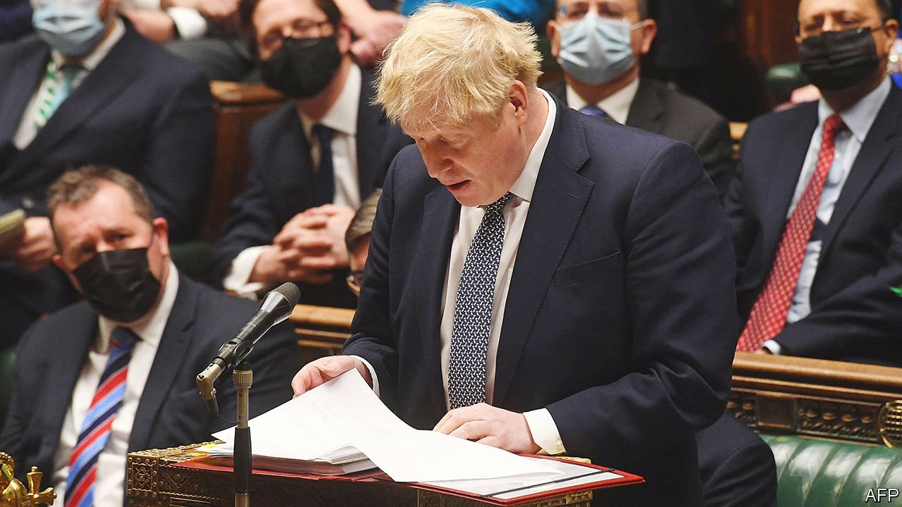

###### Breaking bad

# Boris Johnson’s career of rule-breaking runs into crisis 

##### From smashing the political status quo to partying during lockdown 

 

> Jan 15th 2022 

HOLLOW-EYED AND with his shoulders hunched, Boris Johnson offered the sort of apology he has made to many people, many times. In May 2020, with Britain in strict lockdown, Downing Street officials had held a drinks party in the prime minister’s walled garden. He attended for 25 minutes, he admitted to the House of Commons on January 12th. And he understood the “rage” Britons felt at that, after enduring private miseries that spring.

He also set out his defence, which will be central to an inquiry by Sue Gray, a senior civil servant: that he was an unwitting participant, since the garden was being used as an office, and that he believed “implicitly” that it was a work event. It looked bad, but “could be said technically to fall within the guidance”. Sir Keir Starmer, Labour’s leader, said that was ridiculous and demanded that he resign.


He almost certainly won’t. The mood of Tory MPs is bleak, and donors who funded his election campaign are incensed. “I just feel a bit disgusted,” says a financier, who is considering turning off the taps. A handful of senior figures, among them Douglas Ross, the leader of the Scottish Conservatives, and William Wragg, a select-committee chair, have called for him to go.

But his party is unlikely to force him out in short order. That would require 54 MPs to sign a letter of no confidence, and then 180, or half the parliamentary party, to vote to eject him. The Conservatives’ reputation for ruthless regicide has been undeserved since the days of Margaret Thatcher. It has since had a high tolerance for low performance: the hapless Theresa May was got rid of only in 2019, two years after she lost the party its majority. Some backbenchers are happy with a crippled prime minister, since it makes him biddable on corona virus policy and Brexit.

For most of his career, Mr Johnson’s political appeal has lain in his rule-breaking. As mayor of London he would break the small rules of politics, which forbid lies and affairs, thumbing his nose at po-faced rivals. Voters who were tired of slickness liked him, just as small boys like slapstick.

As prime minister he promised to break the big rules that framed political reality. A “people’s government” would offer whatever whetted the public’s appetite, in particular things that had been ruled out of bounds because they were uneconomic or impractical. Britain could leave the European Union, radically curtail immigration and lavish funds on pet projects, from bridges to royal yachts, no matter what Treasury bean-counters might say. If Parliament was obstructive, it could be suspended. His would be a good-times administration, and he a merry Charles II to Mrs May’s mirthless Oliver Cromwell.

But after weeks of revelations about lockdown parties and irregular donations, the breaking of small rules has lost its charm. Mr Johnson is now badly damaged inside his party, and unpopular in the country. According to Ipsos MORI, a pollster, his net approval rating has slumped to -36, close to Jeremy Corbyn’s shortly before his election defeat of 2019. Sir Keir, a former public prosecutor, will make probity in public office central to his campaign to be prime minister.

Meanwhile the big rules of politics are reasserting themselves. The government faces a gruelling spring, preparing for local elections while household incomes are being squeezed and public services are coming under severe strain. The campaign will be led by a diminished prime minister who will be unable to conjure the easy answers and ready fixes that are his style.

Before the parties, it was inflation that was keeping Conservative MPs awake at night. Consumer prices rose by 5.1% in November compared with a year earlier, the biggest annual increase since September 2011. Over the next few months, increases should beat anything seen since the early 1990s. Pay is unlikely to keep pace with the prices of cars, clothes and cigarettes. State pensioners, a big chunk of the Tories’ electoral coalition, and people on state benefits will be squeezed particularly hard.

A large part of the problem is caused by high global prices for oil and gas, compounded by Britain’s poorly designed regulatory framework (see next story). In April the government will raise its cap on retail-energy prices. The average household’s annual bill is expected to rise by 50%. The Labour Party is feasting on Tory discomfort: it has proposed a temporary cut to VAT on domestic energy bills.

This is artful politicking, designed to irritate Tory backbenchers. The measure was promised by Mr Johnson’s Brexit campaign as a potential dividend from leaving the EU, though was not enacted. But such is the scale of the problem, notes Robert Joyce of the Institute for Fiscal Studies, that even if it were, it would offset less than a fifth of the average increase in energy bills. All this is reminiscent of the early 2010s, when Ed Miliband successfully exploited what he termed a “cost-of-living crisis” to torment David Cameron’s government.

Also coming in April is a rise of 2.5 percentage points in national insurance, a payroll tax, half each from employees and employers. Senior Tories are unhappy, including Jacob Rees-Mogg, the leader of the House of Commons. The extra money is supposed to support the National Health Service for three years, before being diverted to fund a new social-care regime.

But the NHS is in the midst of a waiting-times crisis, the result of doctors halting routine work during the pandemic. The national-insurance rise will barely make a dent. Some 6m people are already waiting for a procedure; by 2024, when the next general election is due, that could be 13m, or one Briton in five. Everyone will know someone on a waiting list; Labour will be able to pick and choose between heart-rending stories for its campaign ads. After his apology in the Commons, the first question the prime minister faced came from James Davies, a Tory, who raised his constituent’s eight-week wait at a breast-screening clinic.

It is not in Number 10’s garden, but in supermarkets, petrol forecourts and doctors’ waiting-rooms that Mr Johnson’s fate will be decided. The past week has been the most miserable of his career. The coming year will be worse. ■


