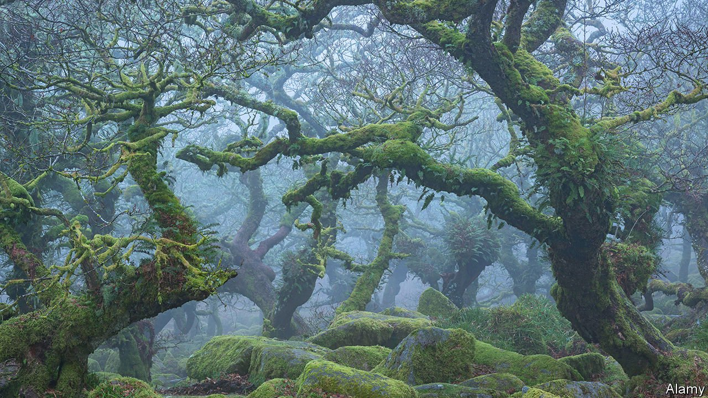

###### Trees and history

# Britain still has a few patches of rainforest, which need help 

##### Rewilding is not the solution 

 

> Jan 13th 2022 

WHEN JOHN HOWELL’S grandfather purchased 550 hectares of land nearly a century ago in what is now Dartmoor National Park in Devon, he also acquired a patch of a vanishing ecosystem. On his land was an eight-hectare wood where oak trees perched on a steep hillside of moss-covered granite along the River Erme–a temperate rainforest.

British rainforests lack the warm weather and spectacular fauna of the tropical kind. On a rainy day they are “bleak”, one environmental activist admits. Yet their heavy precipitation and steady temperatures allow plants to grow on top of other plants and give them a Tolkienesque feeling. Some environmentalists want to see more of them because they mitigate flooding, sequester carbon and maintain biodiversity, mostly in the forms of mosses, lichens and liverworts.


Rainforests could grow on about a fifth of British land, to judge from weather patterns and the prevalence of bracken, which grows in places where soil is rich enough to support forests. But people have been chopping them down since the Neolithic era, and they now make up just 1% of the land area. Many upland regions that could become rainforest are privately owned and grazed by sheep. It is not always easy even for landowners to enlarge their patches.

Mr Howell has been trying to expand his patch of rainforest for years. But his neighbours have ancient rights to graze their animals on parts of it. Their sheep eat the green shoots of young trees, which prevents new forest from springing up and old forest from regenerating. Stopping grazing would require the neighbours’ consent, which Mr Howell thinks is unlikely, since it is their livelihood. He reckons he can triple the size of his forest on the bits of land without grazing rights to 24 hectares. But that would still be a small patch. Larger forests tend to contain more species of plants, which makes them more resilient against disease and rapid climate change.

In the Lake District, Lee Schofield of the RSPB, a conservation group, manages a portion of the land along the Haweswater catchment owned by United Utilities. That property, similarly, has three areas where three separate groups of neighbours have grazing rights. Mr Schofield spent years striking deals in two of them to reforest bits of the property. He has planted a few trees in the third area, but doubts that he will be able to do more.

Post-Brexit agricultural policy could speed things up. England is steadily winding down a European subsidy scheme that paid people to farm and rolling out a new one that will pay more for conservation. On January 6th the Department for Environment, Food and Rural Affairs announced it would spend £800m ($1.1bn) a year by 2028 on landscape-recovery projects. The aim is to restore 300,000 hectares of wildlife habitat by 2042. For now, details are scant.

At the same time some farmers and landowners have been drawn to the idea of rewilding. This attempts to return parts of Britain to as close as possible to their state before human intervention, at which point they will require minimal maintenance. The movement was popularised in Britain by Isabella Tree’s work on the Knepp Estate, a 1,400-hectare farm in West Sussex that is gradually returning to wilderness.

Rewilding is hard in Britain, and not just because of its high population density. Farmed landscapes have been around for so long that they are seen as traditional and beautiful. UNESCO named the Lake District, home to some of England’s most impressive rainforests, a world heritage site in 2017 not for its biodiversity but for the way its farms have shaped the landscape. Dartmoor is littered with burial mounds, ancient houses and stone fences dating back to the Bronze Age, including some on Mr Howell’s land. You can see such things more easily where sheep graze.

And Britain’s rainforests are not as primeval as they look. The oaks in Mr Howell’s forest and the nearby Wistman’s Wood (pictured) are probably so abundant because people planted them for charcoal. Elsewhere, land managers graze cattle and sheep in the rainforests to clear enough undergrowth to bring in light for rare lichens to grow. Protecting England’s temperate rainforests is less about turning the countryside into a sprawling nature park and more about yet another human intervention in a heavily worked landscape. ■

