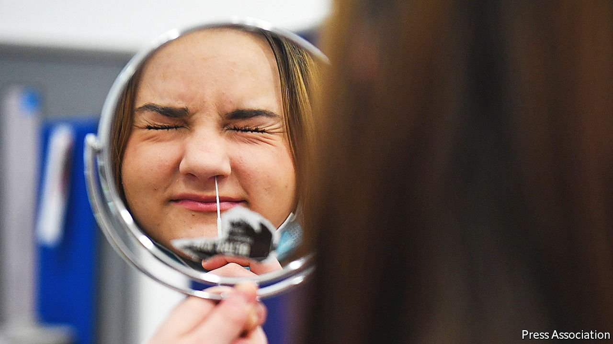

###### Choosing to look away

# Britain’s government plans to stop sending free tests to homes 

##### Deciding when is tricky 

 

> Jan 15th 2022 

ON DECEMBER 29TH Britain recorded 246,215 cases of covid-19, a number more than three times higher than the previous peak, a year ago. If Britain’s level of immunity was the same as in the winter of 2020, when almost no one had been vaccinated, this number of cases would constitute a new order of disaster. Many thousands of people would be dying every day. But thanks to vaccination, they are not. The share who die after testing positive for covid-19 is now roughly a twentieth of what it was last winter.

It is against this backdrop that the government is considering when to stop providing free lateral-flow tests to the public, a policy which has cost more than £6bn ($8.2bn) to date. Faced with public outrage it recently wobbled, but that the supply will soon end is not in doubt. The timing, however, is thorny. The NHS is stretched thin. Scientists and public-health experts worry that high caseloads will leave large numbers of people with the post-viral conditions collectively known as long covid, and that ending free tests would give the virus a boost. Some people have grown used to the licence conferred by the single pink line of a test taken before meeting up with friends or colleagues.


But Omicron’s properties change the logic of testing. It is far more transmissible than previous variants, and has driven its predecessors towards extinction around the world in just one month. There is no chance of eliminating it; even China, with all the authoritarianism it can muster, will fail. Besides spreading through a population with far stronger immunity to it, Omicron also causes inherently milder disease than previous variants. This is thanks to its evolved tendency to infect the upper rather than the lower respiratory system.

All this means that the risk that people will die or be hospitalised because an untested person unknowingly passes on the disease is smaller than it has ever been. By contrast, the risk that essential services will be disrupted because people are obliged to isolate themselves after testing positive is higher than ever. Chris Hopson, the boss of an association of NHS hospitals, said on January 8th that shortages caused by staff isolating after positive tests were causing “just as big, if not a bigger” problem than the influx of covid-positive patients. Even though more Britons tested themselves more than ever before in the past month, the virus has spread widely.

To some people, then, the balance of costs and benefits now argues for ending the distribution of free lateral-flow tests. “The downside of having some people out there transmitting what is essentially a common cold is not very great,” says Sir John Bell, Regius professor of medicine at the University of Oxford. “Spending a lot of money on a testing regime that locks lots of people up and means the economy doesn’t go forward; there’s a significant downside to that.”

But the testing infrastructure must be kept ready to swing into gear again at short notice, Sir John warns, in case a new variant changes the cost-benefit equation once more. Too little is known about viral evolution to be confident that one will not emerge that is as infectious as Omicron but causes many more serious cases.

As Britain ponders the end of its free lateral-flow testing scheme, America is only just beginning to distribute free tests of its own. The logic of Omicron is different there, because the fewer people are fully vaccinated. Other countries will be watching how Britain fares, to see whether the calculations of Sir John and the government are correct, and whether ending widespread asymptomatic testing does indeed prove beneficial overall. As the pandemic eases, and the focus on whether or not a person is infected with covid-19 fades, the attention the public pays to daily case numbers may diminish as well.

Throughout the pandemic Britain’s government has tended to add protective measures hesitantly and remove them decisively, a pattern that has attracted criticism. Its rapid embrace of free lateral-flow tests went against that grain. Ending the scheme will feel like giving up a comfort blanket. That does not mean it is wrong. ■

Dig deeper

All our stories relating to the pandemic can be found on our . You can also find trackers showing ,  and the virus’s spread across .

