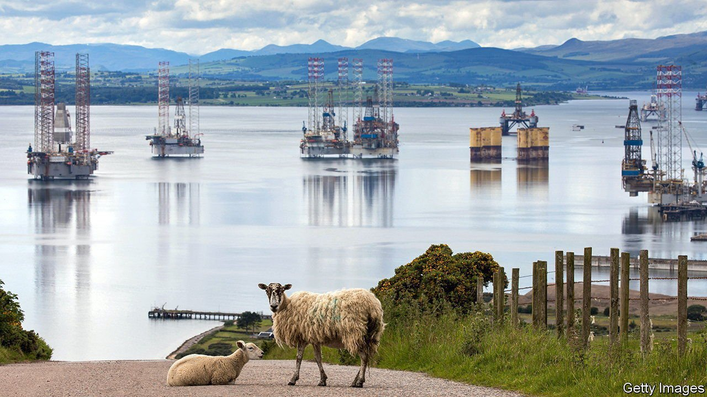
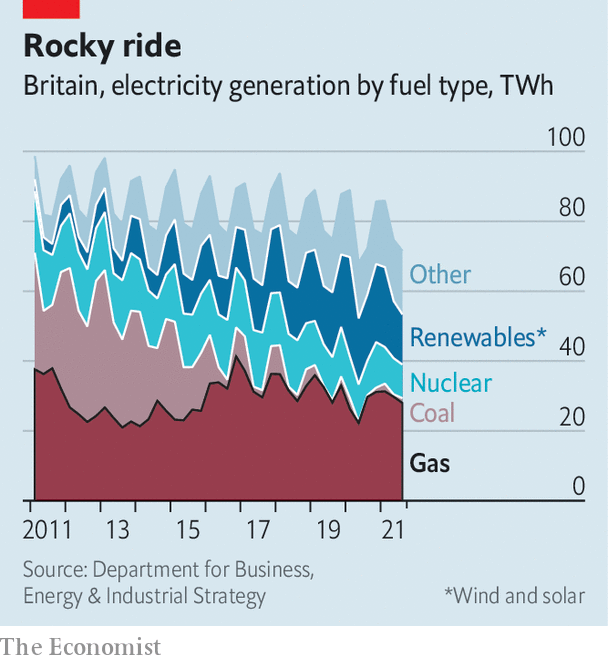

###### Britain’s energy crisis

# Expensive energy is baked into Britain’s future 

##### It’s not cheap being green 

 

> Jan 15th 2022 

AT NOON ON January 7th the twin nuclear reactors at Hunterston B power station, on the Firth of Clyde on Scotland’s west coast, were shut down for the final time. The plant was once the future. Part of a fleet of high-tech British reactors designed—unsuccessfully—for export, it was connected to the grid in 1976, just after the great oil-price shock of 1973.

Its closure is another small tightening of the screw for a country facing a different kind of fossil-fuel shock. Just before its closure Hunterston B was supplying a steady 1 gigawatt (GW) of electricity to the grid, about 2% of demand on a typical winter’s day. Most of the slack will be taken up by power stations burning natural gas, the price of which has roughly trebled over the past year. Britain is unusually reliant on gas, which—on average, over a year—accounts for about 40% of its electricity generation, and heats 85% of its (mostly old and poorly insulated) houses.


Its soaring price has therefore helped drive inflation above 5%, the highest rate in a decade. That has already pushed more than two dozen energy companies into bankruptcy, and piled pain on businesses suffering from covid-related lockdowns and staff absences. In April a government-imposed cap on the price suppliers can charge households is due for revision. Energy UK, a trade body, reckons prices could rise by 50% or more, taking the average bill to over £2,000 ($2,700) a year.

Worried ministers are pondering several ideas to take the edge off the pain. One is to scrap value-added tax on energy bills, though the rate is just 5%. Others include increasing handouts for poor households, loans to surviving suppliers to spread the cost of absorbing customers of defunct firms, and shifting subsidies for renewable energy from bills to general taxation. The opposition Labour party wants a windfall tax on oil-and-gas producers in the North Sea, which have seen their fortunes rise along with prices.

All those policies involve unpleasant trade-offs. Most imply higher taxes, which are unlikely to prove much more popular than higher bills. In any case, says Dieter Helm, an energy economist at the University of Oxford, none does more than tinker around the edges of an energy system that is likely to remain heavily reliant on gas, and to get pricier, too.

 


The chief reason is the government’s drive to decarbonise electricity generation. The share of wind and solar on the grid has risen sharply over the past decade, displacing dirty coal-fired generation (see chart). The government wants that to continue: it hopes for a 25% rise in offshore wind power by 2030. But renewable energy is unreliable. The past few months have been some of the stillest for decades, reducing the amount of power generated by Britain’s wind turbines. The more renewables are added to the grid, says Mr Helm, the more backup must be built as well, even if much of it sits idle much of the time. With coal too polluting, and grid-scale batteries still in their infancy, gas-fired electricity is a likely candidate.

At the same time nuclear power, which is both low-carbon and reliable, and which provided around 16% of Britain’s electricity last year, is shrinking, leaving an even bigger gap to fill. Three of Britain’s six remaining stations are due to close by 2024; by 2028 just one will be left. Ministers had been keen on building more, but so far only one, in Somerset, is actually under construction. It is due to be ready by 2026, but is already late and over budget.

Even when global gas prices fall back, the green transition will bake in higher costs. The more renewables on the system, the bigger—and more expensive—their backup has to be. (Mr Helm thinks that, taking intermittency into account, wind power may be even pricier than the nuclear sort.) The government has set a strikingly ambitious target to decarbonise electricity generation completely by 2035. That means gas plants will have to be fitted with carbon-capture technology, in which emissions are buried underground. That has not been done at scale anywhere in the world. But if ministers are serious, it will push prices up even further.

One way or another the public will pay, whether through higher bills, higher taxes or a combination of both. Whatever the government does about the immediate problem, arguments about the cost of energy will continue. ■

