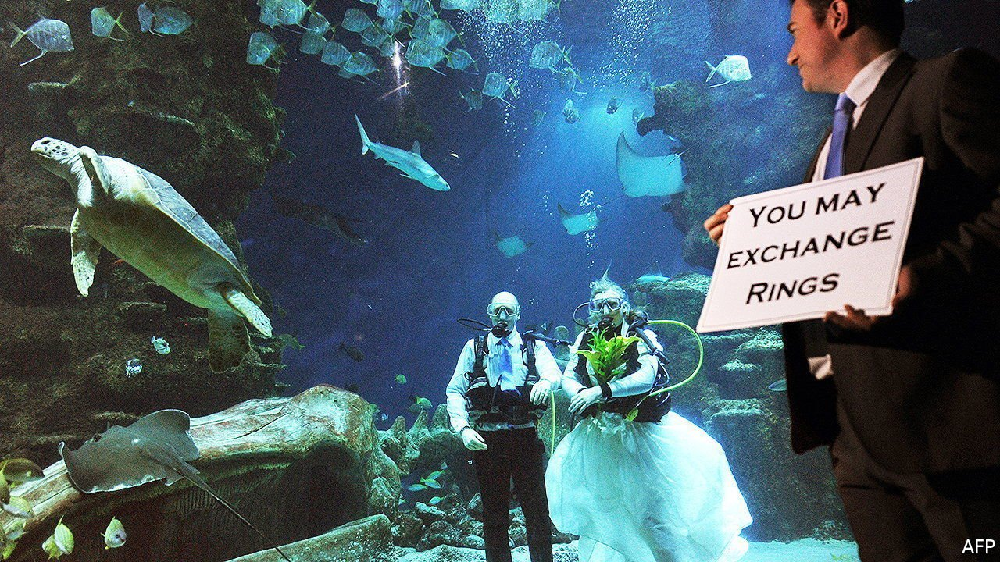

###### Match and dispatch

# Non-religious celebrants are leading more of England’s funerals 

##### They could soon get the right to marry people, too 

 

> Jan 15th 2022 

EVERY WEEK Alison Vallance goes to the funerals of people she has never met. She is a “civil celebrant”, paid by families to lead burial or cremation ceremonies in place of a vicar. Sometimes she delivers eulogies, drawing on interviews with family members. She says there is nothing gloomy about it, especially when celebrating a life well-lived. It takes skill to tell a stranger’s story that goes beyond a mere “list of dates and events”.

Twenty years ago almost half of deaths in England and Wales were followed by a funeral led by Church of England clergy. By 2019 the share had fallen to 23% as church going declined and families found alternatives. There are no reliable statistics on how many turned to celebrants. But Anne Barber, whose firm trains them in Northamptonshire, thinks that in some parts of the country civil celebrants lead three-quarters of funerals.


Some clients are seeking a godless send-off from a specifically humanist celebrant. Many, however, want a ceremony that includes hymns or Bible readings but is not a full religious service. The job attracts people keen on part-time work and career-changers used to speaking in public, such as teachers. A full-time celebrant might do 200-250 funerals a year, earning £220-250 ($300-340) for each, reckons Terri Shanks, who works in Berkshire. But Ms Vallance, who is based in Harrow, says few people do it for the money.

Weddings are the next frontier. By law only registrars and religious leaders can conduct legal marriages. But in 2019 celebrants in England and Wales may have led around 10,000 “wedding celebrations” for couples who had already tied the knot in a registry office, according to research by Stephanie Pywell of the Open University. Some couples want to hold a ceremony at a venue that is not licensed for the purpose, such as a riverside or back garden. Others want to craft a ceremony with some religious elements and some secular ones, perhaps because the partners come from different cultures. This can be difficult to arrange in a church or a registry office.

The pandemic has increased demand, says Sophie Easton of the Association of Independent Celebrants, a trade group. Backlogs caused by lockdowns mean couples are struggling to book registrars for convenient dates. So they do the legal part in a registry office mid-week, then hire a celebrant to lead a romantic event for family and friends.

In July the Law Commission will publish a review of marriage regulations in England and Wales, which was ordered by the government in 2018. Among the topics covered will be ways to enable celebrants to marry people in the eyes of the law, should the government decide to do so. Experience from Scotland, which granted celebrants affiliated with humanist groups that power in 2005, suggests that demand would then soar. These days they officiate at more marriage ceremonies than Christian clergy do. ■

