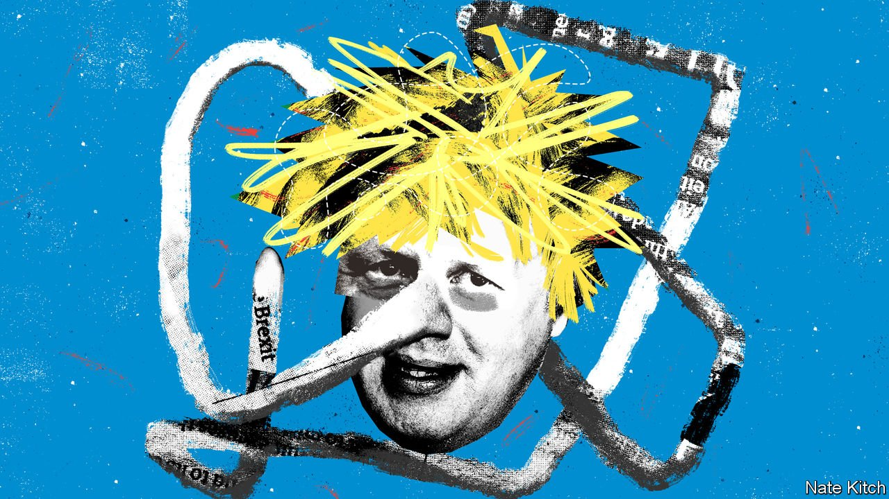

###### Bagehot

# What did you expect from Boris Johnson? 

##### The prime minister, in his own way, is Britain’s most honest politician 

 

> Jan 15th 2022 

BORIS JOHNSON lies often and easily. It is the hallmark of his career. He was fired from his first job, at the Times, for fabricating a quote. As a condition of becoming editor of the Spectator he promised not to stand as an MP, and then promptly did just that. As a shadow minister, he was fired by Michael Howard for lying about an affair. (He later divorced after a few more.) While mayor of London, he said numerous times that he would not stand in the 2015 election, only to turn up as a candidate in Uxbridge.

Lying about attending a garden party at Downing Street in May 2020, at the height of lockdown, is just the latest in a very long list. When public anger grew, MPs protested with all the sincerity of Captain Renault entering a gambling den in Casablanca. Douglas Ross, a Scottish MP who voted for the prime minister in the Conservative leadership election, labelled the prime minister’s position “untenable” and demanded he quit. Why did such defenders of truth once back a man they knew to be an enthusiastic liar? Because Mr Johnson is, in his own way, a man of his word.


When he was drumming up support for his bid for party leader, his pitch was simple: back me, keep your seat, defeat Jeremy Corbyn and do Brexit. And it all came true. Mr Corbyn was crushed and the biggest Conservative majority in three decades followed. In that election Mr Johnson promised two big things and did both. The NHS would be showered with cash, which it has been. And he would do a deal with the EU, which he did.

It was not a good deal, but it was quick and it was clear. Coming after a negotiation with the EU that lacked both speed and simplicity, it is little surprise that voters jumped at it. Mr Johnson’s predecessor, Theresa May, had obfuscated, attempting legalistic contortions to avoid Brexit’s brutal simplicities. Labour’s Brexit position was, in the words of one shadow cabinet minister, “bollocks”. Mr Johnson’s deal hobbles British business for little or no gain, beyond a point of principle. But it is, no more and no less, what he said he would do.

Political lying was not invented by Mr Johnson in the Brexit campaign, comforting though that idea might be. Indeed, the misleading claims of the Leave campaign sometimes revealed awkward truths. When it pointed out that Turkey was in the long process of joining the EU, for example, Remainers cried foul because other countries were likely to block its accession. Yet David Cameron could have promised to veto Turkish membership of the EU, and did not. Turkey joining the club was a long-standing British policy.

In politics, integrity is almost inevitably followed by hypocrisy. Politicians with firm moral centres can crack. Gordon Brown was feted as a son of the manse while hurling handsets at people’s heads. Tony Blair runs an institute dedicated to openness while accepting money from despots. Sir Keir Starmer stood for Labour leader by pitching himself as Mr Corbyn in a suit, and then ditched the leftiest proposals once he had won. Mr Johnson, by contrast, does not even pretend to be a family man, despite having a few of them. He has not pretended to be anything but a power-hungry cynic either. A lack of integrity becomes a form of integrity.

A competent administrator never lurked beneath that mop of thinning hair. Occasionally, a journalist has claimed otherwise in a breathless profile; Mr Johnson has not. Those who work closely with him cannot say they were fooled into thinking he was a loyal boss. His time as prime minister has been marked by the defenestration of aides. When trouble strikes Mr Johnson, deputy heads roll. Being a civil servant rather than a political appointee offers no protection. Those who help him out, for example by chipping in for new curtains in Number 10 to keep his new wife happy, end up enmeshed in scandal.

No one can claim they were not warned about Mr Johnson. He is in no sense a mystery. He is the subject of several biographies and for the past three decades has shared his views about the world in newspaper columns and articles. If he is ever silenced by ministerial responsibility, a high-profile relative can fill the gap with more Johnson trivia. Throughout his career he has left a trail of giggling journalistic colleagues with a cherished Boris story to be whipped out on special occasions, no matter how long ago or dull. The content of his character was known and yet people still saw fit to put him in power.

If voters are souring on Mr Johnson, they only have themselves to blame. The prime minister is not a monarch. In 2019 he won 43.6% of the vote, the biggest share since Margaret Thatcher. Mr Johnson is in Downing Street because just under half the country ticked a box next to a Conservative’s name. Voters are adults. They knew what they were voting for, and they voted for what they got.

It is common to blame the rise of Mr Johnson on “Have I Got News For You”, a BBC1 news quiz on which he was a frequent guest. Ian Hislop, one of the team captains, has a tart reply: “If we ask someone on and people like them, that is up to people.” Mr Johnson is not a boil that can be lanced, at which point Britain’s body politic will recover. British politics, its systems and culture, deteriorated to the point where an honest liar proved attractive. Mr Johnson benefited from chaos created by others.

Small lies, big truths

Those MPs who helped put Mr Johnson in power must now decide whether to sack him for sins he has never hidden. Their choice will be made by calculating whether their voters still want him. Popularity was all that he promised, and he delivered it—until now. If his rise is depressing, his potential fall offers a glimmer of hope. British voters have, at last, begun to grow tired of Mr Johnson’s record of honest lies. A less cynical politics may prosper and populism become unpopular. But optimism should be tempered. MPs would not hesitate to keep Mr Johnson if he, in turn, helped them keep their seats. If those who put the prime minister in power bring him down, they do so to absolve themselves. ■


