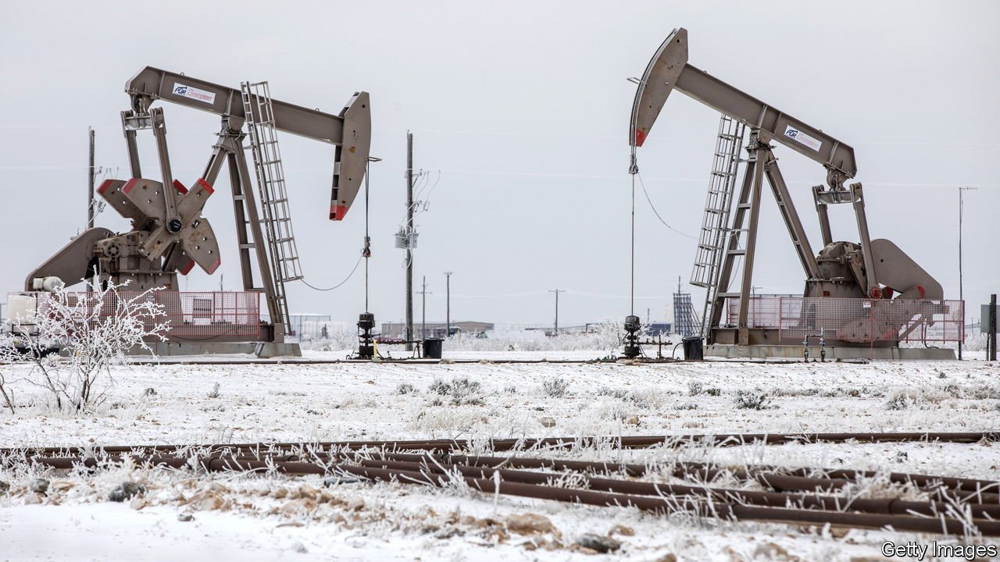
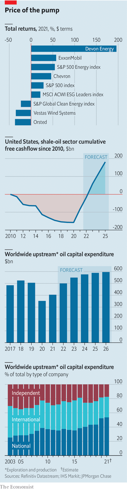

###### The new great game

# Can big oil’s bounce-back last? 

##### Why American oil companies are different 

 

> Jan 12th 2022 

CALLS FOR the oil business to  are growing louder just about everywhere, and not merely from governments and environmentalists. Moody’s, a rating agency, reckons that half of the $1.8trn of global energy debt that it evaluates is held by asset managers and insurers that face increasing pressure on environmental, social and governance (ESG) fronts, notably the climate. An annual survey of 250 big institutional investors published on January 6th by the Boston Consulting Group (BCG) found that more than four in five think it is important for companies to establish targets for long-term emissions reductions. Nearly as many “feel increased pressure” to apply green filters to their investments.

At the same time, the International Energy Agency, a global forecaster, expects worldwide oil consumption to return to its pre-pandemic level of 100m barrels a day (b/d) in 2022. Even if it rose by no more than 1% per year after that, the natural rate of reservoir depletion means that 12m-17m b/d of new supply must be added in the next five years to meet demand, reckons Alastair Syme of Citigroup, a bank. Investors recognise this. As economies reopened last year after the worst ravages of the pandemic and the oil price recovered—this week it is flirting with a seven-year high of $85 a barrel—energy became the best performing sector in the S&amp;P 500 index of large American firms, ahead of technology and finance. It left environmentally friendly stock picks in the dust (see chart).


 


This tension was on display last month at the World Petroleum Congress in Houston, a triennial celebration of hydrocarbons attended by more than 1,000 energy ministers, oil bosses and other industry luminaries. Houston’s mayor, Sylvester Turner, kicked off the proceedings by declaring that “as the energy capital of the world, we have a moral obligation to reduce carbon emissions.” Shortly afterwards Amin Nasser, chief executive of Saudi Aramco, the world’s oil colossus, warned of inflation and social chaos unless countries accept that “oil and gas will play an essential role during the transition.” Between visits to booths where oil companies from Aramco to ExxonMobil, an American super major, competed to appear lower-carbon than rivals, attendees could be seen wringing their hands about  on exploration and production, which  from around $500bn globally in 2019 to $350bn in 2020. Daniel Yergin, a Pulitzer-prizewinning energy wiseman at IHS Markit, a consultancy, warned that “pre-emptive underinvestment” risks hurting the world economy.

Not in concert

Listen closely, though, and the cacophony reveals the  that big oil is pursuing as it looks ahead to the next decade and beyond. The Europeans are increasingly going all in on greenery. The state-controlled giants such as Aramco are biding their time. And the Americans are engaged in a delicate balancing act somewhere in between.

The European firms’ approach represents the . They are divesting many oil assets, especially the dirtiest ones, and replacing them with bets on green-power generation. In December Shell, a British giant, completed a $9.5bn sale of shale fields in America’s rich Permian basin. BP, another British major, and Total Energies, a French one, have sold off, respectively, some $3bn and $2.3bn in assets since October 2020.

Bernard Looney, BP’s boss, has defended his firm’s shift by insisting that “this isn’t charity, this isn’t altruism.” Perhaps. But nor is it as good a business as pumping oil. IHS Markit estimates that global investments in oil and gas have generated a median annual operating return on capital of 8.3% since 2010, compared with 5% for renewables. Moreover, green energy is unfamiliar territory for the oil companies, where they face stiff competition from incumbents such as  and Vestas, two European renewables giants. One analyst calls it the “low return, low regret” strategy.

By contrast, the national oil giants’ approach could be summed up as “high returns, no regrets”. The Persian Gulf behemoths, led by Aramco, have the biggest conventional oil reserves and lowest costs. In an ironic twist of geology, Saudi Arabia’s reserves are also among the least carbon-intensive to develop. Largely impervious to pressure from shareholders and environmentalists, their share of global oil investments has risen from around a third in the early 2000s to more than half. According to Bob Brackett of Bernstein, an investment firm, the dilemma for the state-controlled behemoths is how to keep oil prices high without choking off demand.

American oil companies cannot afford to be as patient as the Gulf petro-states. They also reject the European retreat from crude. Their strategy does involve a degree of decarbonisation. But its centrepiece is trying to become ever more efficient at pumping oil while resisting the urge to splurge on new capacity whenever oil prices go up.

The American firms’ decarbonisation drive is different from the European one in two ways. They are funnelling far less of their future capital spending to low-carbon projects compared with counterparts across the Atlantic. And the lion’s share is not going on ventures that replace hydrocarbons but on limiting or offsetting the companies’ climate impact.

Most of America’s big oil companies have plans to limit leaks of methane, a powerful greenhouse gas, from their pipelines and to produce hydrogen, a promising clean fuel, from natural gas. Exxon Mobil is spearheading a proposed $100bn carbon-capture-and-storage consortium. Analysts observe that the shallow-water leases in the Gulf of Mexico that the firm recently acquired do not fit with its oil strategy but are suited to storing carbon dioxide. More ambitiously still, Occidental Petroleum is helping scale up the world’s largest “direct air capture” facility to suck carbon dioxide from the air, whose construction will begin this year in the Permian. “There is no more arguing…climate change is real and we have to address it,” insists Vicki Hollub, Occidental’s boss.

In time, such projects may play a role in cleaning up the climatic mess that the oil industry has had a hand in creating. For now they remain a sideshow and, in the candid words of one American oil boss, “provide cover” for investors who need to genuflect to ESG activists. Indeed, both the shareholders and managers of America’s oil companies have a clear primary objective—to milk the high oil prices without succumbing to capital indiscipline that has often followed spells of pricey crude.

Nowhere is this clearer than among the country’s shale producers. S&amp;P Global Platts, a research firm, points to big improvements in productivity and efficiency in America’s shale patch, which contains some of the world’s cheapest remaining hydrocarbon stores. The time required to get new projects online has shortened dramatically in the past few years. Costs have fallen, too. Many shale producers now generate cash when oil trades at $40 a barrel, down from a “breakeven” price of $80 a barrel a decade ago.

Doing frackin’ great

Shale firms made more money last year with oil at $70 a barrel than they had when prices surpassed $100 in 2014. Having burned through $150bn in cash from 2010 to 2020, they will generate cumulative cashflow of nearly $200bn between 2010 and 2025, reckons IHS Markit. Devon Energy, a big shale operator, has managed to cut its operating expenses in the Permian by nearly a third since 2018. That, plus roughly $600m in annual savings from a merger with WPX, a rival, has pushed its breakeven point down to as low as $30 a barrel, boasts its chief executive, Rick Muncrief.

Mr Muncrief attributes his firm’s sparkling stockmarket performance last year—when its shareholder returns approached 200%—in part to its pioneering use of variable dividends, which promise investors both a traditional fixed payout and a share of free cashflow when oil prices surge. Scott Sheffield, Mr Muncrief’s opposite number at Pioneer Natural Resources, a rival company, adds that the growth-at-all-costs mindset that led to several shale crashes in the past has been replaced by “a new investor contract”. This puts returning cash to shareholders ahead of debt-fuelled expansion. Moody’s calculates that shale producers’ ratio of debt to gross operating profit will fall to 1.8 this year, down from 4.4 in 2020.

It could all still come undone. The oil price may crash. Or the companies may revert to their old undisciplined ways. In a report published on January 11th America’s Energy Information Administration forecast that shale production will hit a new record in 2023.

For now, though, the American strategy seems to be working, whether or not it is good for the climate. At the start of the year American oil firms’ shares were trading at a 69% valuation premium relative to those of their European peers, according to Bernstein. Companies that focus on finding oil and pumping it from the ground have done especially well. An index of such “upstream” firms compiled by Bloomberg, a data provider, shot up by 86% last year, the biggest annual gain since its creation in 1995 and far outpacing the 55% rise in the oil price. This implies that the soaring share prices do not reflect a temporary windfall. For all their low-carbon talk, in other words, investors are not giving up on oil—and American oil bosses know it. ■

For more expert analysis of the biggest stories in economics, business and markets, , our weekly newsletter. For coverage of climate change, register for , our fortnightly newsletter, or visit our 

