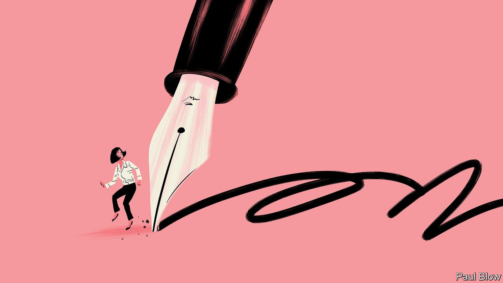

###### Bartleby

# Remote work and the importance of writing 

##### The written word will flourish in the post-pandemic workplace 

 

> Jan 15th 2022 

THE PANDEMIC has given a big shove to all forms of digital communication. Video-conferencing platforms have become verbs. Venture capitalists make their bets after watching virtual pitches. Products like Loom and mmhmm help workers send pre-recorded video messages to their colleagues. More than a third of Slack users each week are now “huddling”—using the product’s new audio feature to talk to each other. And all this is before the metaverse turns everyone into an avatar.

A workplace dominated by time on screens may seem bound to favour newer, faster and more visual ways of transmitting information. But an old form of communication—writing—is also flourishing. And not just dashed-off emails and entries on virtual whiteboards, but slow, time-intensive writing. The strengths of the written word have not been diminished by the pandemic era. In some ways they are ideally suited to it.*


The value of writing is a staple in management thinking. “The discipline of writing something down is the first step toward making it happen,” reckoned Lee Iacocca, a quotable titan of the American car industry. Jeff Bezos banned slide decks from meetings of senior Amazon executives back in 2004, in favour of well-structured memos. “PowerPoint-style presentations somehow give permission to gloss over ideas,” he wrote.

Some executives write for themselves. Andrew Bosworth, a bigwig at Meta (formerly Facebook), has a blog in which he muses interestingly on many topics, including on writing itself: “In my experience, discussion expands the space of possibilities while writing reduces it to its most essential components.” Others do so to reach an audience. Shareholder letters from Larry Fink and Warren Buffett are the corporate equivalent of a blockbuster book launch.

But the move to remote working has enhanced the value of writing to the entire organisation, not just the corner office. When tasks are being handed off to colleagues in other locations, or people are working on a project “asynchronously”, meaning at a time of their choosing, comprehensive documentation is crucial. When new employees start work on something, they want the back story. When veterans depart an organisation, they should leave knowledge behind. Writing everything down sounds like an almighty pain. But so is turning up to a meeting and not having the foggiest what was decided last time out.

Software developers have already worked out the value of the written word. A research programme from Google into the ingredients of successful technology projects found that teams with high-quality documentation deliver software faster and more reliably. Gitlab, a code-hosting platform whose workforce is wholly remote, frames the secret of successful asynchronous working thus: “How would I deliver this message, present this work, or move this project forward right now if no one else on my team (or in my company) were awake?” Gitlab’s answer is “textual communication”. Its gospel is a handbook that is publicly available, stretches to more than 3,000 pages and lays out all of its internal processes.

The deliberation and discipline required by writing is helpful in other contexts, too. “Brainwriting” is a brainstorming technique, used by Slack among others, in which participants are given time to put down their ideas before discussion begins. Lists of corporate values can make greeting cards seem hard-hitting. But thoughtful codification of a firm’s culture makes more sense in hybrid and remote workplaces, where new joiners have less chance to meet and observe colleagues.

Purists will sniff that none of this counts as writing. But good prose and useful prose share the same essential qualities: brevity, structure, a clear theme. Cormac McCarthy, a prize-winning novelist, copy-edits scientific papers for fun. Ted Chiang says that his science-fiction short stories and his technical writing both draw on a desire to explain an idea clearly.

Writing is not always the best way to communicate in the workplace. Video is more memorable; a phone call is quicker; even PowerPoint has its place. But for the structured thought it demands, and the ease with which it can be shared and edited, the written word is made for remote work.


Read more from Bartleby, our columnist on management and work:

 

 (Jan 1st 2022)

 (Dec 18th 2021)

