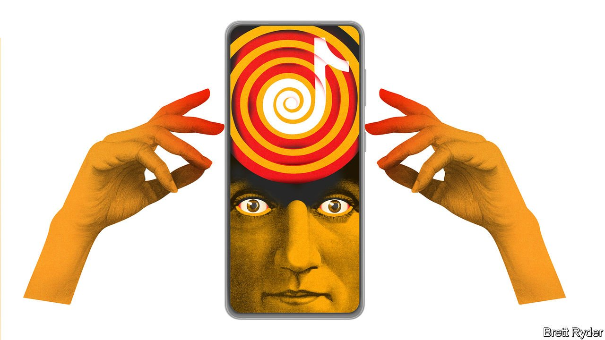

###### Schumpeter

# TikTok isn’t silly. It’s serious 

##### It is disrupting America’s social-media landscape 

 

> Jan 15th 2022 

“WHEN YOU gaze into TikTok, TikTok gazes into you,” wrote Eugene Wei, a tech blogger, in 2020, explaining the almost clairvoyant nature of TikTok. What the algorithm sees as it gazes into your columnist, a neophyte user, is anyone’s guess: a random feed delivers tips on how to design a ball gown, someone barking at a dog, Rod Stewart with a hankie on his head, and (phew!) Maya Angelou reciting “Phenomenal Woman”.

Schumpeter is quite clear, however, about what he sees in TikTok. It is not just the busty seductiveness of many of the clips that he cannot help noticing. It is the serious money changing hands. And the unmistakable thrill of creative destruction.


About time. Just five years after its birth, TikTok claims to have exceeded 1bn monthly users, despite a ban in India. On January 12th App Annie, a data gatherer, said TikTok caught up with Facebook in 2021 and overtook WhatsApp and Instagram in time users spent on it. Notwithstanding a judge’s decision on January 11th to allow America’s Federal Trade Commission to sue Meta, the social-media trio’s parent company, on antitrust grounds, TikTok’s success appears to mock the argument that Facebook is impregnable.

TikTok derives its magic from its algorithm and the data on which it is trained. Unlike Facebook’s rolling feed, TikTok’s simple, one-video interface means that the app always knows exactly what a user is watching. Clips are short, so viewers see a lot of them, generating plenty of information. This, combined with few friends and family clogging up the feed, allows the algorithm to match users with content creators that actually entertain them. And because videos are mostly shot on a smartphone, anyone can make them. Barriers to entry are low. Virality is high.

A big question remains. Can TikTok win business as well as it woos eyeballs? Its provenance has long suggested it can. It is born out of ByteDance, a privately held Chinese powerhouse that some think generated more than $40bn in revenues in 2021. Its sister app, Douyin, has thrived in China’s hyper-competitive social-media market, which makes Silicon Valley look staid by comparison. That gives TikTok hands-on commercial experience to draw on.

So far its revenues, though growing fast, are reportedly low (it discloses no financial information). That is unsurprising. Donald Trump’s abortive attempt in 2020 to ban it on national-security grounds scared away advertisers. The ensuing drama—a thwarted sale, management upheaval and uncertainty over its relationship with ByteDance—caused yet more disarray. But these hurdles now appear to be behind it. In the absence of further geopolitical turmoil, TikTok could shake up the business model of social media in America, not just the user experience.

There are several ways it could do so. Start with advertising. Google and Facebook pioneered the pay-per-click approach. TikTok is transforming it further, inviting brands to work with creators to make potentially viral content, such as skateboarders swigging Ocean Spray juice to the sound of Fleetwood Mac. Sometimes a brand’s presence might only be visible via a hashtag.

Second, e-commerce. Like other American social-media platforms, TikTok now enables viewers to buy goods directly by tapping a shopping tab on a video. It has teamed up with Shopify, an e-commerce platform, to bring more merchants to the site. So-called social commerce—including via live streaming—is far bigger in China than in America. Jeremy Yang of Harvard Business School says TikTok may build on Douyin’s experience in this field to bolster its online-shopping business.

Third, the creator economy. It is not just that, according to Forbes magazine , TikTok’s seven highest-paid stars earned a total of $55.5m from work on and off the platform last year, triple the sum it counted in 2020. TikTok has also recently introduced ways for users to provide gifts and tips to favoured creators, boosting the incentive to produce fresh material and providing fees to TikTok. Such practices first took off in China.

None of these innovations will amount to much if TikTok has another near-death experience. That is why it appears to be putting a final piece of its commercial strategy into place: balancing the demands of America and China. It has appointed Shou Zi Chew, a Singaporean of Chinese ethnicity, as CEO. He is based in the city-state, which serves as neutral territory. He is comfortable on both sides of the Sino-American divide, having been educated in the West and served as chief financial officer of ByteDance and Xiaomi, a Chinese smartphone-maker. It is still an open question whether he can—or even should—further disentangle TikTok from ByteDance to curb the perception that China could make nefarious use of TikTok’s data. To do so may help geopolitically. But cutting TikTok off from an army of Chinese software engineers could also jeopardise its mind-reading brilliance.

TikTok faces plenty of other challenges. It needs to invest heavily in content moderation to ensure toxic videos are removed before they go viral. Addiction is a palpable concern, not just as a meme—#tiktokaddict has more than 500m views. The app faces probes about data privacy, particularly of under-age users. Regulatory risk will rise as TikTok becomes more prominent.

One thing TikTok need not fear is being crushed by the big beasts of Silicon Valley (at least without help from Uncle Sam). Instagram has sought to mirror TikTok with “Reels”, and YouTube, owned by Google’s parent company, Alphabet, has introduced “Shorts”. Neither has damaged TikTok’s popularity.

#LessonforChina

That is a good thing. TikTok is on the vanguard of ideas pioneered in China’s video-mad social-media landscape that have taken years to permeate America. At a time when the Chinese Communist Party is arbitrarily cracking down on the consumer-tech industry it is especially gratifying to witness Chinese free enterprise and ingenuity grab the world’s attention. ■


Read more from Schumpeter, our columnist on global business:

 (Jan 1st 2022) 


