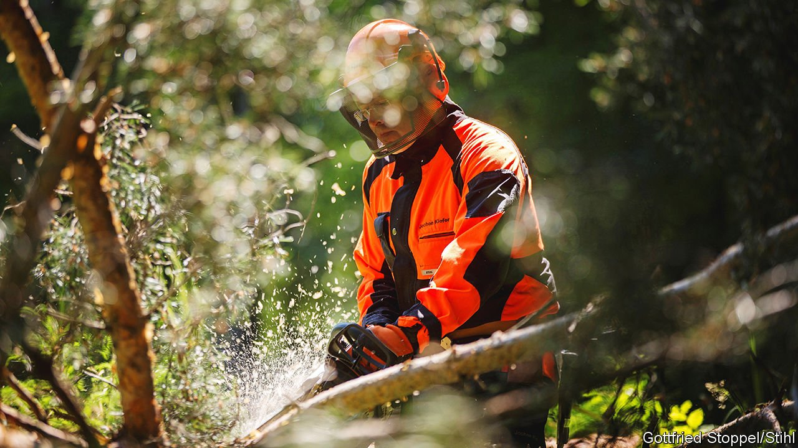

###### Medium-sized expectations

# What the Mittelstand wants 

##### Germany’s manufacturing bosses size up the new government 

 

> Jan 15th 2022 

THE BOSSES of Germany’s 3.6m medium-sized and small manufacturing firms would have loved to see last year’s general election yield a pro-business government of the centre-right Christian Democrats and the liberal Free Democrats (FDP). What the Mittelstand got instead was a pact between the Social Democrats (SPD), the FDP and the Greens. That is still too leftie for many tastes. But it could have been worse. Plenty of chief executives feared that Olaf Scholz, the new SPD chancellor, would row back his pre-election vow not to form a business-bashing coalition that would include Die Linke, a hard-left party.

A disaster averted may be one reason why the Mittelstand is not despondent at the start of the new year. Another is that big chunks of the coalition treaty, which runs the length of a slim novel, “go in the right direction”, says Hans-Jürgen Völz, chief economist of the BVMW, a Mittelstand trade body. Still, several gripes remain.


One is taxation. During the election campaign the SPD, the Greens and Die Linke mooted the idea of re-introducing a wealth tax and raising inheritance taxes. Such a move would hit the Mittelstand’s family firms hard. It now appears to be off the table thanks to opposition from the FDP, whose boss, Christian Lindner, is the new finance minister. But so, too, is the prospect of a corporate-tax cut, from a headline rate of 30% to 25%, and the abolition of the personal “solidarity” tax (known as soli), the proceeds from which flow to the formerly communist east.

The Mittelstand’s second peeve is red tape. “Bureaucracy is costing German business around €50bn ($57bn) a year,” says Mr Völz. Over the last decade parliament has passed three legislative packages to ease the bureaucratic burden on the Mittelstand. But little real progress has been made. According to Nikolas Stihl, head of the supervisory board of Stihl, the world’s leading maker of chainsaws, excessive bureaucracy helps explain why Germany is 30 years late with big infrastructure projects such as the feeder road for the 55km railway tunnel that is being dug beneath the Brenner Pass linking Austria and Italy. “We don’t know any more how to implement big projects,” sighs Mr Stihl.

Besides these longstanding gripes the Mittelstand has two more pressing ones. As in many countries, German firms struggle to find qualified workers—or any workers. Bosses want Mr Scholz to push the EU to extend the “blue card”, a work permit that helps university-educated migrants take up job offers in the bloc, to blue-collar workers. A separate Chancenkarte (opportunity card) promised in the coalition treaty would enable migrants to look for work in Germany provided they fulfil criteria such as a working knowledge of German.

The most burning problem for manufacturers is the soaring cost of energy. Many also fret about Germany’s dependence on Russian gas. “Even worse than the 70% increase of our company’s energy costs is the worry about security of supply,” says Ferdinand Munk, owner and boss of Günzburger Steigtechnik, a maker of ladders and rescue kit in Bavaria. He worries that “the gas taps could be turned off at any time.” So far Mr Scholz has not signalled how he plans to tackle the energy problem.

At least the Mittelstand’s mood is leavened by bursting order books. As demand for goods ballooned in the pandemic, German firms in the manufacturing supply chain have thrived. “We have the highest number of orders in our nearly 100-year history,” beams Andreas Möller, a spokesman for Trumpf, a maker of machine tools in the south German city of Ditzingen. A covid-era gardening boom helped lift Stihl’s sales from €3.9bn in 2019 to €4.6bn in 2020—and the firm is poised to report record revenues in 2021, too.

More than half of the firms polled by the BVMW in a recent survey reported that they were in good or very good shape. Nearly 45% said they would hire more staff this year. Over 70% will maintain or increase investments. If shortages of workers or energy prevent these pocket powerhouses from fulfilling orders, Mr Scholz may lose much of the remaining goodwill that the Mittelstand still harbours. ■


