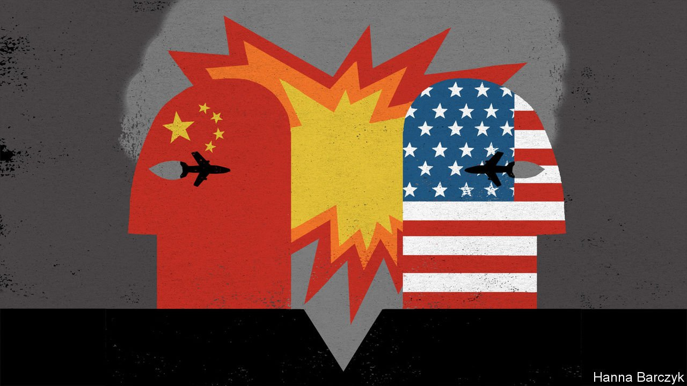

###### Chaguan

# America and China are one military accident away from disaster 

##### Lessons from a Chinese jet’s fatal collision with a US spy plane, 21 years ago 

 

> Jan 15th 2022 

IN AN AGE of superpower rivalry and distrust, it is odd to talk of good fortune smiling on America’s relations with China. But in one important domain, the rivals have shared a long streak of astounding luck. It is two decades since the last fatal encounter between the armed forces of America and China. Today the skies and seas around China swarm with a growing number of planes and warships from each side. In Beijing, scholars and officials talk of when, not whether another accident will occur. Then they wonder how such a crisis would be managed, by two countries locked in open ideological competition and stalked by rising nationalism.

The last incident involved a collision between a Chinese navy fighter and an American spy plane, high over the South China Sea on April 1st 2001. The Chinese pilot died after his jet broke apart. Badly damaged, America’s naval reconnaissance plane, a lumbering, propeller-driven EP-3 with 24 crew aboard, limped to a Chinese military airfield on the tropical island of Hainan, landing without permission. The crew’s detention by the People’s Liberation Army (PLA) was an early test for George W. Bush, who had been president for less than three months. The crew were freed just 11 days later, after America’s ambassador to Beijing, Joseph Prueher, signed a letter saying his government was “very sorry” for the Chinese pilot’s death. While noting that the EP-3 made an emergency landing to save its crew, the letter added that America was “very sorry”, too, for the plane’s arrival in Hainan without clearance. Through deft translation into Mandarin, China presented the letter as a formal apology. Party chiefs declared the pilot, Lieutenant-Commander Wang Wei, a revolutionary martyr and Guardian of the Sea and Sky. Official media told citizens to channel their grief into hard work to make China strong, and the country moved on.


In 2001 both governments took risks to end the stand-off. Chaguan covered the EP-3 collision during an earlier posting to China. Hours before the Americans flew home, he interviewed locals in a hot, rainy street near the Americans’ detention place in Hainan. Ignoring police officers listening in, passers-by shouted that the EP-3 pilot should be put on trial. Irate university students told of campus protests squelched and of handwritten posters torn down. They were right to sense a fudge. For all their demands that America end surveillance flights near China, party chiefs signalled to Bush-administration envoys early on that they wanted a deal, in the interests of broader bilateral relations. Notably, China wanted entry to the World Trade Organisation and to host the 2008 Olympic Games, and America had leverage on both counts. After making clear his desire to see the dispute resolved, President Jiang Zemin left for a tour of Latin America.

America compromised, too. Pentagon officials gave reporters images of Wang Wei flying so close to American planes on previous missions that he could be seen holding up his email address. When debriefed later, the EP-3 crew from April 1st described the Chinese pilot making two reckless passes within ten feet (three metres), before misjudging a third and hitting one of their propellers. The PLA account flouted laws of physics and common sense: that Wang Wei was a safe 400m away when the larger, slower EP-3 veered and rammed him. But to get the crew home, American negotiators set aside the question of blame.

Luck played a role in 2001. Mr Bush handed the crisis to his new secretary of state, Colin Powell, a pragmatist with unusual influence as a former general and chairman of the joint chiefs of staff, able to get quick decisions out of the White House. Mr Prueher was a former admiral and head of Pacific Command, who as a naval aviator spoke with confidence about mid-air intercepts. That said, previous contacts with Chinese generals did not help, he recalls in a telephone interview. The PLA was, he says, “non-existent in solving this problem. They did not answer my calls.” The EP-3’s survival was a stroke of fortune. Brigadier General Neal Sealock, who as America’s defence attaché in Beijing led talks on the ground in Hainan, accords the EP-3 pilot “much honour” for saving his crew, thereby averting a catastrophe or even a war if 24 Americans had died in a crash, or, worse, been shot down. Powell’s clout somewhat shielded American negotiators in China from Washington politics. Two decades on, a vastly more partisan Congress and media in America would surely denounce or obstruct any compromise like that struck by the Bush administration. Today, “if China is a problem, which it is, a bigger problem is sorting out the effectiveness and efficiency of our government,” worries Mr Prueher.

All lucky streaks end eventually

For their part, Chinese nationalists would be harder to manage today. Most Chinese get their news from often-strident online outlets, rather than the staid television channels that played down the crisis in 2001. Chinese scholars see some positive changes, starting with the PLA’s growing capabilities. Zhang Tuosheng, a former military academic and diplomat, is an expert on crisis management at the Grandview Institution, a Beijing-based think-tank. In 2001, he says, American officers debated destroying their own plane on the ground to preserve its secrets, but thankfully decided against lobbing a missile at a Chinese airbase. China’s modern-day strength should make America still more cautious now, he argues. Mr Zhang praises emergency hotlines and codes of conduct agreed by PLA and American commanders over the years. But China and America remain fundamentally divided on how to avoid accidents, he concedes. The PLA stresses “national security”, meaning that America should stop coming near China. Americans stress “safety”, meaning sober behaviour during close encounters.

Meanwhile, Chinese pilots are growing more aggressive. Since 2021 American and allied surveillance planes have logged multiple near-misses with PLA aircraft, some, it is said, within 100 feet (30 metres). When complaints are lodged, China’s response is: stay away. A disaster looms. Resolving it will be far harder next time. ■

Read more from Chaguan, our columnist on China: (Jan 8th)

 (Dec 11th) (Dec 4th)

