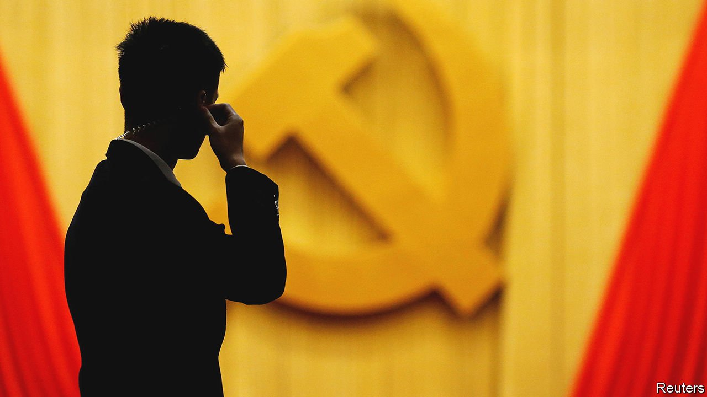
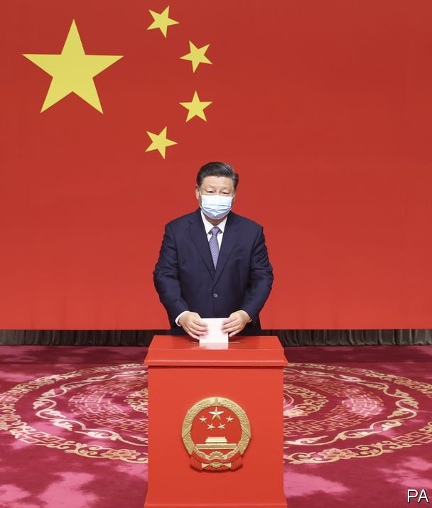

###### All change, bar one

# Xi Jinping’s job is safe but China’s leadership is being shaken up 

##### A five-yearly churn is affecting decisions on everything from the economy to covid-19 

 

> Jan 13th 2022 

ELITE CHINESE politics take place in a fog of obscurity. But one forecast is commonly accepted: Xi Jinping will still be China’s ruler next year and beyond. Having completed a decade in power, he is likely to defy convention and remain in office. But throughout the rest of the hierarchy, huge changes are under way. They will reach a climax late this year with a sweeping shuffle at the top. Mr Xi may be a rule-breaker, but he has not altered the underlying political rhythm. A five-yearly turnover has begun of leaders high and low. Throughout officialdom, the tension is evident.

In speech after speech, bureaucrats harp on a task of paramount importance: ensuring the success of the Communist Party’s 20th congress. The party is typically vague about when this will be held—all it will say is the second half of the year. It usually does not confirm the date until a few weeks beforehand. But such gatherings, held every five years, usually take place in October or November. They are largely rubber-stamp affairs, yet play a crucial role. They “elect” a new Central Committee of nearly 400 members that convenes immediately afterwards to appoint a new Politburo (currently 25 people) and military high command. Only when that is done will officials begin to relax.


China’s political landscape has changed considerably since Mr Xi took charge. He has seized more levers of control than any of his predecessors, including over economic matters, which were once largely the remit of the prime minister, now Li Keqiang. In 2018 he secured a revision of the constitution that scrapped the term limit on the presidency, allowing him to keep that job indefinitely. There is no term limit on his job as the party’s general secretary, the holder of which is by convention also head of state and the army. So Mr Xi could remain China’s leader for life.

His position seems secure. There is little sign of the bitter political feuding that preceded his own anointment as leader at the party’s 18th congress in 2012. But the build-up to the 20th congress will not be plain sailing. Mr Xi has to decide on many appointments and stay vigilant. His decision to scrap the presidential term limit was controversial. People affected by his sweeping purges of enemies and corrupt officials are likely to be nursing grievances.

Some changes are enforced by the incumbents’ ages. Mr Xi still appears to respect unwritten rules about when senior officials should retire. Assuming he continues to do so, at least 11 of the 25 current members of the Politburo, including two in the Standing Committee, will have to step down after the congress, because they are 68 or over. (Mr Xi will be that age, but the rule will not apply to him.)

That means that some notable Politburo members may face retirement. One is Liu He, a deputy prime minister who has been at the forefront of economic policymaking as well as trade talks with America. He will soon turn 70. Another is Yang Jiechi, China’s most senior diplomat, who will be 72. The Standing Committee members who are likely to leave are Han Zheng, a deputy prime minister in charge of Hong Kong affairs, and Li Zhanshu, the head of China’s legislature. All eyes will be on their slots. If either or both of their replacements are 62 or younger, one of them could succeed Mr Xi at the 21st congress in 2027 should he decide to step down then.

The future of another member of the Standing Committee, Mr Li, is uncertain. The constitution obliges him to step down as prime minister after two five-year terms, so he will be replaced in 2023. But he will be 67 when the congress convenes, ie, young enough to keep his Standing Committee seat and take on another portfolio.

Changes in the Politburo—and at every other level—may help Mr Xi to tighten his mighty grip. Officials stress that loyalty to him is essential for promotion. But a generational change is also under way that may affect politics in the years ahead. More than half of the Central Committee’s members are likely to be replaced at the forthcoming congress (a typical churn). Cheng Li of the Brookings Institution in Washington says this will result in 85% of seats being held by people born in 1960 or later, compared with just over half previously.

In a report in December, MacroPolo, an in-house think-tank of the Paulson Institute in Chicago, called this generation’s rise “a rare dynamic in Chinese politics”. It noted a “gulf” between the younger group’s experiences and that of the older cohort to which Mr Xi and most other Politburo members belong. Those, like Mr Xi, who were born in the 1950s grew up during Mao’s vicious Cultural Revolution of 1966-76, when formal education was severely disrupted. The younger cohort came of age after Mao’s death in 1976. Its members were shaped by a rapidly changing China that was opening up to the West. The think-tank said Chinese politicians belonging to this group tended to be more pro-market and politically liberal than their elders.

The advance of this generation, and of even younger officials who may have been students during the pro-democracy upheaval of 1989, is already evident at the provincial level and below. Shuffles began in these lower strata early last year. So far, more than half a dozen provincial party chiefs have been replaced. Several of them were leaders of Mr Xi’s generation who have been succeeded by officials of the 1960s group. About one-third of new entrants to the inner circles of provincial party leaderships were born in the 1970s.

Power generation

But, at least while Mr Xi remains in power, few observers expect any relaxation of the party’s vice-like grip on China. A return to the relatively liberal political climate of the 1980s is hard to imagine. Leaders who began their careers at that time have been moulded since by two profound changes: China’s meteoric rise as a global power, and growing disillusionment among Chinese with the West as a political model.

At every level, the reshaping of leaderships is being intensively managed to ensure that only those loyal to Mr Xi are promoted. That is a colossal undertaking. In 2011, during a similar exercise in the build-up to Mr Xi’s accession, the chief of the party’s central Organisation Department, its vast human-resources machine, said that more than 100,000 “senior officials” would retire or be assigned to new posts. The turnover is likely to be just as drastic this time, with changes down to the level of rural townships. They include shuffles in leaderships of government departments and local legislatures (Mr Xi is pictured voting in November for party-picked delegates to his district-level one).

The party often touts this five-yearly shake-up as democracy in action. Delegates to the party congresses are supposedly chosen by ordinary party members. In fact democratic choice is minimal. Organisation departments at various levels ensure that only those favoured by higher-ups are promoted. The delegates are selected carefully for their compliancy.

There will be 2,300 of them at this year’s national congress. Work on picking them has just begun. State media will be filled in coming months with reports about the mobilisation of party members to nominate suitable candidates. Past such efforts have involved motorcycle teams driving across remote grasslands to consult party-member herders; party branches sending messages to members abroad to seek their opinions; even officials visiting homes to seek advice from the sick.

 


In reality, members are used merely to echo their leaders’ choices. Before nominations are submitted, party committees organise propaganda campaigns to publicise the deeds of some select “model workers”. The message is clear: choose names from among them. Party members in the bureaucracy know whom to nominate: their leaders. The initial round may produce hundreds of thousands of names. Their numbers are whittled down by low-level party committees, which shape the lists to ensure that quotas are met—specific percentages of officials, women, ethnic minorities, migrant workers and so on.

The lists are passed back and forth, up and down the ranks, for further refinement until every province, the armed forces and a handful of other “electoral units” each has its own list of delegates that satisfies the Organisation Department. Despite the party’s role in producing these lists, chosen delegates are still subjected to extensive vetting. This has involved interviews with colleagues, police checks and examination of records relating to everything from tax payments to compliance with family-planning rules. As officials put it, no one is to be selected “carrying sickness”, ie, with a blotted copybook.

Out, out brief candle

Any faint glimmer of democracy that may once have flickered Mr Xi has extinguished. In 2007, about three months before the party’s 17th congress (Hu Jintao was then general secretary), the party conducted an unprecedented poll of members of the Central Committee and a few others to assess support for potential Politburo candidates from a list of nearly 200 of them. It was described as an occasion of “great significance” for inner-party democracy. Five years later, before the congress at which Mr Xi took power, the party repeated the exercise, this time also asking for their recommendations for promotions to the Standing Committee.

Mr Xi has made clear his disdain for “simple reliance on votes to choose people”. Instead of straw polls, his officials have preferred to interview senior people to assess their support for candidates for powerful roles. Xinhua, a state news agency, said the straw-poll system had been abused by Mr Xi’s since-purged rivals, who had tried to win votes with bribes.

So the pre-congress atmosphere is familiar. Officials are scrambling to ensure that nothing will upset preparations. Earlier this month one of the Politburo’s youngest members, Chen Min’er (born in 1960), rumoured to be a rising political star, summed it up: “We must resolutely keep the word ‘stability’ at the forefront.”

In the months ahead, security will become ever tighter and officials even less tolerant of dissent. Leaders are unlikely to risk a health crisis by easing their zero-tolerance approach to covid-19. As The Economist went to press, a fresh outbreak near Beijing was causing alarm. The capital also has to worry about another big event: the Winter Olympics next month. “We must maintain a stable and healthy economic environment, a clean political environment and a social environment of peace and security,” said Mr Chen, setting out pre-congress tasks. For millions of officials, they will be all-consuming. ■

