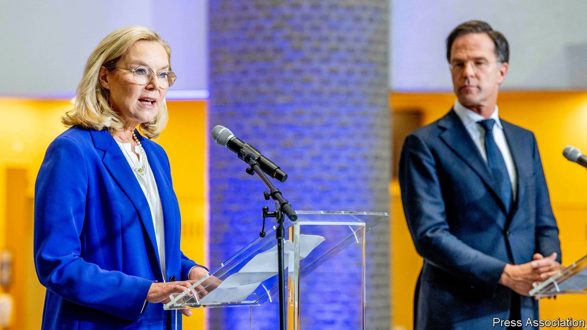

###### Removing the clogs

# A new Dutch government with a taste for Europe 

##### The Netherlands has long resisted collective EU spending, but that is changing 

 

> Jan 15th 2022 

ORDINARILY, WHEN the EU favours a flood of collective spending, the Dutch put their collective finger in the dyke. In 2020 the Netherlands rallied a group of small, rich countries (the “frugal four”) to oppose the EU’s covid recovery fund. They eventually gave in, but not before Wopke Hoekstra, the then finance minister, insulted southern Europeans for lacking budget discipline. This week a new Dutch government took office. It comprises the same parties as the previous one, yet its stance on the EU is far more relaxed.

Mark Rutte, the Liberal prime minister, is back for a fourth term, but has turned boosterish on Europe. Just as important is the new finance minister, Sigrid Kaag of the centre-left, pro-EU D66 party. Finance is the most powerful ministry, and has largely run the Netherlands’ EU policy since the euro crisis of 2010-12. Mr Hoekstra, a Christian Democrat, has been shunted to foreign minister. This may seem an odd fit, but Mr Hoekstra incarnates an old adage about the country’s diplomacy: “I am Dutch, so I may be blunt.”


Finance ministers are often popular in the Netherlands. Winning the post is testament to Ms Kaag’s bargaining skills, honed as a UN diplomat in the Middle East. The coalition negotiations lasted nine excruciating months. Striking a deal required the parties to trade favours, leading to some rather un-Dutch plans for big spending. They include a climate fund of €35bn ($40bn) through 2030 and reimbursing 95% of child-care costs up to the age of 12. Government debt will rise past the EU’s notional limit of 60% of GDP.

Dutch flexibility would be welcome in Brussels, where France and Italy want to loosen the budget rules permanently. The new government may go along, with conditions. It also backs letting the EU raise more of its own taxes, including a carbon tariff on imports. Instead of clubbing with small thrifty states, it will work with the EU’s powerhouses, France and Germany.

The Netherlands’ tone has changed, but its interests have not. As a country that trades a lot and has a big financial sector, it felt closer to Britain than to France until Brexit. It remains less statist than most EU members. “We will continue to be a liberal outpost in Europe,” says Hans Vijlbrief, a D66 minister who has worked at the finance ministry and in Brussels. But they may be less blunt about it. ■

