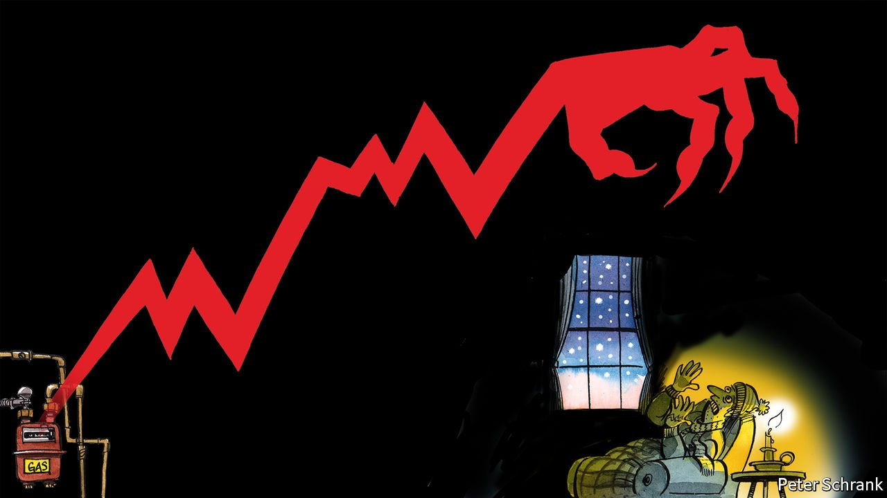

###### Charlemagne

# Europe’s energy crisis will trigger its worst neuroses 

##### A surge in gas prices is the stuff of nightmares 

 

> Jan 15th 2022 

IN GEORGE ORWELL’S “1984”, Room 101 is where prisoners are confronted with their worst fear. Finding Europeans’ prevailing phobia is trickier: what spooks voters in one bit of the continent (asylum-seekers! deficits! Russia!) may be of scant concern to those on the other end. Covid-19 is one contender, as it has made life dull from Dublin to Dubrovnik and beyond. Another is the continent’s ongoing energy crisis. Surging natural-gas prices are sending heating bills soaring, soaking up the cash Europeans have saved while moping around at home for two years. It is a crisis so all-encompassing that all parts of the EU will have to face up to their deepest apprehensions.

As with most nightmares, the origins of the power crunch are partly clear and partly mysterious. Europe went into the winter season with low stocks of natural gas, which is used for heating homes and generating electricity. Shrinking domestic energy production in places like the Netherlands, wimpy breezes that failed to spin wind turbines as much as hoped, booming Asian demand sucking gas eastwards, and maintenance trouble at French nuclear plants have coalesced into a shortage few saw coming. When Russia, whence gas pipelines tend to depart, did not rush to help with additional supply, prices spiked. The average European household faces electricity and gas bills of €1,850 ($2,100) in 2022, up from €1,200 in 2020, according to Bank of America. Fears of winter power cuts have been forestalled by a bout of unseasonably warm weather—for now.


But the horror goes beyond the pocketbook: for many countries, it evokes their worst insecurities. Take proud France, which currently holds the rotating presidency of the Council of the EU. The crisis makes a mockery of the bloc attaining “strategic autonomy”, President Emmanuel Macron’s latest big idea. That Europe should be shielded from being bossed around by foreign powers sounds laudable, but seems more distant than ever. What autonomy can Europe claim when it requires Russian largesse to keep its homes warm? This is an awkward question at a time when Vladimir Putin is threatening to invade Ukraine. If America responds with sanctions against Russia, as it has threatened, it is Europe that will suffer the worst of the Kremlin’s retribution. No wonder the EU can scarcely find a seat at the negotiating table.

Worse, some countries seem sanguine at the existing state of affairs. Germany is in the final stages of signing off on Nord Stream 2, a pipeline that will make Europe even more reliant on Russian gas. The EU’s biggest economy will have to confront angst of its own. The energy-price surge will be disastrous for its industry. It has also triggered a jump in inflation, the economic indicator Germans fear most. And the new coalition government, which is divided over Nord Stream 2, has just overseen the closure of three nuclear-power plants that might have come in handy in keeping the continent’s lights on. The country that thinks of itself as providing solutions for Europe is now part of the problem.

Twin dreads keep northern Europeans awake through their long winter nights. One is that the EU will fail to act against climate change, which greatly concerns voters in the Netherlands and Scandinavia. The other is that “their” money will go to subsidise spendthrift southerners. The deal struck in 2020 for a European covid recovery fund neatly set these two fears against each other: frugal northerners agreed to underwrite a big aid package, on the condition it fund long-term investments (notably green ones). The gas crisis undermines that set-up. Governments in places like Italy and Spain are doling out billions to help households handle higher utility bills, while Polish miners work overtime to dig up filthy coal.

Southern Europe’s biggest fear is of a sputtering recovery. Greece, Italy and others could use a good run after two crises in barely more than a decade. Big jumps in energy bills hurt poorer countries more. That applies to eastern Europeans too. But their Room 101 is dominated by Mr Putin, who keeps his hand on the gas tap while demanding that former Warsaw Pact countries stop hosting NATO troops. If winter temperatures don’t have Baltic countries shivering, the prospect of a hockey-masked Mr Putin picking them off like terrified teens surely will.

Pump scare

The gas-price horror movie is most terrifying for Eurocrats. The causes of the current energy snafu are hard to distil down to a single factor, says Georg Zachmann of Bruegel, a think-tank in Brussels. That leaves plenty of room to designate a scapegoat, and one candidate comes to mind. The European Commission regulates EU energy markets (mostly quite sensibly) and has made carbon neutrality a central plank of the bloc’s future (also sensible). Sound as its policy decisions may be, they have aggravated the current crisis. For example, shifting to coal to keep prices down is less of an option, since it would require buying expensive EU carbon-emissions credits.

Had Britain still been in the EU, the likes of Nigel Farage would no doubt have spent the past few months blaming Brussels for rising energy costs. Others might seize his demagogic mantle. France, home of the gilets jaunes, has recent experience of grassroots grumpiness linked to energy prices, and is gearing up for an election featuring some raucous eurobashers. Viktor Orban will also be looking for some element of the EU machine to pummel as he prepares to face Hungarian voters in April.

European officials know the spotlight of blame might swing to them, and are not looking forward to it. Yet anxiety can be healthy when the fear is of being held accountable. Having voters fume at the EU’s approach to problems is a sign that it is devising policies some people disagree with, and might want overturned. That looks an awful lot like a functional democracy at a pan-European level. Scary, isn’t it? Boo! ■

Read more from Charlemagne, our columnist on European politics: (Jan 8th) (Jan 1st) (Dec 18th)

