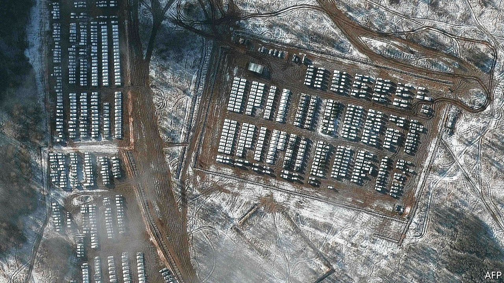
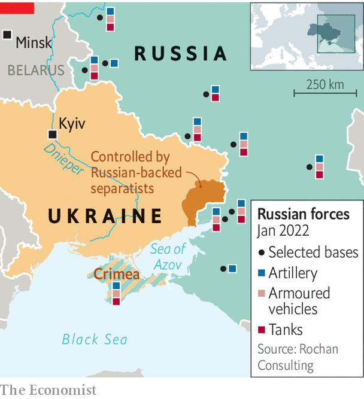

###### Teetering at the summit

# Russia and the West meet for a crucial week of diplomacy 

##### Even as they talk, both sides are preparing for war 

 

> Jan 15th 2022 

AS RUSSIAN TANKS poured west, heading from Vladivostok on the Pacific coast to the border with Ukraine, American diplomats headed east. Not since the Balkan wars of the 1990s has Europe seen a week of such crucial security summitry. On January 10th American diplomats met Russian ones in Geneva. Two days later the NATO-Russia Council convened in Brussels. On January 13th the diplomats headed to Vienna for a gathering of the Organisation for Security and Co-operation in Europe (OSCE), a group of 57 countries.

The purpose of this frenetic diplomacy was to prevent a war. Russia’s government has demanded, among other things, that  and pull back from places that used to be part of the Soviet Union. It wants NATO members to stop co-operating with Ukraine, and a legal guarantee that Ukraine and Georgia will never join the alliance (something those countries have previously been promised). America and its European allies have agreed to discuss the Kremlin’s stated grievances, while beefing up their defences and threatening sanctions should Vladimir Putin, Russia’s president, attack Ukraine again.


On the face of it, the summitry took some heat out of the crisis. Sergei Ryabkov, Russia’s deputy foreign minister, said that his meeting with Wendy Sherman, America’s deputy secretary of state, was “very professional” and “deep”. Ms Sherman, who proposed ideas about how America and Russia could limit missile deployments and the size and transparency of their exercises, noted that Mr Ryabkov had even discussed “things that are not Russian priorities”.

Yet Mr Ryabkov was keen that this not be misunderstood. Deals on missiles and exercises were nice, but a sideshow. “For us, it’s absolutely mandatory to make sure that Ukraine never, never, ever becomes a member of NATO,” he said, clarifying in English: “We need ironclad, waterproof, bulletproof, legally binding guarantees.”

These were not forthcoming when Russia met the 29 other members of NATO in Brussels on January 12th for four hours of talks. “It is only Ukraine and 30 allies that can decide when Ukraine can become a NATO member,” said Jens Stoltenberg, the secretary-general of the alliance, after the meeting. “No one else can.”

This was no surprise for Moscow, which had expected its demands to be spurned. Less clear was whether the Kremlin’s aim was to elicit a pretext to attack Ukraine, or simply to generate material for propaganda. Some people familiar with Mr Putin say that he has long lost interest in the day-to-day business of running Russia, but is excited by geopolitical theatre; in recent months, Russian officials have drawn grandiose parallels with the Cuban missile crisis. Mr Putin is well aware that ordinary Russians have little appetite for a big war. Yet he hopes to keep them in a state of fear, to distract from the many grumbles they have about his regime.

Western officials are keen to keep talks going as long as possible in the hope that the crisis may dissipate. Russian officials have repeatedly warned that they will not be drawn into what Mr Putin has called the “swamp” of drawn-out discussions, not least because an invasion of Ukraine would become harder once the ground in the country’s east thaws in spring. Mr Stoltenberg said that Russia had been open to the idea of more dialogue, but declined to agree to a schedule of further meetings. Mr Putin will make the final call, but his emissaries showed little satisfaction. Russian proposals were not “a loaf from which you can peck out some...sultanas”, complained Alexander Grushko, the head of the country’s delegation to Brussels. If diplomacy failed, he thundered, the threat from NATO would be “countered by military means”.

If Russia does indeed attack Ukraine, American officials have promised “massive” economic sanctions, far in excess of those imposed after its previous assaults in 2014, when it annexed Crimea. They hint at disconnecting Russia from the SWIFT network, which connects banks to one another, and banning it from receiving goods with American electronics in them. The measures would be “like none he’s ever seen”, warned Joe Biden, America’s president, after a .

Europeans have also explored sanctions on banks and individuals close to the Kremlin, says Sabine Fischer of SWP, a think-tank in Berlin, but they are more nervous. There are “serious concerns” over kicking Russia out of SWIFT, which has its headquarters in Belgium, she says, because it would hurt ordinary Russians and EU sanctions are supposed to be targeted.

 


There is also uncertainty over the fate of , a controversial gas pipeline from Russia to Germany. American officials claim that Germany has agreed to suspend the pipeline in the event of war. Germany’s coalition government remains divided over the issue, and some officials are wary of restricting gas supplies just as Europe faces a looming energy crisis.

Ukraine itself, the focal point of the crisis, has sat largely on the sidelines of this diplomacy. On January 2nd Mr Biden spoke to Volodymyr Zelensky, Ukraine’s president, for the second time in a month and on January 10th Mr Stoltenberg welcomed the country’s deputy prime minister to Brussels to show solidarity. Yet Ukraine has been given just one opportunity to participate in the talks, at the OSCE meeting, which is widely viewed as a sideshow.

Meanwhile, Russia has shown no sign of stepping back (see map). Its buildup remains slow and is not yet large enough for a “serious” offensive, says a European intelligence official. Russia has deployed mostly equipment, rather than fully manned units; personnel would need to be flown in later. But the fact that the country has begun sending forces from its eastern military district, over 6,000km from Ukraine, is a “horrible sign”, warns Konrad Muzyka of Rochan Consulting, who tracks Russian military movements. “My prediction is these negotiations will end with no success within several months,” says Ruslan Pukhov, the director of CAST, a think-tank in Moscow. “The risk of war with Ukraine is very big.” ■

