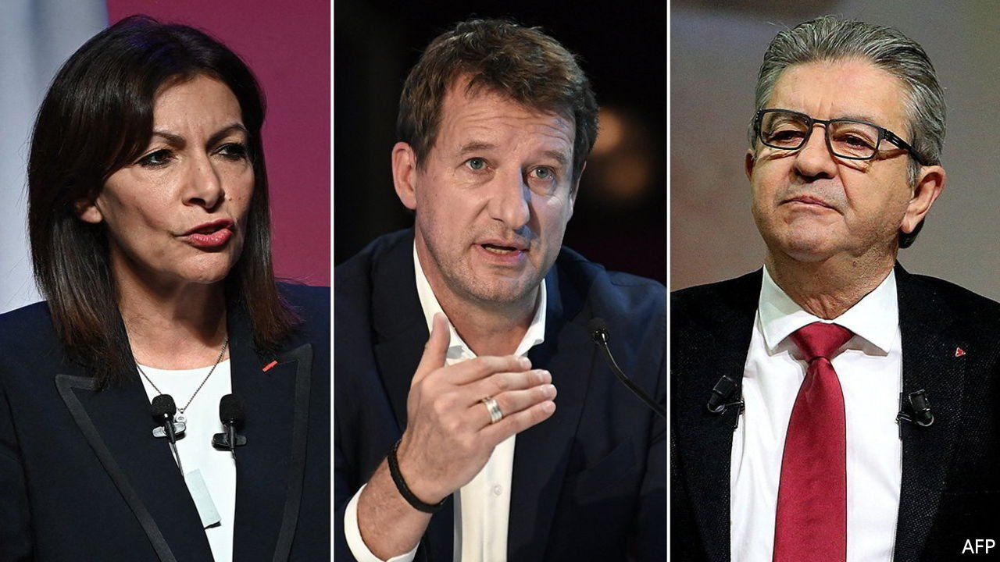
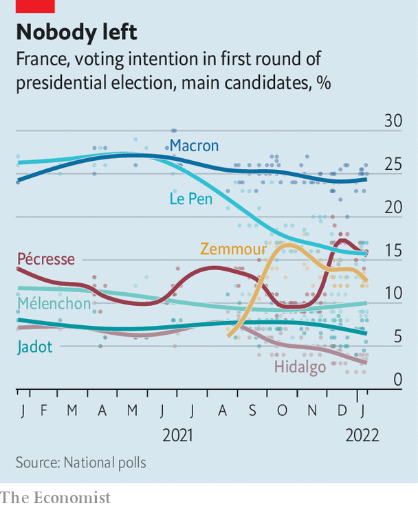

###### Unfashionably gauche

# The French left faces disaster in April’s presidential election 

##### The once mighty Socialists are now barely a blip 

 

> Jan 13th 2022 

ON THE ANNIVERSARY OF François Mitterrand’s death on January 8th Anne Hidalgo, the mayor of Paris, went in the driving rain to lay flowers at his grave. She was seeking “inspiration” from the late Socialist president, but it looked more like a requiem for the party’s current candidacy. Polls show Ms Hidalgo, the Socialists’ nominee, winning just 4% in the first round of the French presidential election in April. A result that bad would not only disqualify her from the run-off but fail to meet the 5% threshold for taxpayers to reimburse half of her campaign spending.

What has happened to the once mighty French left? Under the Fifth Republic, the grand old Socialist Party has provided two presidents (Mitterrand and François Hollande) and landmark social legislation, including the abolition of the death penalty in 1981 and the legalisation of gay marriage in 2013. A decade ago it controlled the presidency, both houses of parliament, and most regions and big cities. In Ms Hidalgo, it has an internationally respected mayor, praised for turning over swathes of central Paris to cyclists and joggers. The French Green party, with which the Socialists often govern, also has a presentable nominee, Yannick Jadot. Its big issue, climate change, is constantly in the news.


Yet neither Ms Hidalgo, nor Mr Jadot, nor any of the candidates further to the left—including Jean-Luc Mélenchon, a 70-year-old left-wing firebrand, and a clutch of other anti-capitalists and communists—currently stands any chance of reaching the final run-off.

 


The trouble for the French left is threefold. First, too many candidates have fragmented the vote. None seems to have the clout or the charisma needed to rally the others behind a single nominee. Ms Hidalgo had backed the idea of a “citizens’ primary” as a way to do this. Due to take place on January 27th-30th, this is a non-binding online vote proposed by 130,000 grass-roots supporters as a way to measure support for the different candidates, whether they like it or not. But Mr Jadot argues, reasonably enough, that he has already won his own party’s primary, and has no intention of heeding the result. Mr Mélenchon says all this is not his problem.

Second, the mainstream French left has lost the working class. Its base is now made up largely of city-dwellers and public-sector employees. This is too narrow to win national elections easily. In the past, Mitterrand deftly linked the Socialists to the French Communist Party to secure the blue-collar vote. Now the biggest slice of that vote goes to the nationalist Marine Le Pen: 33% of blue-collar workers back her for president, next to 3% for Ms Hidalgo. Such voters want a harder line on law and order. Cycling, one of Ms Hidalgo’s signature issues, may be popular in central Paris and Green-run cities such as Bordeaux. Elsewhere, voters depend on their cars and resent being made to feel guilty for it.

Third, France has shifted to the right. Today 37% of voters say they are on the right, up four points since 2017, next to 20% who say they are on the left, down five points in the same period. As a former economy minister in a Socialist government, Emmanuel Macron in 2017 drew from the moderate left to build his new centrist party when he ran for the presidency. Many such voters were subsequently disillusioned by his tax cuts for the rich, but since the pandemic they have grown less hostile, says Chloé Morin, a former Socialist adviser now at the Fondation Jean-Jaurès, a think-tank: “The weakness of the left means that voters on the centre-left are thinking that they might as well vote Macron to keep out the right and the far right.”

“I’m not giving up,” insists Ms Hidalgo, who argues that polls understate support on the left. She blames Mr Macron for de stabilising the party system. But some even within the Socialist Party think that the solution to their troubles lies with yet another potential candidate: Christiane Taubira, a popular former justice minister from French Guiana who is something of an icon on the left. She says she will run for the presidency if she wins the “citizens’ primary”. Unless some of the others then step aside, however, Ms Taubira’s candidacy will only fragment the vote further.

As candidates squabble over how to run for office, they are failing to tell the public what they would do if they win it. Yet France needs to grapple with big policy issues. These include how to integrate minorities, curb inequality and protect the poor from the burdens of the green transition, at a time when public spending has reached an exceptional 62% of GDP, the highest level in the EU. If the left has a future in France, this year’s candidates are doing a good job of disguising it. ■

