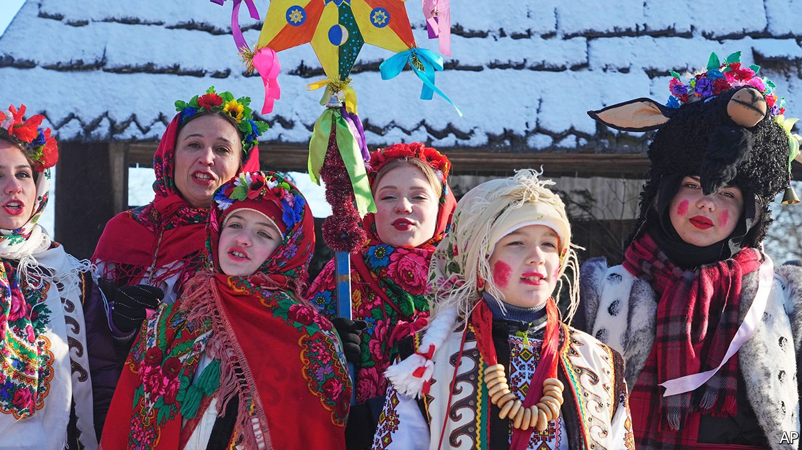

###### The geopolitics of December 25th

# Ukraine’s Orthodox Church may change the date of its Christmas 

##### Switching to the Western date is a snub to Russia 

 

> Jan 13th 2022 

AFTER RUSSIAN soldiers invaded their country in 2014, many Ukrainians began favouring Western holidays over ones associated with Russia. Women’s Day, an originally socialist holiday that took hold in Soviet times, has faded, while the American-made Mother’s Day is in vogue. As the snow piled up in Christmas markets in December, so did the evidence that Santa Claus was displacing the Soviet-era Ded Moroz (“Father Frost”) as the country’s pre-eminent bearded gift-bearer. Weightiest of all is the debate over when to celebrate Christmas itself. Epiphanius I, the head of Ukraine’s Orthodox Church, says he expects his congregants will favour switching from January 7th to December 25th within a decade.

Why is there an issue with the date of Ukrainian Orthodox Christmas? It began with Russian Orthodoxy’s attachment to the 2,000-year-old Julian calendar, which observes too many leap years. The Russian church never adopted the calendar devised in 1582 by Pope Gregory XIII, which skips three leap years every four centuries. When the Soviet state went Gregorian in 1918, the Russian church did not. The Julian calendar now runs 13 days behind, so Christmas falls on January 7th—through 2099; in 2100, when the world next omits a leap year, it will move to January 8th. But in 2019 Ukraine’s Orthodox Church sealed its autonomy from the Moscow Patriarchate. It can now decide when to jingle its bells.


Old Calendarists argue that switching would muck up the formula for calculating Easter, violating canonical texts. But it can be done, as shown by Orthodox churches in Greece, Romania and Albania, which use the Latin Christmas date. The Ukrainian state declared December 25th a public holiday in 2017, ostensibly for the sake of the country’s Catholics. But pushing too fast risks dividing Ukrainian society, splitting the church or pushing old-fashioned believers back towards Moscow.

In secular terms the idea has a cold logic. Since 2014 Ukraine has unravelled its economy from Russia’s to knit it together with the EU’s. It makes sense for countries to align their rhythms of work and rest with their closest foreign trading partners. That is what Saudi Arabia did in 2013 when it became the last Islamic country to ditch Thursday-Friday weekends. Religions do not need to be logical. But if Ukraine does break with its cherished habit, marking Christmas on a different day would emphasise that its divorce from Russia is truly final.

