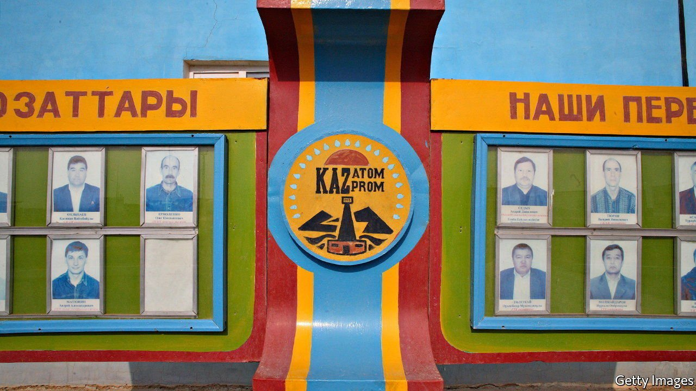

###### Atom and abroad

# The Kazakh crisis is only one threat hanging over the uranium market 

##### A global crunch in nuclear fuel is no longer impossible 

 

> Jan 15th 2022 

KAZAKHSTAN IS OFTEN called the Saudi Arabia of uranium. In fact its market share, at more than 40% of the world’s nuclear fuel, is not far off the share in the oil market of the Organisation of the Petroleum Exporting Countries and Russia combined. So when unrest, followed by harsh repression, shook the country early this month, buyers of the metal shuddered. Spot uranium prices jumped by 8% on January 5th alone, to $45 per pound, according to UxC, a data provider. With protests now quashed, the market has settled. Nevertheless, the commodity, which is often dubbed “yellowcake”, seems set for a turbulent decade.

The immediate impact of the Kazakh turmoil may be limited. Although the protests happened far away from uranium-producing regions, a small drop in global output is nevertheless likely. To extract uranium, Kazakhstan uses a method that involves pumping acid into the ground to dissolve the ore, recovering the solution and then using chemicals to separate out the metal. Disruptions to the shipping of compounds and equipment, because of stranded trains or communication problems, may have slowed operations.


Any shortfall may not matter much for now. Big buyers of uranium, such as China and France, which are heavy users of nuclear fuel, have several years’ worth of inventories. The most exposed utilities could borrow from foreign peers in case of immediate shortages, reckons Toktar Turbay of CRU, a consultancy. Most of them buy nuclear fuel using long-term contracts that largely insulate them from short-term jumps in the spot price. All of this creates a buffer against a squeeze.

Still, the events in Kazakhstan, which for decades was the world’s most stable uranium supplier, may eventually jolt buyers into guarding against the risk of relying too much on a single source. A day may come when the Kazakh government falls or state assets come under attack (Kazatomprom, the country’s sole uranium producer, is 75% owned by a sovereign fund). Some consumers are therefore looking to diversify their sources of supply. As Kazakhstan is the lowest-cost producer by far, that will mean paying a premium.

A rise in overall demand could lift prices further. From Belarus to Bangladesh, many emerging markets are going nuclear to help them decarbonise. China is planning 150 new reactors in the next 15 years. Even in the West, which has long been ambivalent towards nuclear energy, attitudes could change. The European Commission plans to class nuclear as green in its “taxonomy” for investors, which could direct funds towards new projects. NuScale, the first firm seeking to commercialise small, modular reactors to be approved by American regulators, is preparing to go public (via a merger with a special-purpose acquisition company).

Beyond the near term, supply may not be able to rise quickly enough to satisfy greater appetite for the metal, supporting prices further. New mines are planned in Africa and the Americas, but they require a price of at least $50-60 per pound of uranium to be profitable. If a rise in demand of 2% a year between now and 2030—a conservative estimate—is to be satisfied, then all of those projects will need to be up and running, says Tim Bergin of Calderwood Capital, a hedge fund. That may not be realistic. One such mine, in Canada, is under a lake; another involves freezing the ground up to 400 metres below the surface. The price of fissile fuel may become increasingly flammable. ■


