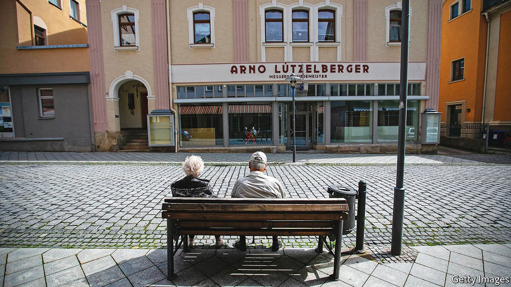

###### Aversion therapy

# The new government hopes to cure Germans’ distaste the stockmarket 

##### Plans include funding a small part of the public-pension scheme through stock investment 

 

> Jan 15th 2022 

THE 177-PAGE coalition agreement between Germany’s Social Democrats, Free Democrats (FDP) and the Greens contains grand plans to combat climate change and covid-19, and to speed up digitisation. Tucked away on page 73 is a more modest promise, to fund a small part of its public-pension scheme by investing in stocks. Reactions in Germany ranged from the apprehensive to the enraged. “Is our pension safe in stock?” fretted one news outlet. Another asked: “Are politicians gambling away our pension?”

As retirees live longer, Germany’s pension system, which was established in 1889 by Otto von Bismarck, is buckling. Workers and bosses together pay a “pension tax” of about 18% of a worker’s gross wage. This is meant to fund the roughly €300bn ($340bn, or about 9% of GDP) paid out in pensions each year. But shortfalls have meant that the government has had to subsidise the scheme, to the tune of €100bn last year. The problem is only set to get worse as more baby-boomers retire.


In order to help fix the problem, the liberal FDP has long supported a plan to reshape the pension scheme along Swedish lines. Sweden’s system consists of a standard pension, to which taxpayers contribute 16% of their gross income, and a supplemental “premium” pension, through which 2.5% of each taxpayer’s income is placed into a stock fund of their choosing. Should the taxpayer decide against active investment, the money is deposited instead in a state fund, which since 2003 has made an annual return of 9.9%.

The plan outlined in Germany’s coalition deal is far more modest. The government will funnel €10bn from its annual budget into a publicly managed pension fund, which will be invested in the stockmarket, and which may generate attractive returns. The principal itself accounts for only about ten days of pension payments, says Martin Werding of the Ruhr University Bochum, who conducted a feasibility study of the FDP’s proposal ahead of the election. But the party hopes it may only be a first step towards a “stock-and-bond covered pension system”.

The reaction to the government’s plan tells you much about Germans’ attitudes to capital markets. Studies indicate that they are “market-shy” and tend to overestimate the risks from investing. Only around a quarter of households own stocks. By contrast, more than half of all American households do so, much of it in the form of 401(k) retirement plans. This could in part reflect differences between the two countries’ tax systems. Germany imposes a higher tax rate—of 25%—on long-term capital gains, for instance.

Then there are Germany’s scars from the dotcom era. In 1996 Deutsche Telekom listed on the stockmarket. Germans headed to the market in droves; about 650,000 of the buyers of the newly issued stock were first-time punters. The share price soared seven-fold before crashing spectacularly in the early 2000s. The effects still linger. Those who held Deutsche Telekom shares or who might remember the crash are less likely to hold stocks even today, as are their children, suggests research published last year by the German Institute for Economic Research (DIW), a think-tank in Berlin. Even by 2020 the number of Germans investing in the stockmarket was still a shade below its 2001 level.

The FDP hopes that the planned changes to the pension scheme might increase Germans’ familiarity with stock investing. “The Swedes really aren’t known as turbo-capitalistic stock gamblers,” jokes Johannes Vogel, the party’s expert on pension politics. The coalition government also aims to make it easier for people to save for retirement outside their state pension. The tax-free personal allowance on capital gains will rise from €800 to €1,000 a year in 2023, and the coalition hopes to launch an inquiry into the creation of a Swedish-style public-investment fund.

These changes alone might do little to put the pension system on a sustainable footing and make pensioners better off. That, says Marcel Fratzscher of the DIW, would require a change to the state retirement age, as well as labour-market reforms. Nonetheless, he reckons, the plans provide a “glimmer of hope” that the government realises, at least, that the system needs reform. ■

