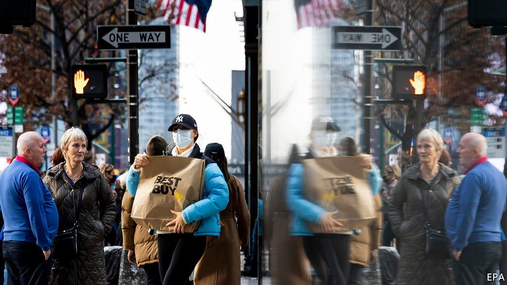
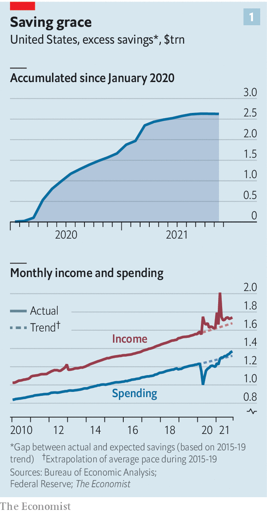
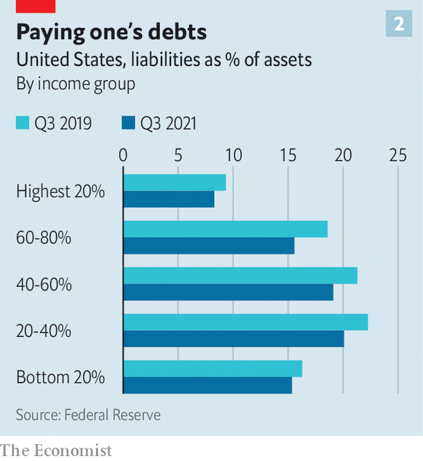

###### Life after stimmy

# Will Americans’ pandemic savings stash keep the economy rolling? 

##### The “stimmy” boost may linger even as policymakers wind down support 

 

> Jan 15th 2022 

This article has been updated with December's inflation figure

AMERICA’S FISCAL  during the pandemic has fuelled not just economic growth but also a lively hip-hop niche. Over the past two years musicians have released no fewer than 30 different songs referring to the government’s stimulus cheques, known as stimmies. “Yeah, check, I need a stimmy. S-T-I-double M-Y, tell ‘em gimme,” raps Curtis Roach in one snappy track. The video seems to confirm the worst fears about how the money was spent. Mr Roach fans himself with dollar bills and sprays them about at parties. But a closer listen reveals a conservative streak that would do fusty financial planners proud. “Generational wealth, that’s where it’s at…save a lil’ bit for the rainy days on yo’ back, never slack.”

The question of how Americans spent and, crucially, saved money over the past two years looms large over the economy today. In spring 2020, when millions lost their jobs overnight, a reasonable assumption was that personal finances would suffer. Instead, government handouts, from the stimmies to more generous unemployment benefits, propped up incomes. Moreover, as people stayed home, their spending fell well below normal levels.


The result was a piggy-bank boom. Americans have accumulated some $2.5trn in extra savings compared with the pre-covid trend (see chart 1). Higher-than-expected incomes account for two-thirds of the stockpile, while lower-than-expected expenditures explain the other third, according to calculations by The Economist.

 


This stash of cash could, in theory, provide a pillar for the economy over the coming year as policymakers withdraw support. With annual consumer-price inflation running at a four-decade high—it hit 7% in December—the Federal Reserve has signalled that it intends to  soon. Some economists expect as many as four rate increases this year. Fiscal policies are also becoming more parsimonious. Many of the benefit top-ups expired in the autumn. The Democratic Party’s  to pass President Joe Biden’s “Build Back Better” programme will lead to further retrenchment.

Will the extra savings blunt the impact of all this policy tightening? There are reasons to be sceptical. Were the $2.5trn shared equally across the country, it would amount to about $7,500 for every American—more than the combined total of the three rounds of stimulus cheques. In practice the distribution is far from equal. In the decade before covid-19 the wealthiest 1% of Americans had, in aggregate, about twice as much in cash and chequable bank deposits as the bottom 50%. The pandemic has skewed this further: the top 1% now has four times as much as the bottom half. Although the government directed its assistance towards poorer Americans, the ultra-rich reaped far greater rewards, thanks in large part to soaring asset prices.

That matters in trying to assess the potential impact of excess savings. The wealthy typically spend a low share of their incomes. The extra cash sitting in their hands is more likely to go towards investment accounts than grocery purchases.

Another dampener may be the nature of the economic recovery. In a paper last year Martin Beraja and Christian Wolf of the Massachusetts Institute of Technology showed that recoveries from recessions where falls in spending are concentrated on goods tend to be stronger than those with cuts concentrated on services. Pent-up demand for, say, smartphones can be released in a flood. By contrast, demand for beach holidays returns more slowly: vacationers can only be in one place at a time. This suggests that as the pandemic fades, the flow of savings into services such as travel and entertainment may be sluggish.

A final concern is high inflation. That eats into both wealth and incomes. Adjusted for rising prices, wage growth in America has turned sharply negative over the past half-year. Similarly, the real value of savings looks a bit less impressive given the reduction in purchasing power.

The story does not end there, though. Surveys by the Fed’s New York branch indicate that stimulus recipients saved about one-third of the cash and used another third to pay down debts. That helps explain why households’ balance-sheets are healthier today than before the pandemic, regardless of their level of income (see chart 2). They thus have scope to borrow and spend more.

 


This may already be happening. Consumer borrowing soared in November by $40bn, the most on record, as credit-card usage soared. Some observers saw that as a sign that households were strapped for cash. Alex Lin of Bank of America disagrees. “An increase in credit-card spending can be a function of greater re-engagement in the economy,” he says. “Americans like to use their credit cards to rack up points for travel or restaurants, and that is not necessarily a sign of danger.”

The damage from inflation may also prove tolerable, especially if the Fed’s tightening, plus supply-chain improvements, brings prices back under control. Wage growth has been stronger for those on lower incomes, the group most vulnerable to a reduction in real spending power. In November annual nominal wage growth for the bottom quartile of earners reached 5.1%, versus 2.7% for the top quartile, according to the Atlanta Fed.

As a whole, Americans saved about 6.9% of their incomes in November, less than the 7.4% average in the five years before the pandemic. Yet this is exactly what should be seen if some people are dipping into their excess savings. It is also a key reason why most forecasters think the economy will , a robust pace in the face of headwinds.

And that barely grapples with the changes that the extra cash enabled for many recipients. In another hip-hop track, Reneé the Entertainer sings of a woman who splurged on a buttock-augmentation procedure: “She spent the stimmy/on the booty/in Miami.” Reneé, whose real name is Mariah Pizarro, in fact put her money to what is arguably a more productive use. “I used them to get a more reliable vehicle,” she says. Although Ms Pizarro dreams of a music career, the car has for now facilitated a less glamorous occupation. It lets her drive to work at an Amazon warehouse. ■

For more expert analysis of the biggest stories in economics, business and markets, , our weekly newsletter.

