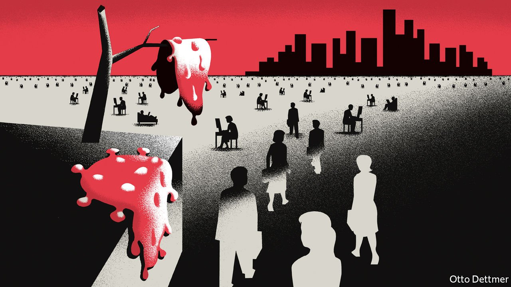

###### Free exchange

# Will remote work stick after the pandemic? 

##### Speakers at the American Economics Association’s annual pow-wow take a shot at the question 

 

> Jan 15th 2022 

BOSTON IS NOT the most popular of winter travel destinations. But many economists were nonetheless disappointed by the news that their profession’s grand annual meetings, scheduled to take place in the city in early January, would again be virtual. Greater experience with remote-conferencing technologies meant that events unfolded more smoothly than they did a year ago. That seemed appropriate for a conference dominated by speculation about how covid-19 might permanently alter the economy.

Many sessions were devoted to sketching out the probable features of the post-pandemic world. New habits are sticking—and economists have gathered the data to prove it. Take remote work. Jose Maria Barrero of the Instituto Tecnológico Autónomo de México presented results from research with Nicholas Bloom of Stanford University and Steven Davis of the University of Chicago. Since May 2020 the economists have conducted a monthly survey that, among other things, asks Americans about their plans to work remotely. A year ago, the results suggested that remote work would account for 20% of full-time hours after the pandemic.


Over the past year, however, remote work has gained favour. Based on the survey results from December, the researchers reckon that 28% of hours might ultimately be worked from home. Employees who were once undecided now say they might sometimes work from home, said Mr Barrero. And respondents who had always said they would toil remotely now plan to spend more time doing so. In all, about 15% of full-time workers are expected to be fully remote in future, and just under a third to work in a “hybrid” fashion—a dramatic change from before the pandemic, when just 5% of people laboured at home.

Remote work will persist because the experience of it has been better than expected, and because workers and firms have invested time and money (together estimated by Mr Barrero to be worth about 0.7% of America’s GDP) in improving it further. But new arrangements will also be driven by employees’ preferences. Though many workers look forward to returning to the office, a sizeable chunk—about 15%—say they would definitely or probably leave employers who do not offer remote options. This has created an opportunity for young firms to attract talent by hiring remotely, said Adam Ozimek of Upwork, a freelance-work platform.

As the opportunities to toil remotely have grown, people have become happier to move away from big, expensive cities. Mr Ozimek noted that research published early in the pandemic suggested that the most significant geographical impact of new working arrangements would be on the distribution of population within cities. Reductions in commuting time as a result of hybrid arrangements would produce a “doughnut effect” as people left city centres for distant suburbs. But analysis of more recent data suggests that moves between cities are increasingly significant. Places with high housing costs and a large share of workers in jobs that can be done remotely have experienced slower growth in house prices and rents than other areas. Whereas data from 2020 sent an ambiguous message about migration trends, figures for 2021 show clear outflows from high-cost places, like California.

Some parts of the world may face uncomfortable adjustments as a result, rather as deindustrialisation placed severe strains on parts of America and Europe in the 1970s and 1980s. Research presented at the conference by Conor Walsh of Columbia University noted that the economic burden of the pandemic fell hardest on less-skilled service workers in dense and expensive cities, who previously catered to the needs of skilled workers. A permanent exodus of white-collar professionals could leave some less-skilled workers trapped in places with declining job prospects.

A more remote future could yield some offsetting benefits, though. Studies of pockets of the economy suggest that pandemic-related shifts hold the potential for productivity gains. Emma Harrington of Princeton University discussed research showing that the productivity of workers at call-centres rose by 7.6% when work went remote, without a detectable decline in customer satisfaction. Dan Zeltzer of Tel Aviv University presented analysis of the shift to telemedicine in Israel, which showed that the utilisation of resources tended to rise and costs to decline, with little sign of more missed diagnoses or other negative health outcomes.

Virtually unrecognisable

Whether such gains will translate into a stronger macroeconomy is less clear. Janice Eberly of Northwestern University credited remote work with reducing the decline in GDP in early 2020 by nearly half relative to what it might otherwise have been. Yet although remote work might boost companies’ profits by lowering the costs of office space, and improve welfare by reducing commuting, she doubted that it was a fundamental enough shift to lead to enduring productivity gains. That chimed with other, more general fears about the post-pandemic economy. Catherine Mann of the Bank of England worried that business investment might prove insufficient, held back by uncertainty about growth prospects and uncompetitive markets. Though investment was strong in 2021, recent surveys show diminished appetite for capital spending, she noted, compared with share buybacks and mergers.

Larry Summers of Harvard University observed that, although central banks may struggle to control inflation in the short term, long-run growth is likely still to be restrained by the same headwinds, such as demographic change, that blew before covid-19. The upshot of the conference often seemed to be that although economies have done better during the pandemic than many people dared hope, they are likely to disappoint in its aftermath. But as participants from around the globe zoomed seamlessly from session to session, without having to visit an airport or queue up for coffee, one had to wonder whether such conclusions were not a touch too pessimistic. ■


