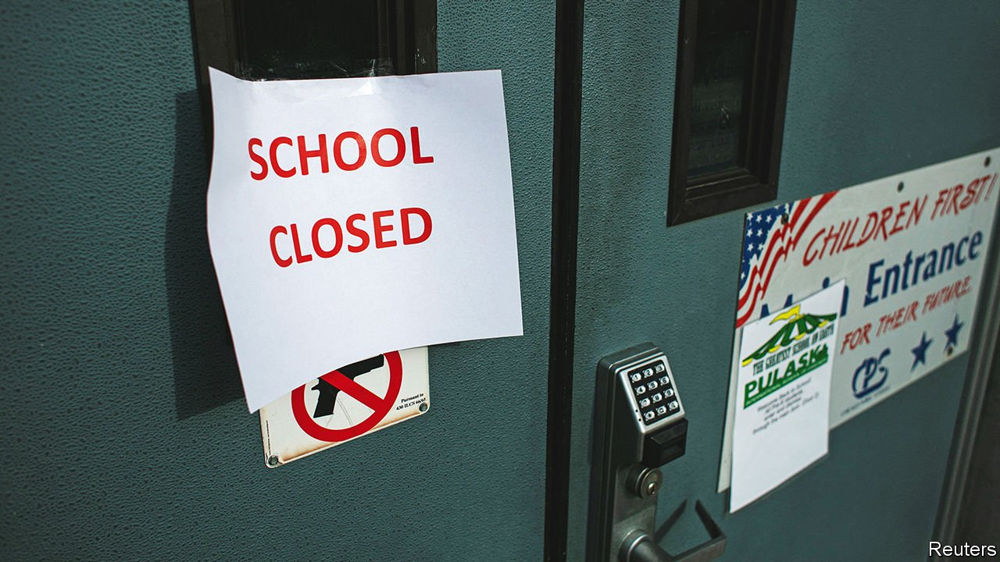

###### Poor students

# America has failed to learn from the safe opening of classrooms abroad 

##### Its children have lost more school days than peers in most rich countries 

 

> Jan 13th 2022 

OVER THE past two years America’s children have missed more time in the classroom than those in most of the rich world. School closures that began there in early 2020 dragged on until the summer of 2021. During that time the districts that stayed closed longest forced all or some of their children to learn remotely for twice as long as schools in Ireland, three times longer than schools in Spain and four times longer than in France.

In recent weeks American schools have started closing once again, as the Omicron variant of covid-19 has brought a fresh wave of infections. About 5,000, equivalent to roughly 5% of schools, were shut for part or all of the first week in January. Sometimes that was because , but other closures were pre-emptive. In Chi cago teachers refused to turn up between January 5th and 11th. Some staff in California urged healthy colleagues to call in sick. America’s shrill debates about schooling continue to set it apart. The new term met with much less fuss in England—even though the country had a higher national infection rate than America and has vaccinated fewer young children.


America’s bungling has several explanations. Whereas in Europe national or regional governments have decided when schools close and reopen, in America the choice has largely fallen to its 14,000 or so school districts. That has splintered the conversation about school closures into thousands of noisy arguments. Media coverage has not helped. A study in 2020 found that stories about school reopening run by big American news providers were much more negative in tone compared with similar stories abroad. Teachers’ unions have ignored encouraging findings from other countries, such as research suggesting that teachers in schools that had opened faced no greater risk of severe sickness than other professionals.

Defenders of America’s record claim that its schools are more crowded and poorer than those abroad. But many foreign educators envy America’s advantages. The federal government has earmarked around $200bn for schools since 2020. America was quicker than most countries to make vaccines available to all adults, and to offer jabs to children.

Some of those demanding fresh closures argue that Omicron brings new uncertainties, and that it would cost little for schools to shut their buildings for a while. Remote learning may be more effective than being in a classroom where lots of staff and students are absent, goes the thinking. But once schools have closed temporarily, they tend to stay shut longer than expected. Even short closures seem to depress children’s attendance after they reopen. Lots of children have no safer place to be than a classroom and many parents cannot work from home. Furthermore, without wider lockdowns that nobody is considering, school closures accomplish little, because youngsters continue to catch and pass on the virus, for example in child care, in shops, or while being looked after by relatives.

Remote teaching has harmed children’s learning, mental health and physical safety. America’s schools should be buoyed by early evidence suggesting that Omicron infections lead to less severe symptoms than other variants of covid (which are themselves mild in most children) and that vaccination still offers strong protection against serious illness.

Schools must continue to find ways of covering for quarantining teachers, such as pulling administrative staff into classrooms or inviting teachers back from retirement. When staff shortages are severe, it would be better to force only some year groups into remote learning before closing whole schools. Even then, schools should allow vulnerable children and those of key workers to remain in the building. That has been common in Europe, but far from standard in America. Children have little to gain from school closures and much to lose. Teachers’ unions should stop dumping the pandemic’s costs on them. ■

