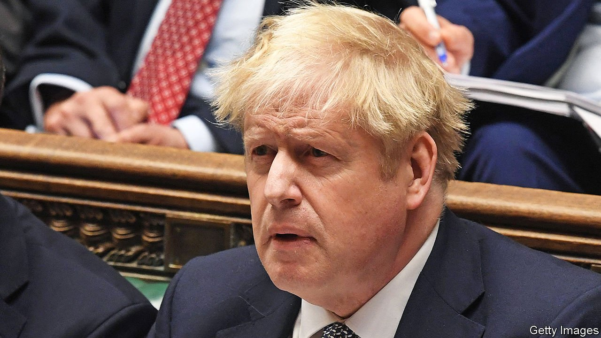

###### Party animal

# Boris Johnson has always been unfit to be prime minister 

##### With him in office, Britain can expect a rough ride 

 

> Jan 15th 2022 

MEMBERS OF PARLIAMENT shared their own and their constituents’ tragic stories: separation from loved ones in their final hours; illnesses suffered in solitude; mourning alone at gravesides. On January 12th, after days of junior ministers being shoved in front of microphones to defend the indefensible, Boris Johnson at last apologised to Parliament. What brought him to this point was the latest in a string of lockdown breaches by the prime minister and his allies:  in the garden of Number 10. It was held on May 20th 2020, when Britons could go out only for essential work and solitary exercise; or to meet just one person, socially distanced and outdoors.

Mr Johnson’s apology was carefully worded to suggest that, monk-like and ascetic, he never comprehended that the braying throngs knocking back bucketloads of booze in his garden constituted a party rather than work. And isn’t fresh air a good way to limit infections? After he spoke, one opposition MP after another pressed him to resign. To each Mr Johnson repeated that he commiserated with the suffering, regretted his misjudgment, wished things had been otherwise and advised everyone to wait for the findings of an inquiry.


Nothing in Mr Johnson’s public or professional life suggests that the burden of conscience will trouble him enough for him to . Some furious Tory MPs have called publicly for him to go. However, although many must be frightened of paying the price at the ballot box for his hypocrisy and selfishness, the party is still quite a way from engineering a vote to replace him. Yet the country needs him gone—and not just because he has misled the House of Commons and flouted his own government’s rules, but because Britain is about to face a tumultuous period, and with a weak, unpopular leader, it is ill-placed to thrive.

After two pandemic-battered years, . Every country’s health-care system is creaking, but the NHS, which is poorly managed and short of capacity, is close to collapse. Before the next general election waiting-lists for treatments could reach 13m, or one Briton in five.

Inflation is also a problem, because of Brexit-induced labour shortages and trade frictions. Household energy bills are expected to rise in the next few months by 50%. On top of all that, payroll taxes are due to increase by 1.25 percentage points. Britain is not alone in suffering from blocked supply chains and higher energy prices. Other countries also need to raise taxes to pay for an ageing population. But the pain will be worse than elsewhere because of past policy mistakes, including a poorly designed and unstable retail-energy market, as well as underfunded social care. All this adds up to a cost-of-living squeeze that will be greater than most Britons have seen in their adult lives.

It is too late to avoid much of this. But a good leader could soften the blows, lift spirits and plan for better. Mr Johnson is the opposite of what is required. Voters chose him in 2019 because the alternative, Jeremy Corbyn, was far-left, anti-Semitic and chaotic, and because Mr Johnson promised to leave the European Union. But above all they thought he was a welcome change from the divisions presided over by the uncharismatic Theresa May. Here was someone who would help Britons remember the fight over Brexit as a jolly good jape. His fellow MPs neither liked nor trusted him, but thought he was an election-winner.

Two years later, Mr Johnson looks cynical and heartless—and an electoral liability. Ministers are staying away from Parliament, or keeping silent. Backbenchers are turning from national questions to focus on their pet obsessions or saving their seats. Even the appearance of consensus within the party is starting to fracture, as MPs in safe seats in prosperous areas pull in one direction and those from poorer constituencies that voted Labour until Brexit pull in another. Would-be candidates for the top job are plotting and posturing. Since they include Rishi Sunak, the chancellor, and Liz Truss, the foreign secretary, the chaos will consume the great offices of state.

Meanwhile, a country that ripped up its constitutional order to pursue the dream of Brexit lacks a government with the will, discipline, direction and power to chart a new course. Festering problems, such as Britain’s worsening relations with the EU and tensions in Northern Ireland, will go unresolved. Long-promised and urgently needed legislation, including planning reform and measures to boost growth outside London, will be delayed and watered down, and will ultimately stall. Britain chose a party animal for its leader. Now comes the hangover. ■

For coverage of matters relating to Brexit, visit our 


