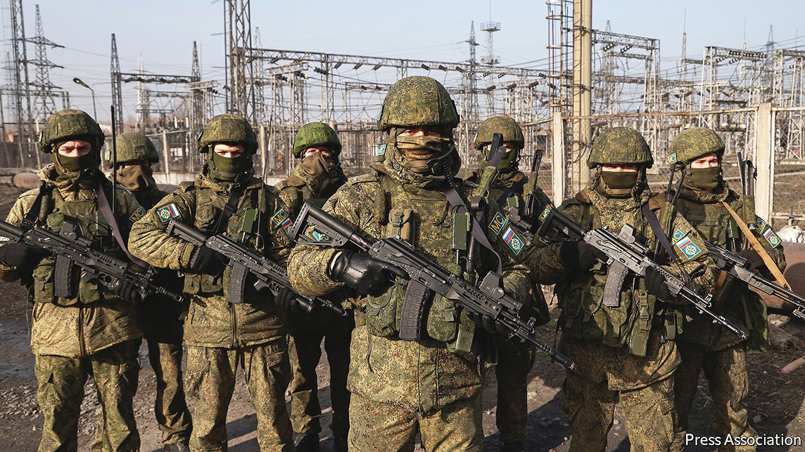

###### Standemonium

# Central Asia will remain unstable, however many troops Russia sends 

##### Events in Kazakhstan are not what they seem 

 

> Jan 15th 2022 

ANOTHER WEEK, another setback for freedom and democracy in the former Soviet Union—and another show of force from Vladimir Putin, Russia’s president. That is one way to read recent events in Kazakhstan, and there is some truth to it.

When gripes about rising fuel prices escalated into broader protests against a corrupt autocracy, and then erupted into mob attacks on government buildings, the authorities violently suppressed the unrest. They not only ordered the security services to shoot rioters without warning, but also turned to Russia, allowing Mr Putin to send in a squad of paratroopers to help restore order. The rights of ordinary Kazakhs, already circumscribed, have been ferociously trampled, and Mr Putin has once again affirmed his status as the region’s kingpin. He even crowed that he would not allow any more “colour revolutions” in the former Soviet Union, meaning that he would make sure corrupt and repressive governments were always able to crush peaceful protests by exasperated citizens.


But that account is misleading. True, an authoritarian regime has clung to power by force, and Mr Putin has asserted Russia’s primacy in its near abroad. But that disguises how the upheaval turned into a power struggle among the country’s elites. Until this week Kazakhstan’s president, Kassym-Zhomart Tokayev, was seen as a mere placeman, installed to defend the system built by his long-serving predecessor, Nursultan Nazarbayev. It was Mr Nazarbayev whom the chanting demonstrators denounced, and it is Mr Nazarbayev who has been most obviously weakened by the turmoil. His allies have been accused of hijacking the protests for their own ends, and sacked from senior government jobs; he himself was removed as chairman of the powerful national-security council. It is just about possible that the mildly reformist Mr Tokayev might now find himself freer to clean up the crooked state Mr Nazarbayev bequeathed him.

By the same token, although Mr Putin is doubtless flattered to be asked to pose as kingmaker, Kazakhstan and indeed all of Central Asia are much more likely to be a source of problems for him than of prestige. For one thing, there had been speculation that he might eventually try to emulate Mr Nazarbayev and craft a form of retirement that would protect his interests and those of his cronies. Mr Nazarbayev’s troubles suggest that will be hard.

What is more, the internecine battles among the Kazakh elite hint at how unmanageable Central Asia is. The region is a fissiparous one, with many languages and ethnicities, all jumbled up in a whorl of arbitrary Soviet boundaries. Although most of Central Asia’s 75m people are at least nominally Muslim, their governments are largely secular, and afraid that the pious might rally against them.

For all their considerable differences, the five Central Asian countries depend on exports of commodities and labourers, with the wild economic swings and entrenched corruption that these things so often bring. All are plagued by mafias of one sort or another. And all are run by authoritarian regimes of widely varying degrees of . The tarnished transition from Mr Nazarbayev to Mr Tokayev is about as close as the region has come to a peaceful handover of power.

Many Central Asian states are crying out for better rulers, regardless of Mr Putin’s misgivings. The madcap dictator of Turkmenistan, Gurbanguly Berdymukhamedov, ordered dark cars removed from the streets of the capital because he considers white a lucky colour. He spends his country’s dwindling revenues from oil and gas on white elephants, while staple foods run short. Kyrgyzstan’s president, Sadyr Japarov, was serving a prison sentence for kidnapping until 2020, when a mob freed him and propelled him to power. Emomali Rahmon, Tajikistan’s leader, styles himself “founder of peace and national unity, leader of the nation” and is grooming his son to succeed him.

The good news is that change is possible. Since taking over from a textbook strongman in 2016, the president of Uzbekistan, Shavkat Mirziyoyev, although no democrat, has abolished slave labour, allowed ordinary citizens more personal freedom and tried to modernise the economy. There were hopes that, under Mr Tokayev, the comparatively outward-looking Kazakhstan would follow suit—as it still might. China has poured money into infrastructure, including pipelines, leaving Central Asia less dependent on Russia, at least economically. But popular resentment at China’s internment of Muslims in nearby Xinjiang makes close ties awkward.

The more that other countries are involved in the region, the easier it will be for Central Asian governments to stand alone. The West should certainly not write the ’Stans off, not only because they occupy a strategic spot, between China and Russia, and are a source of commodities, such as uranium. More important still, Western involvement could help the regions’ modernisers gain the upper hand over the autocrats. That would be good for Central Asia and the world, if not for Mr Putin. ■

