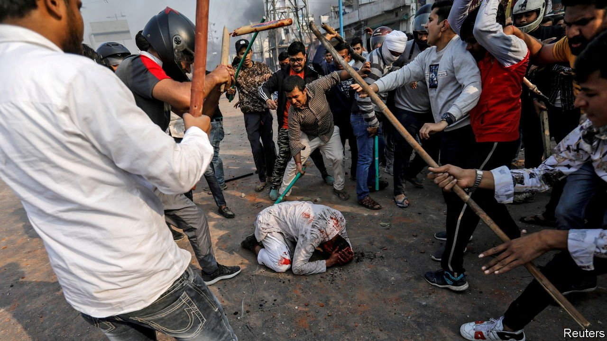

###### Indiacitement

# Hindu bigots are openly urging Indians to murder Muslims 

##### And the ruling party does nothing to stop them 

 

> Jan 15th 2022 

“ALL HINDUS must pick up weapons and conduct a cleanliness drive,” bellowed a Hindu priest at a three-day “religious parliament” in north India last month. Another speaker fired up the large crowd even more crudely: “If a hundred of us become soldiers and kill two million of them, we will be victorious.” By “them”, she meant India’s 200m Muslims.

Those priests baying for blood are not isolated bigots. Under the Hindu-nationalist government of Narendra Modi, the world’s most populous democracy has seen a . In Gurgaon, a satellite city of Delhi, Muslims have been denied the use of open space to pray because it “offends sentiments”. They have also been denied permission to build mosques. Elsewhere Muslims accused of transporting cattle for slaughter, or of being in possession of beef, are sometimes lynched. Muslim businesses are boycotted. In recent months young Hindu radicals have persecuted high-profile Muslim women by creating apps to “auction” them off.


Muslims are not the only target of Hindu chauvinism. In Varanasi, a Hindu temple town, posters warn non-Hindus to stay away. Attacks on Christians, a tiny minority, have risen in recent years. Last week, after Mr Modi, the prime minister, was briefly delayed on an overpass in Sikh-majority Punjab, people associated with his ruling Bharatiya Janata Party (BJP) warned darkly of a repeat of 1984, when thousands of Sikhs were killed in pogroms after the assassination of Indira Gandhi by her Sikh bodyguards. In an index of societal discrimination against minorities compiled by Bar Ilan University in Israel, India scores worse than Saudi Arabia and no better than Iran. It is impossible to know the number of hate crimes in the country: independent trackers were shut down in 2017 and 2019, and the government stopped collecting data in 2017.

Another reason to worry is the silence of the government. From the prime minister downwards, no senior figure has condemned the drumbeat of incitement. When asked about it by the BBC, one BJP politician ripped off his microphone and stomped off. Academics, bureaucrats and retired army officers have sent anxious pleas to Mr Modi to appeal for calm. Yet only one unimportant official—the vice-president—has spoken up.

With big elections due next month, the mood could grow even more fissile. Senior BJP officials stop short of urging people to kill minorities, but they do incite hatred. Yogi Adityanath, the Hindu-nationalist chief minister of Uttar Pradesh, India’s biggest state, declared that the vote was about the 80% against the 20%—that is, Hindus against Muslims.

Some pundits fear the BJP is resorting to divisive rhetoric because it can no longer rely on divisive promises, such as stripping the Muslim-majority former state of Jammu and Kashmir of its special status and starting work on a temple where a mosque once stood in the holy city of Ayodhya. Having honoured those commitments, it needs something new. And with the economy battered by the pandemic, a hostile China poking at the border and slim prospects for the millions who join the labour force every year, it is succumbing to its worst instincts.

The Indian government should realise that by pumping up the ridiculous notion that India’s 300m or so non-Hindus represent a threat to the 1.1bn majority, it is unleashing forces that may become uncontrollable. Sectarian bloodshed can generate a momentum of its own. India has suffered enough in the past for the risks to be obvious: hundreds of thousands died during its post-colonial partition, possibly more. Subsequent decades have seen episodic pogroms. But until recently, although rogue politicians often stirred up hatred for electoral advantage, the secular state mostly acted as a restraint. No longer.

The West, distracted by Russia and China, has paid little attention. Yet a stable, democratic India would be a counterweight to authoritarian China. A Hindu chauvinist India would not only be nastier for its inhabitants; it could also spread instability, prone to even worse relations with its Muslim neighbours. India’s friends, starting with America, should use their influence to persuade Mr Modi and his acolytes to check the spread of hate before it explodes into widespread violence. Mr Modi should want to prevent such a calamity, too. Does he? ■

