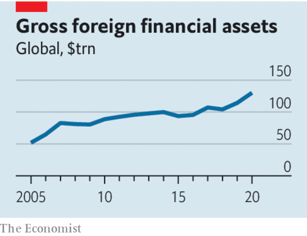

###### Financial risk

# The worry about cross-border capital flows 

##### They are growing fast and they pose a threat to stability 

 

> Jan 13th 2022 

WHEN GLOBALISATION was at its zenith, huge rewards flowed to those who squeezed out redundancies in the world’s supply chains. Only when the pandemic struck—when lockdowns in Asia threatened the supply of goods to the world—was it clear how fragile the system could be. The world’s financial supply chains are just as crucial, but even less well understood. A similar shock may lie in store.

Since the global financial crisis, flows of capital across borders have risen unabated. In 2020 the stock of cross-border financial assets reached $130trn, an increase of almost 60% since 2007. Measured relative to world GDP, at 153%, they now exceed the peak just before Lehman Brothers collapsed.


As the , so its character has changed. Many European countries’ share of the total has fallen, while Asia’s share has rapidly increased. Emerging markets are slightly more important, too. The world’s largest banks are smaller, better capitalised and less international than they were. Cross-border bank lending was $34.6trn at the end of June, a fraction above its peak in 2008. By contrast, market-based finance has grown hugely. Insurers, pension funds and a range of stodgy financial intermediaries have become big international investors in their own right. One example is an alliance formed in 2020 between Algemene Pensioen Groep and National Pension Service, the largest pension funds in the Netherlands and South Korea respectively, which has invested in a Portuguese toll-road provider and Australian student housing.

 


Just as supply chains are a source of efficiency, so cross-border investment matches investors from one part of the world who have capital to spare with investors in another who are eager to put it to work. The benefits spill over into jobs and development. Everyone gains.

But there are dangers. Foreign investors, especially staid institutions, may not understand how much risk they are taking on. High-yield bonds offer lower returns today than ten-year Treasuries did before the financial crisis. That has sent firms in search of higher returns into more risky, illiquid and opaque assets. In economies with more savings than local investment opportunities, that often means heading overseas where investments are less certain and less well understood. Before the financial crisis, several German banks lost money when structured credit in America soured in 2007.

Outside observers are no clearer about the risk than investors. Information on cross-border banking is extensive, partly because the Bank for International Settlements (BIS), which supports central banks, has collected data on international claims and liabilities for traditional lenders since 1963. However, disclosure for other financial institutions is limited. By definition, cross-border investments involve issuers covered by regulators in one country and buyers covered by regulators in another. Often, nobody has a grasp of the risks. You can tell that the value of global portfolio investment has soared, but not precisely where it is invested or by whom.

Some investors will not properly gauge the risk of default. Others will overestimate the liquidity of their investment or how it is exposed to currency fluctuations. One potential example is the Formosa bond market, in which international companies sell debt denominated in a range of currencies to Taiwanese life insurers. Around $200bn in bonds is outstanding, a total that has more than doubled in the past five years. Because there has been a lot of financial engineering, the debt is hard to price.

In March 2020 investors caught a glimpse of the dangers that may lie ahead. During turbulence in dollar-funding markets, large institutions in Asia exacerbated the squeeze by stampeding to cover their exposures. Regulators are alive to the threat. In December the BIS warned about the opaque activities of non-bank financial institutions in currency markets. The Financial Stability Board, a group of regulators, has also recently called for a better understanding of the systemic risks. Whether investors are sufficiently cautious is more doubtful. ■

