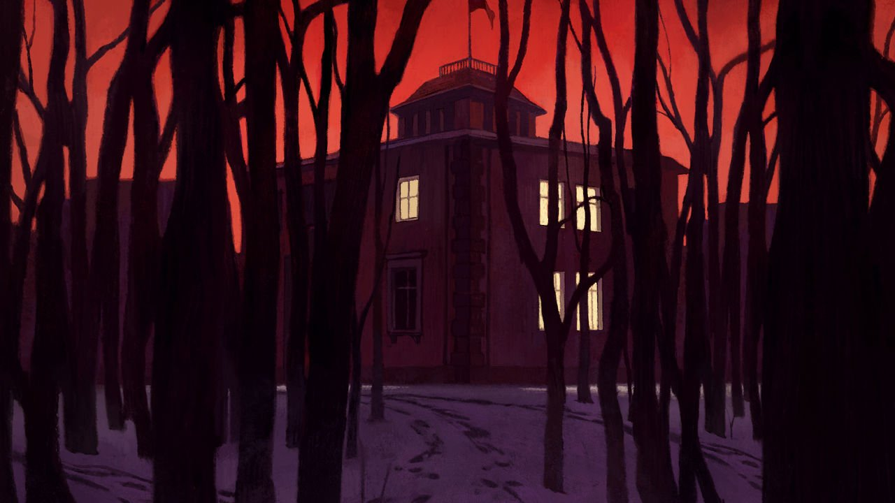

###### On the Republicans, Ukraine, gaming, running with bulls, corrugated iron, doors

# Letters to the editor 

##### A selection of correspondence 

 

> Jan 15th 2022 


Wither the centre ground

Far too few Republicans are prepared to stand up for the sensible and staid party it once was, known for its belief in free markets and private enterprise (“”, January 1st). Donald Trump may have no true convictions at all and so he’s happy to promote the Republicans’ new focus: the protection of personal liberties, a category that has broadened to include the right to threaten the well-being of the vulnerable, as in the belligerent behaviour of anti-vaxxers. To its great shame, the party also tolerates political viciousness, as well as the poisonous notion that the government is engaged in a “purge” of “patriots”, otherwise known as voters who can’t accept a loss with grace.


When, every so often, Democrats claim that moderate Republicans are extinct, I pipe up and say, “Still here.” But it does appear now that the party has decided we are expendable. If they cared to retain our support, the leadership would have the courage to risk dispatching the bully in our midst, demand that he stop sabotaging the campaigns of the centre-right candidates who are most palatable to voters, and tell him point blank that the party can no longer afford the ongoing damage his continued insistence on a stolen election has done the Republican brand.

MARGARET MCGIRR

Greenwich, Connecticut

If it is correct to call the storming of the Capitol on January 6th 2021 an “insurrection”, then why has no one arrested in connection with those events been charged with insurrection, which is, after all, a federal crime under the United States Code?

HUGH MYERS

St Albans, Hertfordshire

One of the fastest-growing electoral reforms in America is the use of ranked-choice voting. By allowing voters to rank their preferences, their vote is not split among similar candidates. Ranked choice has support from moderates in both American parties. It has enabled centrist Republican senators in Alaska and Maine to stand up to Mr Trump without the fear of being deselected at the next election. Glenn Youngkin, whom you described as a “country club” Republican, was selected as the party’s candidate for governor of Virginia using a ranked-choice vote at a statewide convention. More elections should use RCV.

KATHRINE SANTOS

Executive member

Liberal Democrats for Electoral Reform

London

 


Killing by starvation

Another vital ingredient in Ukraine’s vote for independence from Russia (“”, December 18th) is the lasting memories of the death by hunger of at least 3m Ukrainian peasants from Joseph Stalin’s brutal collectivisation of agriculture in 1933. Rare is the Ukrainian family without a relative or acquaintance whose grandparents perished in the Great Famine, the Holodomor.

Some quarter of a million ethnic Poles, at the time also citizens of Soviet Ukraine, were likewise liquidated by order of Stalin. Hardly a recommendation for reviving the historical links between Ukraine and Russia.

LESLIE COLITT

Berlin

 


Improving gaming data

A focus on data from the video-game industry will not be enough to understand whether excessive gaming can become addictive (“”, January 1st). We recently developed the Smart Gaming campaign in partnership with the Electronic Sports League, and have conducted the largest survey on gaming disorder to date. From our standpoint, functional impairment experienced by gamers is a key feature of gaming disorder (now recognised by the World Health Organisation). However, how can functional impairments be understood from gaming data alone? Time spent gaming is not a sufficient predictor to diagnose the disorder.

We agree that it is important to understand how A/B testing of different game-design elements impacts on play time and other objective play variables, but this needs to be understood within a larger framework for studying the well-being of gamers. Hence, such industry data needs to be combined with self-reported data provided by gamers. Finally, independent scientists should not only have access to such industry data, but be able to conduct studies on the many existing online platforms. This would enhance our knowledge of the associations between well-being and gaming, and also the potential links between well-being and social-media use.

PROFESSOR CHRISTIAN MONTAG

Department of Molecular Psychology

Ulm University

Ulm, Germany

HALLEY PONTES

Department of Organisational Psychology

Birkbeck, University of London

 


No place to hide

There are few places one can passively view “controlled panic” than the streets of Pamplona during the running of the bulls. However, I do not see a need to widen the town’s streets (“”, December 11th). I worked as a film producer in Pamplona for six consecutive years filming with a crew. We worked in and around the “panic zone”, every morning for seven days.

During the filming we had to contend with panicked people climbing up and over, onto our equipment and colliding with our gear and crew. We tried many ways to steer them clear. What we learned was that when humans become panicked you cannot stop them, but you can steer them effectively by simple gestures and shouts to redirect their path. We successfully deployed a crew member to each position who would shout, “Run!” and point away from the camera and this worked beautifully.

You can’t beat the panic but you can direct it. Rather than bulldozing streets to create more space, it would be far easier to just install large signs showing an arrow and the words “Run” or “Escape”.

JONATHAN KITZEN

Vancouver

 


Pitter-patter

When I lived in Darwin the sound of the monsoon rains on corrugated iron was a happy sound (“”, December 18th). Corrugated iron is the roofing material of choice in Australia’s Northern Territory. Because of the intensity of the rains most houses don’t have eaves or gutters. Instead the roof extends a metre or so outside the wall, so when it rains the corrugated channels simply funnel the water away from the sides of the house, much like the function of gargoyles on a Gothic cathedral.

JOHN SHIELD

Gladstone, Australia

 


The doors of perception

“” (December 18th) told us that many “of the institutions and attitudes that brought stability in the old world look ill-suited to the new. The pandemic is like a doorway. Once you pass through, there is no going back.” This intriguing view of doorways must complicate The Economist's commute. But I've often gone back through doorways (most of them, in fact). Perhaps there is hope?

MATTHEW DRAPER

Charlottesville, Virginia

