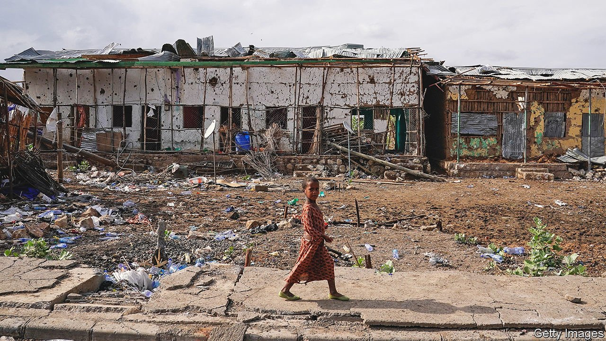

###### Happy Christmas, war is over?

# Ethiopia promises peace but keeps bombing rebels and civilians 

##### Prime Minister Abiy Ahmed’s actions belie his words 

 

> Jan 15th 2022 

THE MOOD at the international airport in Addis Ababa, Ethiopia’s capital, is strikingly upbeat. In recent weeks arriving passengers have been met by smiling dancers and patriotic music. Garlands of flowers and bright yellow carpets adorn the arrivals hall. Banners proclaim the “Great Ethiopian Homecoming”, a state-sponsored effort to convince Ethiopians living abroad to come home for the holidays (Ethiopians celebrated Christmas on January 7th). Echoing John Lennon, the state’s Christmas greetings come with an implied message: war is over.

Ethiopia’s civil war has certainly cooled down. In late 2021 rebels from the northern region of Tigray were on the brink of storming the capital and toppling the government of Abiy Ahmed, the prime minister. Abiy declared a state of emergency and called on residents to fight. Embassies evacuated staff and urged their citizens to leave. But in a matter of weeks the Ethiopian army pushed the rebels into retreat. Tigray’s ruling party, the Tigrayan People’s Liberation Front (TPLF), asked for a ceasefire. Though fighting continues on several fronts, Abiy has declared victory.


Before the war Abiy was known as a peacemaker. He won a Nobel prize in 2019 for ending hostilities with neighbouring Eritrea, and was praised for helping to mediate a power-sharing deal in Sudan. Ethiopia’s year-long civil war, during which the army and its allies have committed war crimes, has damaged that reputation. Now Abiy is hoping to mend it. First his government announced that the army would not seek to reoccupy Tigray. Instead he urged Tigrayans to fight the TPLF. Then, on Ethiopian Christmas, he freed several opposition leaders from prison, including Jawar Mohammed, his chief rival from the Oromo ethnic group, and six TPLF officials.

The prime minister described the move as an act of victor’s mercy, saying that it was necessary for Ethiopia to break the cycle of war. The government wants freed opposition leaders to take part in a so-called “national dialogue”, which is to weigh matters such as the country’s controversial system of ethnically based federalism.

But they are unlikely to do so just yet. “As it is, the intended national dialogue can be neither inclusive nor impartial,” says Jawar’s ally, Merera Gudina. Other powerful Oromo opposition figures, such as Dawud Ibsa, leader of the Oromo Liberation Front (OLF), remain in custody. The OLF’s armed wing is deemed a terrorist group by the government and is therefore excluded from talks, too.

An even bigger challenge is the TPLF, which the government also calls a terrorist group. Officially it will not be invited to the dialogue. But it is possible that the government may want to start separate peace talks with it. An internal document prepared by the ruling party and seen by The Economist did not rule this out. “There was a clear suggestion that we should be talking to them,” says a senior ruling party official who attended the meeting at which the paper was discussed.

It would be a controversial move. The release of TPLF officials from prison sparked an uproar, especially among Abiy’s allies in Amhara, the second most populous region and the focus of fighting in recent months. The National Movement of Amhara, an opposition party, called the release a “historic mistake”. Negotiation with the TPLF would probably provoke even more anger. “How can we talk with people who are still waging war?” asks an Amhara ruling-party parliamentarian. Many would prefer the government to lay siege to Tigray until its leaders surrender.

That still looks like the plan. No aid of any kind has entered Tigray since mid-December and almost no medicine has been allowed in since June. “Our hospital is out of supplies,” says a doctor at Tigray’s largest one. After more than a year of war some 400,000 people are starving and millions more are running out of food. Drones and fighter jets, meanwhile, pound Tigrayans from the air. On January 8th at least 56 people were reportedly killed in an air strike on a camp for internally displaced people, prompting aid agencies to suspend their work. If Abiy is serious about giving peace a chance, he should first stop fighting. ■

