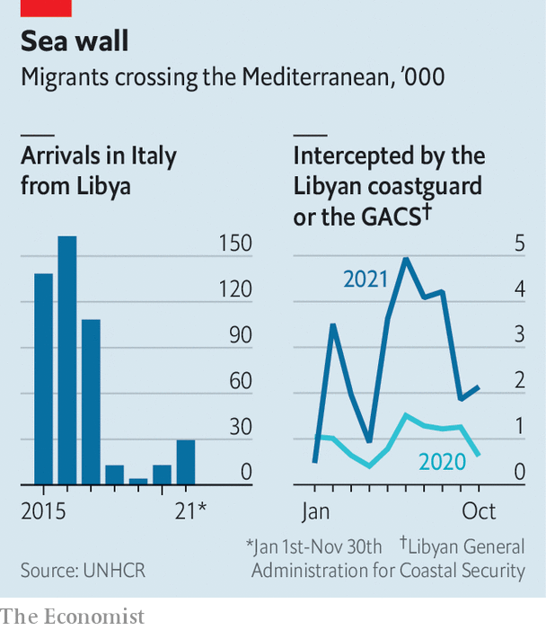
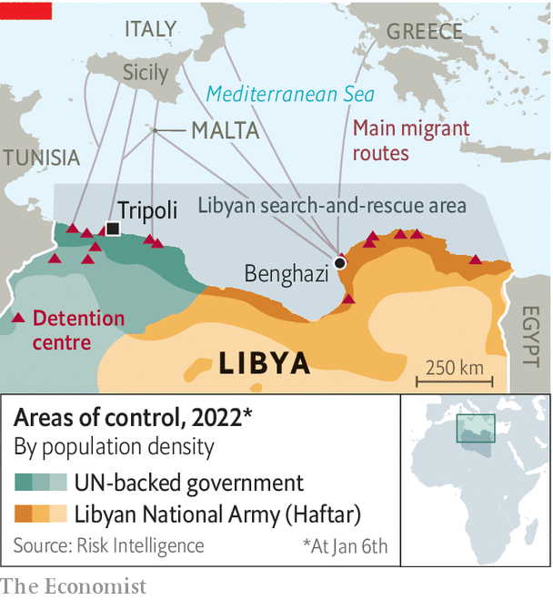

###### An EU-funded horror story

# Europe is bankrolling a force that routinely abuses African migrants 

##### Libya’s coastguard is not known for its professionalism 

 

> Jan 15th 2022 

THE JOURNEY of the Geo Barents was a long, tense stand-off punctuated by moments of frantic effort. For weeks the ship, operated by Médecins Sans Frontières (MSF), a French-founded medical charity, bobbed in international waters off Libya’s Mediterranean coast. Its crew watched for boats full of migrants—as did patrols run by Libya’s coastguard, which has threatened aid-workers who try to stage rescues. From time to time, the radio would crackle with warnings. “You have to sail away from this zone,” coastguard officials would say. “Otherwise immigrants will see you and sail towards you.”

When they spotted a migrant boat, both parties would rush to reach it first. For a few days, the Libyans won the race. With the help of drones and manned planes circling overhead, the coastguard caught four rafts carrying migrants. After a week, though, the MSF crew picked off one boat after another. Soon more than 300 migrants occupied every inch of the ship’s decks: Senegalese, Sudanese, Syrians—many with horror stories of their time in Libya, which they shared with the Outlaw Ocean Project, a non-profit journalism organisation with which The Economist collaborated on this story.


Since at least 2017 the European Union, led by Italy, has  to serve as a proxy maritime force. Migrants who reach Europe have legal protections, and aid-workers and journalists to highlight their plight. By working with the Libyans, the EU has in effect shifted its border controls hundreds of kilometres south of the actual border, to a place where no such niceties apply.

If the goal is simply to keep migrants off European shores, the effort has been a success.  by the Libyans (see chart). The number of people reaching Italy by sea fell by 44% from 2017 to 2021, according to the International Organisation for Migration (IOM), a UN body.

 


For the migrants themselves, though, European policy has been a disaster. The crossing itself has become more dangerous. One measure of that danger, comparing estimated deaths with attempted crossings, increased from one per 50 people trying to cross in 2015 to one in 20 in 2019. Another metric, which uses arrivals in Europe instead of attempted crossings, climbed four-fold. Tens of thousands of migrants who cannot reach Europe are trapped in squalid detention camps in Libya, subject to torture, forced labour and extortion by their jailers. The EU admits it has little control over its partners—and yet continues to pour money into the scheme.

Libya has long been a jumping-off point for migrants eager to reach Europe. Muammar Qaddafi, the late Libyan dictator, used this to blackmail his European neighbours. In 2010 he demanded €5bn ($6.4bn at the time) from the EU to stop migrants from crossing the sea. The alternative, he warned, was a “black” Europe. But Qaddafi would not live long enough to collect this extortion payment. He was booted from power the following year, in a revolution backed by NATO and several Arab states, and subsequently killed by militiamen.

The revolution plunged Libya into a period of chaos from which it has yet to emerge. The militias that overthrew Qaddafi did not lay down their arms; instead they have fought internecine battles for power and wealth. In 2019 Khalifa Haftar, an army general-turned-warlord, marched west from his base in Benghazi, hoping to overthrow the UN-backed government in Tripoli (which itself relied on militias to survive). Foreign powers, including France, Russia, Turkey and the United Arab Emirates, played a big role in the subsequent conflict.

General Haftar’s attempt at conquest failed, and the country remains split along geographic and tribal lines. A presidential election scheduled for December was postponed, in part because Libya lacks a constitution and a proper legal framework for voting. The electoral commission suggested rescheduling the ballot for January 24th, but that looks aspirational.

With no government to control Libya’s borders, hundreds of thousands of migrants have sought to reach Europe from the country. As the influx peaked in 2016, more than 162,000 people crossed the Mediterranean from Libya to Italy. Not all hailed from Africa. Since the eastern route to Europe is largely closed, owing to a deal in 2016 between Turkey and the EU, some migrants from the Middle East now try their luck through Libya. Last year thousands of Iranians, Iraqis and Syrians, among others, attempted the crossing.

European countries have sought help from the militias that control almost everything in post-revolutionary Libya. The coastguard is one such institution: despite its official-sounding name, it is made up of local patrols run by armed groups. Under Italy’s direction, the EU has spent tens of millions of euros to build up the force, supplying six fibreglass boats, dozens of four-wheel-drive vehicles, and hundreds of uniforms, radios and satellite phones. The European Commission recently committed to building a “new and improved” command centre and donating three more ships to the coastguard.

Frontex, the EU’s border agency, conducts aerial surveillance. It alerts the Italian (and, occasionally, Maltese) authorities, who in turn tip off the Libyan coastguard. For those migrants detained and brought to shore, European money pays for the mattresses on which they sleep, the soap with which they bathe and the ambulances that take them to hospital. If they die, Europe pays for body bags.

They are held in detention centres, also run by militias, where they represent a lucrative business. Migrants held under the pretence of enforcing immigration law are forced to ask their families to send money for their release (the average payment is about $500 a person). Some are forced to work on construction sites or farms. Women are forced into prostitution.

Detention centres are rife with abuse. In July Amnesty International, a pressure group, documented torture and rape at Al-Mabani, a centre in Tripoli. At least two female detainees attempted to kill themselves. Last year guards shot and killed six people there. An Eritrean man burned to death in 2020 in a fire at a different facility.

Things are unlikely to improve soon. In December the Libyan government named Muhammad al-Khoja as the new director of immigration enforcement, responsible for overseeing Libya's roughly 15 migrant detention centres. Mr Khoja previously controlled a prison for migrants where abuses and extortion were reportedly common. On January 10th the authorities violently raided migrant camps in Tripoli, detaining more than 600 people.

European officials do not deny that conditions are grim. A leaked EU report from 2019 acknowledged that the bloc has little ability to monitor the coastguard’s activities. In October an Italian judge sentenced a ship’s captain to a year in prison for returning 101 stranded migrants to Libya. International law requires they be deposited at the nearest safe port; the court found that Libya did not qualify.

 


But the EU has nonetheless tried to keep aid-workers and other do-gooders away from migrants. In 2018 it asked the International Maritime Organisation, a UN agency, to create a “search-and-rescue zone” more than 100km off Libya’s coast, giving the coastguard jurisdiction well into international waters (see map). Since 2018 Italian ports have been closed to ships run by humanitarian groups such as MSF. European navies have halted their own rescue operations in the Mediterranean.

That means the rescued migrants aboard ships like the Geo Barents can be adrift for weeks. To pass the time they prayed, arm-wrestled, danced—and spoke of their experiences in Libya, a sort of group catharsis. One man saw two friends killed in a detention centre; their blood stained his clothes. Another had been beaten by the coastguard after a previous failed attempt at crossing the sea. A Bangladeshi man told of his father selling the family farm back home to pay for his release.

Once the boat was full, it sailed on for days, searching for a port to take its human cargo. “It’s not up to us where or when you can go,” a crew member explained on the loudspeaker, though he did reassure his passengers of one thing: “You can forget about Libya.” ■

