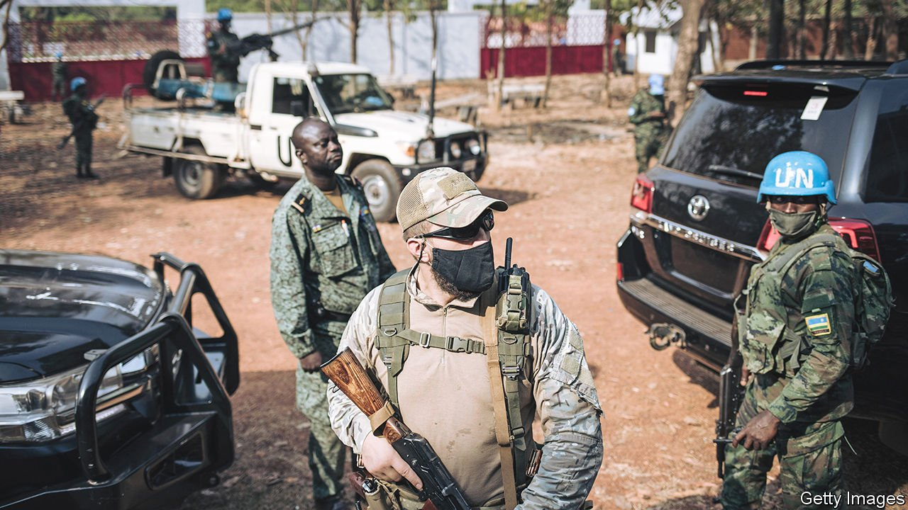
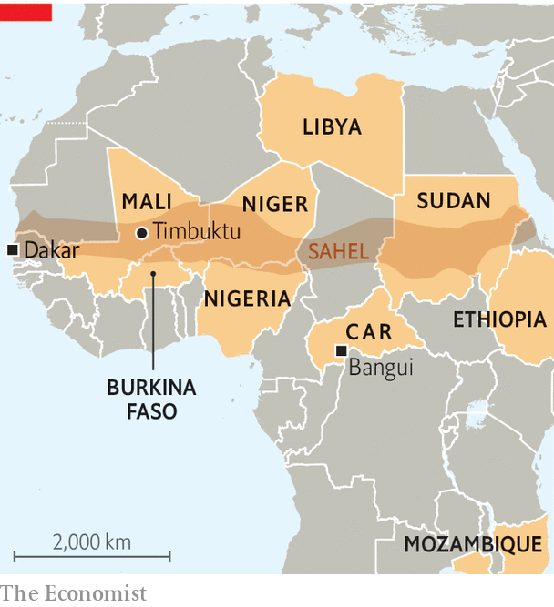

###### Wagner, worse than it sounds

# Small bands of mercenaries extend Russia’s reach in Africa 

##### Local despots seek unsqueamish hired guns 

 

> Jan 15th 2022 

AS HE HANDED over a large wooden key on December 14th, a French colonel symbolically passed control of a military base in Timbuktu to his Malian counterpart. The tricolore, which had flown over the camp in northern Mali since France sent troops there in 2013 to counter jihadists and separatists, was replaced by a Malian flag. The ceremony marked a milestone in a French plan to cut by almost half its 5,100-strong counter-terrorism force in the region, as it refocuses on training and supporting local troops in their battle against the extremists who have overrun swathes of Mali, Niger and Burkina Faso. Yet soon after the French had left, a contingent of Russians moved in.

They are but one element of a Russian force that is perhaps 450-strong, says a French military official, who adds that most are mercenaries from Wagner Group. This is a company founded by Yevgeny Prigozhin, a crony of President Vladimir Putin. It is reportedly being paid $10m a month in Mali, much of it under a goons-for-gold deal. Mali’s government insists it has no hired guns fighting for it and that the Russians are there as trainers officially sent by their government. Yet armed Russians have been seen in several parts of the country. Jihadists may have recently killed one and wounded two more.


Mr Putin has no interest in helping Africa become more peaceful or democratic. A key aim is to stick it to the West, says Oleg Ignatov, who is based in Moscow for International Crisis Group, a think-tank. And Mr Putin appears to be doing so with canny opportunism, deploying small numbers of fighters to prop up wobbly authoritarians or governments that are annoyed by the West. The French official reckons that Russia’s aim is to drive France and its allies out of Mali, leaving Russia “alone to exploit and deploy their influence”. How to respond? That, he says, is a “major question”.

Part of the difficulty is that Mali is a perfect target for Russian influence. Colonel Assimi Goïta, who runs the country, toppled Mali’s elected president in mid-2020. He then installed himself as president with a second coup last year. His junta, some of whose members were trained in Russia, had promised to hold elections in February. But then it said it would postpone them, perhaps until December 2025.

 


That was a step too far for Mali’s neighbours. On January 9th members of the Economic Community of West African States (ECOWAS), a regional bloc, closed their borders with Mali and imposed tough financial sanctions on it, supported by France, Britain and America. Russia backed the junta and blocked a UN Security Council resolution supporting sanctions.

Russia’s strategy in Mali draws on the game plan it used in the Central African Republic, a failed state that might have descended into genocide in 2013 had France not sent in peacekeepers. After handing over to the UN’s blue helmets, France brought most of its troops home in 2016.

That opened the door to Mr Putin. Having previously blocked efforts by France to arm government forces, Russia changed tack and offered to arm them itself. Mercenaries from Wagner soon showed up and a Wagner-linked company won concessions to mine gold and diamonds. Though the UN has accused the Russian mercenaries of murdering, torturing and raping people, that has not dimmed the host regime’s ardour. In November it made the Russian language a compulsory subject for students at the university in Bangui, the capital—the first time since the cold war that learning Russian has been obligatory outside the former Soviet Union.

Russia, which is already the biggest arms supplier to sub-Saharan Africa, is widening its security ties. Last year it signed military co-operation deals with Ethiopia and Nigeria, Africa’s two most populous countries. Ethiopia’s government is angered by Western criticism of atrocities in its civil war; Nigeria’s leaders are grumpy that America paused an arms sale over human-rights abuses by Nigerian forces. In Sudan, Russia took advantage of political turmoil to strike a deal for a naval base, though it has yet to materialise.

Next on Russia’s list may well be Burkina Faso, where on January 11th the government said it had thwarted a coup plot. Already a buyer of Russian helicopters and weapons, Burkina Faso has also been bombarded by pro-Russian propaganda on social media. In November a French army convoy was repeatedly blocked by protesters—some waving Russian flags—chanting “down with France”.

Yet Russia’s mercenaries will probably find it no easier to battle jihadists than do the Western forces they hope to supplant. Their record is certainly uninspiring. In 2019 Wagner sent men to fight jihadists in northern Mozambique. It pulled out after about ten of them were killed, including some who were beheaded. In Libya roughly 1,200 Wagner men fought on the side of a rebel general, Khalifa Haftar, against the UN-recognised government. Yet the rebel push to topple the government failed and Wagner’s troops were accused of war crimes, including murdering prisoners and civilians.

Even if the Russians cannot beat the jihadists, Mr Goïta may still want them to coup-proof his regime. (He narrowly survived a knife attack last July.) Yet in propping him up, or even simply in failing to beat the extremists, Wagner risks having the population turn against it—and Russia. In 2013 François Hollande, then France’s president, was mobbed by cheering crowds in Timbuktu after his forces liberated the city. Today its deputy mayor, Bocar Touré, complains that the French failed to improve security. “The Russians can help more than the French did,’‘ he says. But, perhaps foreshadowing the next wave of anger, he adds: “I would prefer not to have any foreign forces in Timbuktu.” ■

