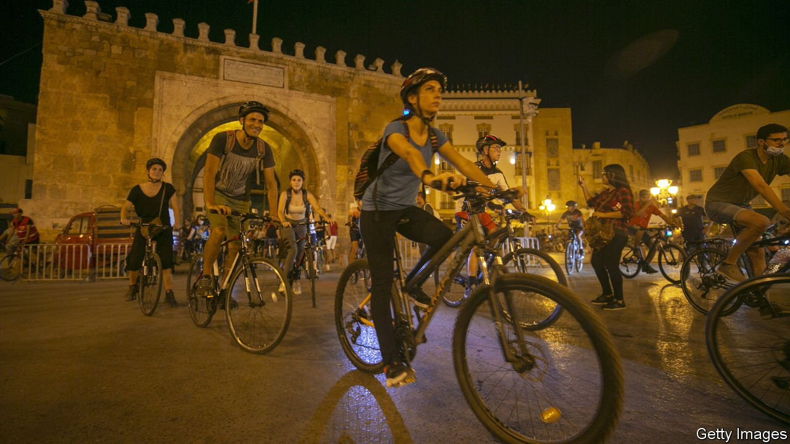

###### Make way

# Why more Arabs are embracing pedal power 

##### Cars still dominate, but cycling is growing more popular 

 

> Jan 13th 2022 

THE DOZENS of cyclists winding past the colonial architecture in Tunis, the capital of Tunisia, are an intriguing sight. They ring their bells and let out cheers. Vélorution wants people to know when it is on the move—and wants cars to give its members space. The group, and others like it, are trying to carve fresh paths for cyclists through the crowded roadways of the Middle East and north Africa.

Older Arabs often dismiss cycling as a form of transport for the poor. Those with means own cars, which still dominate the roads. Most others prefer trams and buses. But an increasingly vocal cohort of younger Arabs tout the environmental and health benefits of cycling, as well as the potential for easier commutes. From Morocco to Syria they have set up groups that arrange mass cycle rides, offer free repairs and campaign for more room on the road.


They face plenty of obstacles. The number of cyclists may be increasing in the Arab world, but so is the number of cars. The development of new infrastructure has not kept up, leading to hours-long traffic jams—and thus dirtier air. When the cars are moving, the situation is often unsafe for cyclists. According to the World Bank, road accidents are a leading cause of death in the Middle East and north Africa.

Cycle lanes would help, but there are few in the region. Drivers and roadside sellers oppose them. Even where the lanes exist, they are often ignored. Shortly after Egypt introduced cycle lanes in Cairo in 2015, drivers began using them as parking spots. In Damascus, Syria’s capital, there are 10km of cycle lanes, says Mohamad Al Hawarii of Yalla, Let’s Bike, a local cycling group. “But there is no commitment to them…most drivers do not know that these spaces are designated for bicycles.”

Tunisia also has some cycle lanes. One nearing completion on the capital's lakeside will allow riders to enjoy a scenic day out. But it is good for little else. “The problem is that disaggregated cycle routes often exist in isolation, meaning cyclists have a few kilometres of riding before they have to dismount and re-enter the traffic,” says Janene Tuniz of UN-Habitat, a UN agency that deals with urban development. “You couldn't comfortably commute that way.” Most countries in the region also lack racks or shelters for storing bikes, or bike-sharing schemes.

Until recently, Arabs had little reason to give up their cars. In Beirut, for example, most trips are within a reasonable cycling distance, but Lebanese could get cheap loans to buy cars and fuel was heavily subsidised. This is changing. Mired in an economic crisis, the Lebanese now face long queues at petrol stations, which are often short of supply. The government, like many in the region, has cut fuel subsidies. Cycling, all of sudden, seems like a less hassle some alternative.

It has influential champions. Muhammad bin Zayed, the de facto ruler of the United Arab Emirates (UAE), has taken an interest; Hamdan bin Muhammad al-Maktoum, the young crown prince of Dubai, posts pictures of himself cycling on Instagram. The UAE, which hosts professional races, has many kilometres of cycling track. Egypt does not, but President Abdel-Fattah al-Sisi has called on his people to take up cycling. One reason: studies by the World Bank and others have found that traffic congestion costs Egypt a significant chunk of GDP each year.

There are other reasons, too. Health-care costs are rising across the Arab world, where obesity and its associated ailments, such as diabetes, are a costly problem. Cars are a big source of greenhouse-gas emissions and air pollution. Ditching four wheels for two would improve all of this. Covid-related lockdowns gave Arabs a sense of what more cyclist-friendly streets would be like. Many enjoyed it. ■

