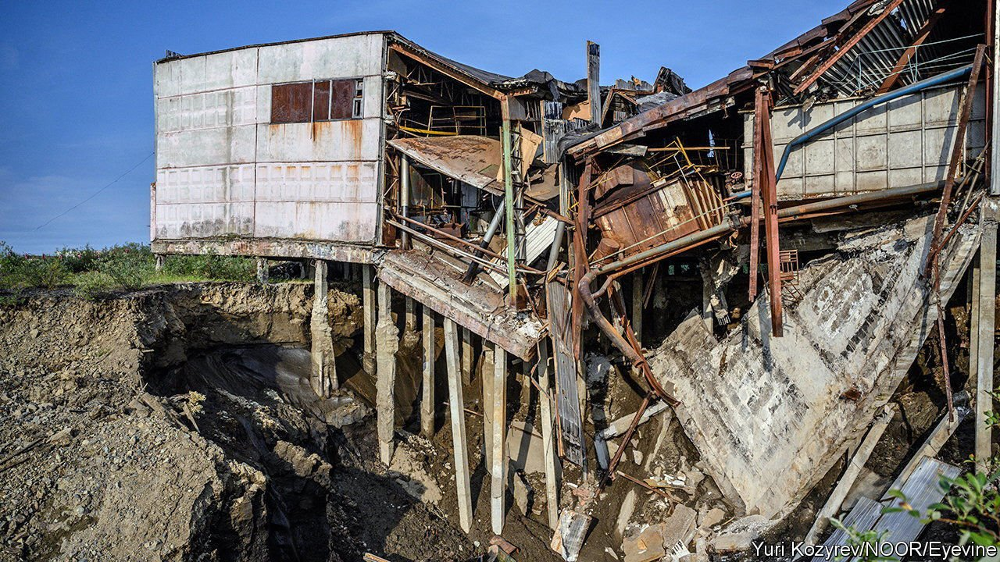
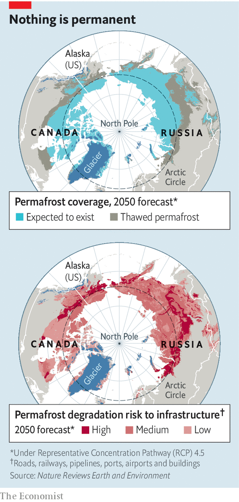

###### Climate change

# A lot of Arctic infrastructure is threatened by rising temperatures 

##### Russia will be particularly badly hit 

 

> Jan 15th 2022 

A QUARTER OF the northern hemisphere’s land is covered by permafrost, defined as ground that remains at or below 0°C for at least two years in succession. Most of this is above the Arctic Circle, a part of the world that is warming at a rate double the global average, with significant consequences for the rest of the planet. Arctic permafrost is thought to contain some 1.7trn tonnes of carbon, most of it in frozen organic matter. That is double the amount of the stuff currently residing in the atmosphere. Rising temperatures mean that much of this material may turn into carbon dioxide and methane as the ground thaws and micro-organisms get to work. That will drive further warming, causing a feedback loop of more melting and yet more greenhouse-gas emission.

These risks are re-emphasised in a paper just published in Nature Reviews Earth and Environment. It warns that warming of the top three metres of permafrost alone could result in the release of 624m tonnes of carbon a year by 2100, a figure similar to the current emissions of Canada or Saudi Arabia. But a thawing Arctic poses other, more immediate, problems. Another paper published in the same journal highlights the threat posed to circumpolar infrastructure as the ground beneath it thaws.


Thawing permafrost is a particularly unpredictable environment on which to build. As its ice content changes and the volume of liquid water increases, the soil can experience vertical movements of up to 40cm a year and its capacity to bear weight drops dramatically. This can lead to landslides, to the subsidence of individual buildings, and to the appearance of cracks and deformities in long, linear structures such as roads and pipelines.

The conclusions drawn by lead author Jan Hjort, of the University of Oulu, in Finland, are stark. Of the 120,000 buildings, 40,000km of roads and 9,500km of pipelines currently built on permafrost, up to half are expected to be at high risk by 2060. By then, he estimates, the bill for maintenance could exceed $35bn dollars a year.

 


Russia is the country most threatened by such changes. Almost 65% of Russian soil is permafrost, and it is here that 60% of the Arctic’s human settlements and almost 90% of its population can be found (see maps). Russian sites are also more likely than those in other parts of the Arctic to contain heavy apartment buildings and large industrial facilities. North America’s permafrost, which makes up half of Canada’s territory and more than three-quarters of Alaska’s, tends to be more sparsely populated than Russia’s, with human impact dominated by roads, airstrips and oil pipelines. Nonetheless, degradation is still an issue. Authorities in the Northwest Territories, one of Canada’s largest and most northerly regions, calculate that permafrost-induced damage amounts, even today, to $41m a year, which is about $900 per resident.

Dr Hjort’s paper also looks at the Arctic conditions which prevail in mountainous regions at lower latitudes. Nearly half of the Tibetan plateau, for example, is covered by permafrost, and this area contains 200,000km of roads and 3,900km of railways. The cost of repairs here runs into the tens of millions of dollars a year. In the European Alps, by contrast, a combination of higher investment and more favourable conditions mean thaw damage is minimal.

Dr Hjort and his colleagues suggest three approaches to increasing resilience, some of which have already been implemented to various extents in different Arctic locations. First, enhance the extraction of heat from thawing soil near structures which need protecting. This can be done by adding porous stone layers to road beds to generate convection, which helps hot air to escape. Decreasing the angle of embankment slopes also helps, by increasing wind flow and reducing the accumulation of snow, which traps heat. Second, limit heat intake by the ground. This means insulating the embankments of roads by increasing their thickness, and also increasing the reflectivity of paved surfaces to minimise the amount of solar radiation absorbed. Third, the ground can be reinforced to create better foundations. One way to do so is to replace layers of permafrost with more stable materials. Another is to thaw the permafrost in a controlled manner, and then build on that consolidated layer.

None of this innovative construction will help, however, if there is a lackadaisical approach to maintaining what has been built. In an earlier study cited by the authors, which looked at the period from 1980 to 2000, most damage to structures in areas of Russia where permafrost abounds was found to have arisen as a result of poor maintenance. Climate change will make that worse. But if local authorities cannot even get the basics right, then large sections of the Russian Arctic may end up being abandoned altogether. ■

To enjoy more of our mind-expanding science coverage, , our weekly newsletter. For more coverage of climate change, register for , our fortnightly newsletter, or visit our 

