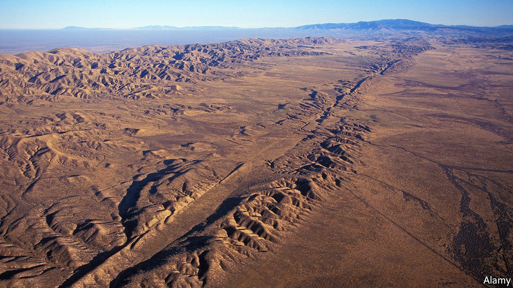

###### Seismology

# Predicting earthquakes is not possible. Yet 

##### But an intriguing new approach shows promise 

 

> Jan 15th 2022 

ONE OF THE questions most frequently asked of the United States Geological Survey is whether earthquakes can be predicted. Their answer is an unconditional “no”. The relevant page on the agency’s website states that no scientist has ever predicted a big quake, nor do they know how such a prediction might be made.

But that may soon cease to be true. Though, after decades of failed attempts and unsubstantiated claims about earthquake prediction, a certain scepticism is warranted—and Paul Johnson, a geophysicist at Los Alamos National Laboratory, is indeed playing down the predictive potential of what he is up to—it is nevertheless the case that, as part of investigations intended to understand the science of earthquakes better, he and his team have developed a tool which might make forecasting earthquakes possible.


As do so many scientific investigations these days, their approach relies on artificial intelligence in the form of machine learning. This, in turn, uses computer programs called neural networks that are based on a simplified model of the way in which nervous systems are thought to learn things. Machine learning has boomed in recent years, scoring successes in fields ranging from turning speech into text to detecting cancer from computerised-tomography scans. Now, it is being applied to seismology.

Slip-sliding away

The difficulty of doing this is that neural networks need vast amounts of training data to teach them what to look for—and this is something that earthquakes do not provide. With rare exceptions, big earthquakes are caused by the movement of geological faults at or near the boundaries between Earth’s tectonic plates. That tells you where to look for your data. But the earthquake cycle on most faults involves a process called stick-slip, which takes decades. First, there is little movement on a fault as strain builds up, and there are therefore few data points to feed into a machine-learning program. Then there is a sudden, catastrophic slippage to release the accumulated strain. That certainly creates plenty of data, but nothing particularly useful for the purposes of prediction.

Dr Johnson thus reckons you need about ten cycles’ worth of earthquake data to train a system. And, seismology being a young science, that is nowhere near possible. The San Andreas fault in California (pictured), for example, generates a big earthquake every 40 years or so. But only about 20 years (in other words, half a cycle) of data sufficiently detailed to be useful are available at the moment.

In 2017, however, Dr Johnson’s team applied machine learning to a different type of seismic activity. Slow-slip events, sometimes called silent earthquakes, are also caused by the movement of plates. The difference is that, while an earthquake is usually over in a matter of seconds, a slow-slip event can take hours, days or even months. From a machine-learning point of view this is much better, for such an elongated process generates plenty of data points on which to train the neural network.

Dr Johnson’s classroom is the Cascadia subduction zone, a tectonic feature that stretches 1,000km along the coast of North America, from Vancouver Island in Canada to northern California. It is the boundary between the Explorer, Juan de Fuca and Gorda plates to the west, and the North American plate to the east. Steady movement of the latter plate over the former three generates a slow-slip event every 14 months or so, and geophysicists have recorded this activity in detail since the 1990s. That means there are plenty of complete cycles of data—and the machine-learning system trained on these by Dr Johnson was able to “hindcast” past slow slips based on the seismic signals which preceded them, “predicting” when they would happen to within a week or so of when they had occurred in reality.

The next test of the technique, yet to be executed, will be an actual forecast of a slow-slip event. But even without this having happened, Dr Johnson’s slow-slip project suggests that machine-learning techniques do indeed work with seismic events, and might thus be extended to include earthquakes if only there were a way to compensate for the lack of data. To provide such compensation, he and his colleagues are applying a process called transfer learning. This operates with a mixture of simulated and real-world information.

Getting real

“Lab quakes” are miniature earthquakes generated on a laboratory bench by squeezing glass beads slowly in a press, until something suddenly gives. This has proved a useful surrogate for stick-slip movement. Dr Johnson’s team have created a numerical simulation (a computer model that captures the essential elements of a physical system) of a lab quake and trained their machine-learning system on it, to see if it can learn to predict the course of the surrogate quakes.

The result is moderately successful. But what really makes a difference is boosting the trained system with extra data from actual experiments—in other words, transfer learning. The combination of simulated data fine-tuned with a pinch of the real thing is markedly more effective at predicting when a lab quake will occur.

The next step towards earthquake forecasting will be to apply the same approach to a real geological fault, in this case probably the San Andreas. A machine-learning system will be trained on data from a numerical simulation of the fault, plus the half-cycle’s worth of live data available. Dr Johnson’s team will see if this is enough to hindcast events not included in the training data. He mentions the magnitude-six Parkfield earthquake in 2004—a slippage of the San Andreas that did minimal damage, but was extremely well studied—as one possible target.

At present Dr Johnson’s aspirations are limited to predicting the timing of an imminent quake. A full prediction would also need to include whereabouts along the fault it was going to happen and its magnitude. However, if timing can indeed be predicted, that will surely stimulate efforts to forecast these other criteria, as well.

He hopes for initial results in the next three to six months, but cautions that it might take longer than that. If those results are indeed promising, though, there will no doubt be a rush of other teams around the world attempting to do likewise, using historical data from other earthquake-producing faults in order to validate the technique. That, in turn, should improve the underlying model.

If it all comes to naught, nothing will have been lost, for Dr Johnson’s work will certainly provide a better understanding of the physics of big earthquakes, and that is valuable in and of itself. But, if it does not come to naught, and instead creates software capable of predicting when big quakes will happen, that really would be an earth-shaking discovery. ■

