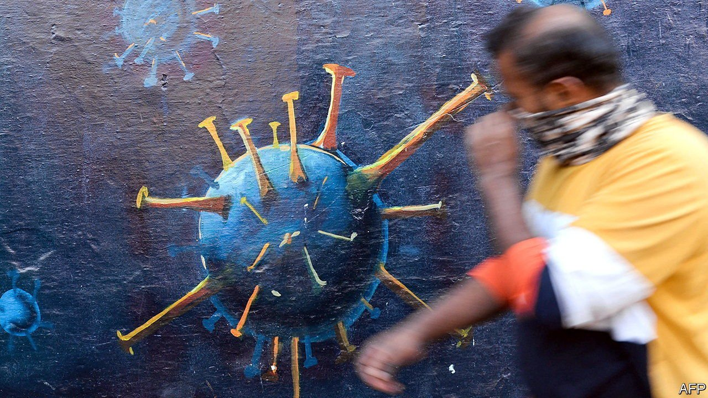
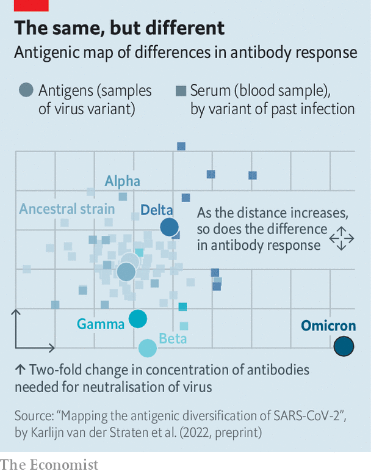

###### Omicron and immunity

# The case for updating covid-19 vaccines for the Omicron variant 

##### A new study puts the variant in a group apart from its predecessors 

 

> Jan 15th 2022 

VARIANTS VARY, but how much? Since SARS-CoV-2 was first sequenced at the beginning of 2020 dozens of versions have been identified. Five have been designated “variants of concern” by the World Health Organisation (WHO). The latest is Omicron, which was given its name in November last year and looks set to become the dominant form of the virus almost everywhere.

One question occupying both scientists and politicians is whether covid vaccines would work even better if they were updated to deal with novel variants. Up to and including Delta, first identified in India, and designated a variant of concern in May 2021, the answer has been “no”. But new research, which has mapped differences between all of the important versions of SARS-CoV-2, suggests that, although administering existing vaccines is still useful, Omicron is so different from the others that the answer might now be “yes”.


Researchers in the Netherlands, co-ordinated by Rogier Sanders and Colin Russell of the University of Amsterdam and Dirk Eggink of the Dutch Public Health Institute, acquired blood samples collected from 51 unvaccinated people shortly after they had been infected with various versions of SARS-CoV-2. These included the original, ancestral, strain and the Alpha, Beta, Gamma and Delta variants. (Omicron samples were not available.) They then assessed the antibody response (“neutralising capacity”) of those samples against different antigens—in other words, different versions of the virus, again using the ancestral strain, Alpha, Beta, Gamma and Delta and, this time, Omicron.

By measuring the neutralising capacity of the serum of each participant against the various variants and applying what is known as a multidimensional scaling algorithm, Dr Sanders, Dr Russell, Dr Eggink and their colleagues were able to position both the viruses and the serum samples on an “antigenic map” (see chart). This is used to study how mutations make viruses more or less different from the ancestral strain, in a process called antigenic drift. In such maps, one unit of distance is equivalent to a two-fold change in neutralisation titre (a measure of the concentration of antibodies in the blood needed to neutralise a virus). Samples plotted closer together are more similar. Going by a measure conventionally used to group influenza viruses—a distance of three or fewer antigenic units—the researchers found that Omicron would count as the first of a new group of SARS-CoV-2. Whereas all widely circulating variants before it, being less than three units apart from each other, cluster as a single group, Omicron is more than five units away from all others.

 


A paper describing this research was uploaded to medRxiv, a research portal, on January 3rd, but has not yet been peer-reviewed. The authors also caution that their methods vary slightly from those conventionally used to map influenza. Nevertheless they conclude that “the change in neutralisation between Omicron and other variants of SARS-CoV-2, including the ancestral strain, is striking”. (A separate investigation, published on the same day in Cell, reaches a similar conclusion.) Dr Russell cautions that the study’s findings should not be interpreted to mean that existing vaccinations, designed for the ancestral strain, are ineffective. “Omicron’s substantial reduction in cross-reactivity with previous variants doesn’t mean that there is no reactivity. This is probably why boosting with current vaccines provides some protection,” he says.

As more people catch Omicron or are vaccinated, so more of the population will have some protection than in the past. Other studies have also shown that the response of another part of the immune system, its T-cells, seems less affected by Omicron’s mutations. That is probably one reason why Omicron rarely causes severe disease and death in those who have acquired immunity through infection or vaccination. The other is that Omicron itself seems to be inherently less lethal. But, just as twice a year the WHO organises expert reviews of influenza viruses and issues recommendations on how to tweak vaccine compositions, Dr Russell proposes something similar for covid vaccines. For maximum efficacy, he suggests, vaccines should be updated as soon as possible. ■

To enjoy more of our mind-expanding science coverage, , our weekly newsletter. All our stories relating to the pandemic can be found on our . You can also find trackers showing ,  and the virus’s spread across .

