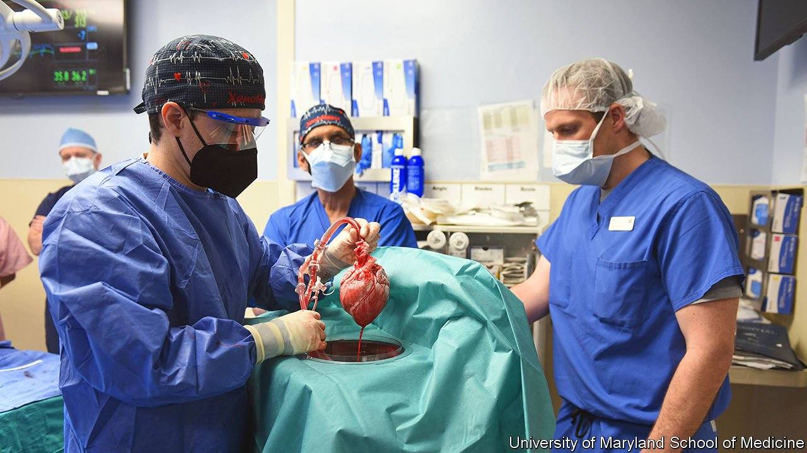

###### Xenotransplantation

# The science behind the first successful pig-to-human heart transplant 

##### It may lead to a new approach to organ transplantation 

 

> Jan 15th 2022 

ON JANUARY 7TH David Bennett became the first person to have a heart transplanted successfully into him from a pig. In press material issued three days after the operation, the University of Maryland confirmed Mr Bennett was doing well, and was capable of breathing on his own. While he continues to rely on artificial support to pump blood around his body, the team behind the surgery, led by Bartley Griffith, plan gradually to reduce its use.

This operation is a milestone for xenotransplantation—the transfer of organs from other species to human patients. It comes hot on the heels of , when a pig’s kidney was successfully attached for three days to a brain-dead patient in a hospital in New York. On that occasion, mere surgical success was the goal. But Dr Griffith’s team hope to save a life.


The operation itself received exceptional authorisation from America’s Food and Drug Administration under a provision which lets doctors use experimental treatments as a matter of last resort. Prior to it Mr Bennett was diagnosed with terminal heart disease, but was judged too ill to qualify for a human transplant. Having spent months in a hospital bed with no improvement to his condition, he gave his consent to the surgery.

The field’s recent flowering has long-established roots. For decades, researchers have attempted to tackle xenotransplantation’s fundamental problem. This is that the human body, when it recognises foreign tissue, has a tendency to turn against it. In the case of pigs, the most important marker of foreignness is a sugar molecule called galactose-alpha-1,3-galactose (alpha-Gal), which is found on the surfaces of their cells. While this molecule does not exist in humans, antibodies to suppress it do. Consequently, no transplant from a pig with alpha-Gal would last more than a couple of minutes in a human body.

In 2003 pigs were produced with a genome modified so as to suppress the enzyme responsible for making alpha-Gal. This was a step in the right direction, but other barriers popped up in its place. As Frank Dor of Imperial College, London, who was involved in that original genome-modification project, observes, with each of these barriers requiring years of work to overcome, many researchers—and much research funding—abandoned the field.

One collaboration which survived was that between the University of Maryland and Revivicor, a regenerative-medicine company in Blacksburg, Virginia. It was Revivicor that provided the genetically modified pig for Friday’s surgery. The animal in question had a genome modified in ten ways, to optimise the chances of success. Three genes had been removed to reduce the risk of a human antibody rejecting the donor organ. A fourth, a growth gene, had also been knocked out, to ensure the heart did not enlarge after transplantation. And six human genes had been added, to promote acceptance.

In addition to the usual risks surrounding any heart transplant, there are a number of areas of concern that Dr Griffith and his colleagues will be looking out for. One is any hitherto-unknown rejection mechanism. Another is the possibility that the organ may transfer porcine viruses to its new host. The pig in question was reared in a sterile environment to minimise the chance of that, but it remains a possibility.

Supporters of xenotransplantation think its potential to improve lives is huge. In America alone, over 100,000 people are waiting for transplants (though the vast majority need a kidney rather than a heart). In 2020 only a third of the required number of organs became available.

In theory, pigs can be bred to provide humans with any solid organ, though some will be more complex than others. A large part of the heart’s function is mechanical, but other organs have chemical jobs that will be harder to replicate. Moreover, even assuming these barriers can be overcome and successful surgical procedures developed, most researchers still acknowledge that scaling up xenotransplantation to meet the world’s demand for organs may take decades. After this news, however, the chances that it will happen eventually have increased. ■

