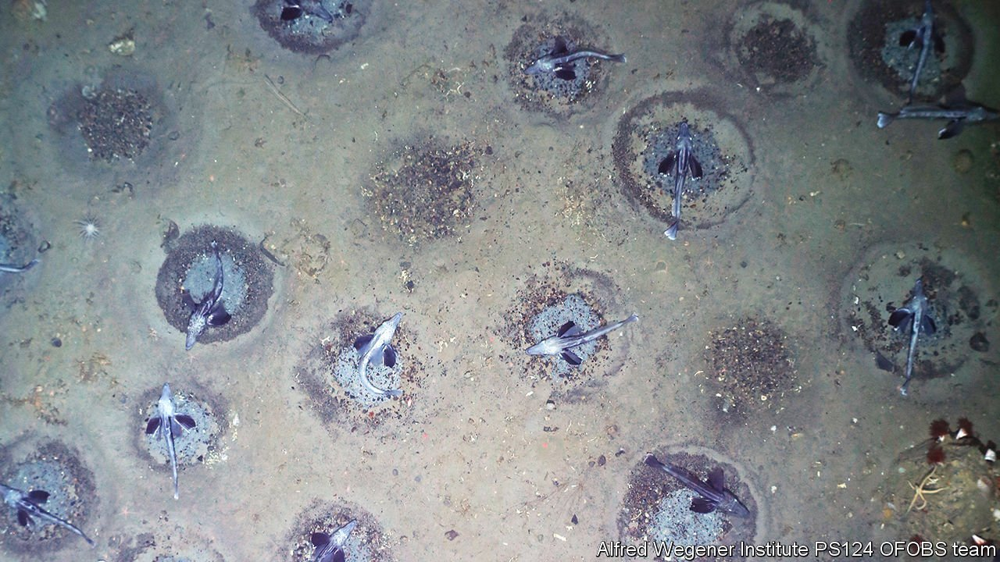

###### Marine biology

# The world’s biggest fish hatchery 

##### The ocean depths still hold many surprises 

 

> Jan 15th 2022 

THIS IS A part of the largest fish-breeding ground yet discovered. It occupies more than 240km of the floor of the Weddell Sea, off Antarctica. Each nest is guarded by a notothenioid icefish, usually the father. Altogether, there are about 60m nests, housing more than 100bn eggs. The site was discovered by Autun Purser of the Helmholtz Centre for Polar and Marine Research, in Bremerhaven, and is reported in Current Biology. Dr Purser saw the first nests on a dive. Further dives revealed more. He and his colleagues then towed cameras over the site to discover its full extent. One reason animals live in crowds like this is to swamp predators. That can, though, backfire when the predator is a modern fishing vessel. For decades, there has been talk of making the Weddell Sea a protected area. Dr Purser has come up with yet another reason to do so.

