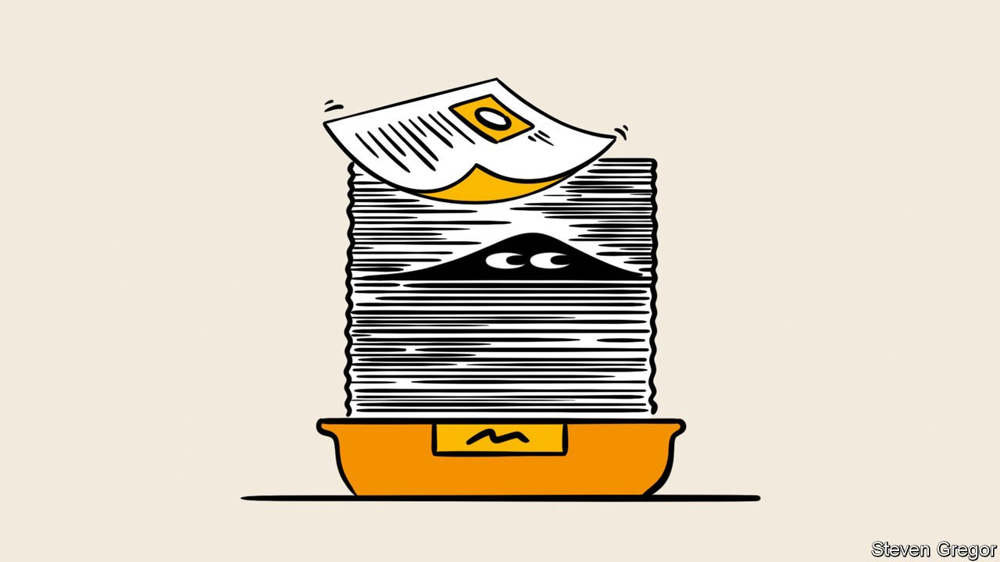

###### Government regulation

# Enthusiasm for regulation, often in areas like the climate, shows no sign of flagging 

##### Red tape continues to spread inexorably 

 

> Jan 10th 2022 

A COROLLARY OF Leviathan’s growth is rising bureaucracy. Once a regulator is created, it is never defunded. As the state becomes more involved in citizens’ lives and agencies expand, so do rulebooks. And a lot of their dos and don’ts apply to business.

Patrick McLaughlin of the Mercatus Centre at George Mason University has tracked the number of prescriptive words such as “shall” and “must” in America’s federal code and its equivalents in Australia, Britain and Canada. They have become more pervasive. In another example, the number of similar prescriptions in America has swelled from 400,000 in the 1970s to 1.1m today. Many may be out of date: an analysis by Deloitte, a consultancy, found in 2017 that 67% of sections in the US code had not been edited since they were drafted.


Purported bureaucracy slayers, such as Mr Trump, who promised to axe two rules for every one introduced, or conservative Australian prime ministers, have left more regulations than they inherited. Mr McLaughlin does not know of similar studies of the EU or Japan, let alone China. But it is a fair bet they are on a similar trend, he says. And that is without state, regional or local rules.

The pace may even be speeding up. Governments are regulating in new areas such as the climate or data protection. They are telling businesses how to treat workers, women, ethnic and racial minorities, and even shareholders. Rules are multiplying about what information companies must disclose, how to allow investors to challenge management and who should sit on boards. And as the rift between the West and China deepens, both are constraining firms’ choices of business partners. Asked whether all this presents risks for companies and investors, one big asset manager responds: “Yes, absolutely.”

One sign is the arrival of big laws. The federal code ballooned after the passage in 2010 of the Dodd-Frank act to regulate the financial industry. In the past two years Congress has passed two huge covid-19 stimulus bills (335 and 243 pages) and the $1.2trn infrastructure plan (1,039 pages). Mr Biden’s Build Back Better extravaganza ran to 2,468 pages in the House-approved version.

The EU’s Digital Services and Digital Markets acts will, once adopted, take on lives of their own as they are translated into national law. Although their toughest provisions target the tech giants (few of which are European), any big organisations that peddle data can expect to be caught up in red tape. That happened with the EU‘s General Data Protection Regulation in 2016.


The scope of regulatory agencies can broaden even without new statutes, if regulators reinterpret old ones. That appears to be happening at the FTC. Mr Biden’s federal vaccine mandate, requiring companies that employ 100 or more to ensure that workers are jabbed or regularly tested, is based on powers of the Occupational Safety and Health Administration. The Consumer Financial Protection Bureau, created by Dodd-Frank, could in 20 years be as large as the Environmental Protection Agency is now, predicts Mr McLaughlin. Many new instructions come not as formal rules but in ancillary guidance, which Wayne Crews of the Competitive Enterprise Institute, a think-tank, terms “regulatory dark matter”.

In environmental, social and governance (ESG) practice, companies and rulemakers are moving in the same direction. Indeed, business may be ahead. Many firms have embraced diversity and inclusion. Corporate carbon-cutting goals often exceed national ones. Partly this is a response to demands from consumers and potential hires. Partly it is a cynical effort to show that soft self-regulation obviates the need for government rules.

Regulators are catching up. “ Tenets of ESG are becoming hard law,” says Mr Rodrik of Harvard. A draft EU directive would require firms to monitor, identify, prevent and remedy risks to human rights, the environment and governance in their operations and business relations. France’s “Duty of Vigilance Act” of 2017 already requires French companies with over 5,000 employees in France or over 10,000 worldwide to monitor their firms, contractors and suppliers for potential abuses. By mid-2023 a Dutch law aimed at stopping child labour will take effect, after a three-year grace period. A similar supply-chain act has been passed in Germany.

 


America’s Build Back Better bill is dotted with requirements for companies to employ unionised workers. The House of Representatives has passed a bill that would reverse many constraints on union power, some dating from 1947. It will stall in the Senate because of opposition from Republicans and centrist Democrats. But it is a statement of intent. Companies are braced for executive actions. A group chaired by Vice-president Kamala Harris has instructed every department and many agencies to come up with plans to push unionisation without congressional action. Some 400 ideas have been submitted.

Governments everywhere seem suddenly to have become much keener on labour protection. Mr Biden’s bid to raise the federal minimum wage was foiled by moderates but the idea is far from dead. The European Commission wants common rules on minimum pay and “platform workers” who ferry passengers for Uber or meals for Deliveroo. Meituan, the food-delivery giant, is in hot water with Chinese authorities for mistreating drivers. Labour standards are being slotted into trade deals, including the United States-Mexico-Canada Agreement that replaced NAFTA.

Fighting for workers—and investors

Financial regulators are also becoming more intrusive. The Bank of England is conducting climate-risk stress tests. The European Central Bank is considering requiring firms to disclose exposure to climate-related risks, including assets that may become stranded by tougher climate legislation. A vocal American champion of this idea, Lael Brainard, has been made vice-chair of the Federal Reserve. In October the Securities and Exchange Commission (SEC) said it was working on requirements for firms to include such disclosures in public filings.

The SEC is also making it easier for investors to hold management to account. In November it simplified rules for elections to corporate boards. Dissident shareholders seeking to appoint directors will no longer need to go through the hassle and expense of sending out rival ballots. A new “universal proxy”, which will come into force later this year ensures that board candidates appear on all ballots at annual general meetings, giving shareholders the choice. Another new rule makes it harder for companies to block shareholder resolutions on climate change and human rights. Both changes will empower activists. The senior lawyer at one big tech firm reports that 2021 was the first year when activists tried to ram through appointments and resolutions without seeking compromise with managers.

A final set of rules encumbering business reflects strained Sino-Western relations. In Tokyo Takayaki Koyabashi, the economic-security minister, has hinted that his mandate might extend to decisions under the Foreign Exchange and Foreign Trade Act, revised in 2019 to tighten rules on foreign investment in Japanese companies, which it ranked in three tiers of security-related sensitivity. The EU is getting more assertive. The European Commission is working on an instrument to let Brussels impose economic pain—from trade and investment restrictions to sanctions on intellectual-property rights—on any country that tries economic blackmail. The EU is often inadvertently snarled by American sanctions applying to products made with American technology.

The blacklist of Chinese firms with restricted access to American technology now contains over 1,600 “entities”, including affiliates of such large multinationals as Huawei and SMIC. Another 27 were added in November, in aerospace, chips and quantum computing, including two affiliates in Singapore and Japan. Deals involving Chinese companies are routinely screened by the Committee on Foreign Investment in the United States. The Holding Foreign Companies Accountable Act of 2020 requires firms traded on American exchanges to submit to audits (which Chinese ones are barred from doing by Beijing on national-security grounds) or face delisting within three years.

Things could get rockier. The international chief of a big American asset manager says Wall Street sees China as “essentially uninvestable”. He puts the probability of it becoming impossible for American finance to operate in China at 30%. That is alarmingly high and could even mean the Western, dollar-centric, financial system is severed from the world’s second-biggest economy.

China’s response has not been to bar firms from doing business with the West—they are too reliant on Western consumers, technology and capital markets. Instead, it wants to reduce this dependence. The “dual-circulation” strategy in its latest five-year plan aims to keep China open to the world (the “great international circulation”) but bolster its own market (the “great domestic circulation”). As China has closed borders to suppress covid-19, domestic circulation has gained in prominence.

The Communist Party is bossing companies around with a zeal not seen since Mao: witness a crackdown on tech and anticompetitive practices and a ban on profitmaking by online tutors. Beijing has made it harder for Chinese firms to float shares on American exchanges by cracking down on the convoluted legal vehicles they used to circumvent Chinese limits on foreign shareholders. In November it forced Didi Global, the ride-hailing giant, to delist from New York and move to Hong Kong. Chinese initial public offerings in America have all but dried up.

The economic toll of continued Sino-Western decoupling may be counted in the trillions of dollars. Nasdaq’s Golden Dragon China Index, which tracks Chinese firms listed in New York, fell by 43% in 2021. The unseen costs of unconsummated business relations are incalculable. “At a stroke of a regulator’s pen, 60-70% of your investment can be eroded,” says an executive at a big investment fund.

Complying with domestic regulations is less costly but harder to escape. Some economists reckon it may shave several points off GDP in America. In one British survey, fewer than one business in three thought regulation enabled innovative products and services to be brought to market efficiently. In another, 69% of firms felt that regulators did not work closely enough with each other. Governments’ management of new and existing regulations is still far from optimal. “Little information exists on whether they actually work in practice,” observes Christiane Arndt-Bascle, who monitors regulatory regimes at the OECD.

Comments to regulators about proposed rules are published 85% of the time but sent to decision-makers in just 41% of cases in OECD member countries. Less than a fifth of OECD members systematically reflect international dimensions in domestic rule-making. Both the British and the American governments lack senior officials with extensive private-sector experience. A consultant close to Downing Street sees “very few, if any, established lines of communication between the government and business”. This means that new rules tend to be more onerous. And it comes on top of another business cost that is about to rise after decades of decline: corporate taxes. ■

