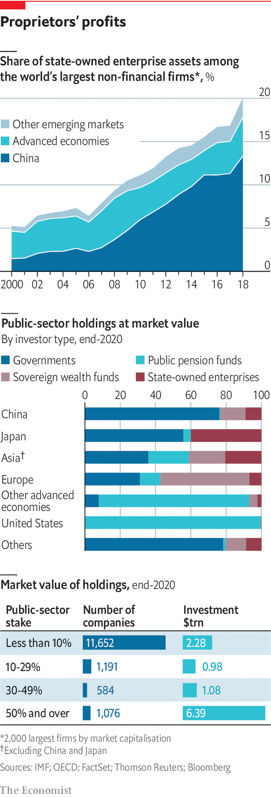

###### Business and the state

# Governments’ widespread new fondness for interventionism 

##### After a long liberalising era, the state has bounced back. That is not a good thing, argues Jan Piotrowski 

 

> Jan 10th 2022 

AS WITH ALL history, capitalism’s may not repeat but it does rhyme. Periods of freer enterprise give way to ones with a more meddlesome state. When change comes, it is after crisis, occasionally exogenous (war, pandemic), at other times provoked by excesses (financial crash, depression, stagflation). Yet the metre is irregular in time and space, differing from decade to decade and country to country.

After 1945 Americans realised that, as Alan Brinkley, a historian, put it, “State power could be used not only to assist but to deny.” Western Europe’s mixed economies embraced elements of central planning—partly as a hangover from the war, partly to stave off communism. Even as Margaret Thatcher battled unions and privatised state-owned companies in Britain in the 1980s, in France François Mitterrand was vowing to “break with capitalism” and nationalising banks and big firms. In Beijing Deng Xiaoping was dismantling Chinese collectivism just as, in Tokyo, a supposedly free-market government was using the Ministry of International Trade and Industry to foster national champions.


It is no easier to predict the timing of capitalism’s swings today. But as globalisation has knitted together world markets, governments have moved in a more synchronised fashion. In the 1990s, after the collapse of Soviet communism exposed the bankruptcy of its command-and-control model, they largely retreated from business. Now the state is again resurgent. Public spending is rising as the welfare state expands. Government is becoming bossier, especially to business. And the bossiness is manifesting itself in new as well as old ways.

 


The first ripples of this wave appeared a decade ago. The financial crisis of 2007-09 persuaded many that leaving markets to their own devices could lead to ruin. Stagnant real wages in large parts of the free world encouraged the perception that the market was not delivering for ordinary people, instead leading to more inequality, especially of wealth. In 2016 Brexit and the election of Donald Trump offered proof that too many people felt left behind by globalisation. Growing worries about markets’ unwillingness or inability to avert climate change fuelled demands for more state involvement in promoting greener energy. Similar concerns motivated China’s president, Xi Jinping, in his campaign for greater self-reliance and “common prosperity”.

The resurfacing of geopolitical rivalry, pitting liberal democracies against Chinese authoritarianism, has also prompted governments to try to align business interests with national strategic ones. And this was before covid-19 made meddling in corporate affairs—from lockdowns and bail-outs to vaccine and mask mandates—look more justified than ever to voters and their political representatives. The world is entering “a political cycle where government has to be responsive to an increasingly fickle and opinionated electorate”, says one asset manager. Public opinion has, in general, turned against business.

Part sincerely, part no doubt smelling the wind, bosses and big investors acknowledge the need to refurbish the capitalist model. Jamie Dimon, chief executive of JPMorgan Chase, America’s biggest bank, has expressed worries about the “fraying” of the American dream. Ray Dalio, founder of Bridgewater, the world’s largest hedge fund, calls for “a reformation of capitalism” to avert over-indebtedness, flagging productivity and voter polarisation. Doug McMillon, boss of Walmart, a supermarket behemoth, says “it’s time to reinvent” capitalism. Paul Polman, former head of Uni lever, the Anglo-Dutch soap-to-soup group, wants to “save” it.

Yet seen from one vantage point, capitalism seems hale and hearty. In contrast to their Marx-curious 20th-century forebears, today’s governments mostly eschew common ownership of the means of production. From 1990 to 2016 states around the world sold assets worth some $3.6trn. A database compiled by Katarzyna Szarzec, Akos Dombi and Piotr Matuszak, three economists, lists 1,160 privatisations in 30 European countries between 2007 and 2016, and only 61 nationalisations. According to the OECD club of mostly rich countries, the public sector owned $11trn-worth of shares in listed companies at the end of 2020, equivalent to 10% of total market capitalisation. That is down from 14% in 2017.

Roughly two-fifths of state holdings by value represent minority stakes in some 13,400 businesses. In 12,000 of these the holding is below 10%. The 1,000 or so majority-owned firms are bigger on average but they are often professionally run by experienced managers to maximise returns, not by bureaucrats eager to boost employment or national pride. A fifth of the public sector’s listed assets are held by sovereign wealth funds and another 13% by pension funds. Saudi Aramco, the kingdom’s oil colossus, is one of the world’s most profitable companies. The world’s four biggest banks by assets are fully or part-owned by the government in Beijing. Plenty of other Chinese state-run firms are at least modestly profitable—how else would 82 have entered the Fortune Global 500 list of the world’s biggest companies between 2000 and 2019?

Not ownership, but influence

On the surface, then, the state appears to be more hands-off. Yet direct ownership is not the only way to influence businesses. Rather than own the means of production, governments increasingly use other levers of control. This special report will explore the four most important old tools that are being dusted off and repurposed for the 21st century.

First is a renewed enthusiasm for industrial policy, defined as state support for favoured industries, technologies or specific firms, and guided by a desire to promote jobs or secure inputs needed for national security (computer chips) or the energy transition (batteries). Next is the expanding ambition of trustbusters that, tentatively in America, slowly in Europe and almost overnight in China, are moving from a focus on prices to a broader assault on corporate power to defend anything from small businesses to government itself.

Third is the growth of regulation, particularly over the environment, labour standards and corporate governance, which cut across sectors and affect all large firms. And fourth is an inflection point in what had seemed an irreversible trend to lower business taxes, as politicians have followed voters in seeing unloved big business as a convenient source of revenue.

This report concludes by arguing that greater state involvement in business is unlikely to lead to better outcomes than in the old days, when similarly interventionist tools were deployed. They may well be worse. Earlier episodes of post-war meddling were at least tempered by a near-universal consensus in favour of freer trade. The new interventionism, by contrast, coincides with barriers to international trade going up not down and a pervasive sense that globalisation and fragile supply chains must be reined in, for both economic and national-security reasons.

A strong reminder is in order that the four vintage tools—industrial policy, trustbusting, regulation and taxes—were gathering dust for a reason. And it is not just politicians and bureaucrats who should pay attention. So, too, should business leaders licking their fingers at the prospect of more state support—especially at the carrot of subsidies. ■

