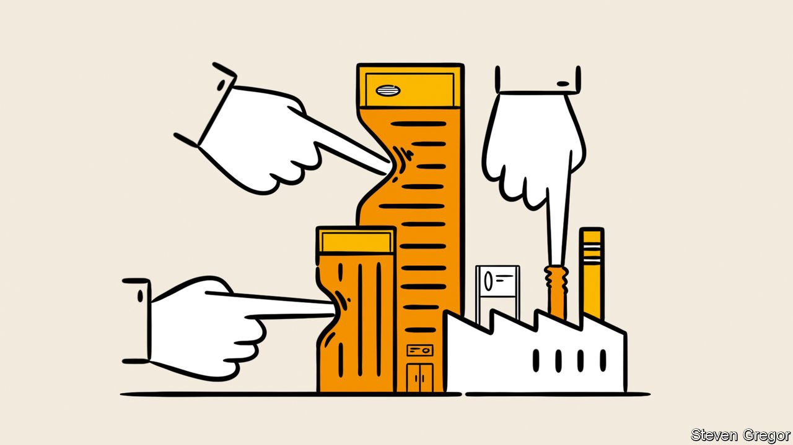

###### The future

# However justified, more government intervention risks being counterproductive 

##### It is time to reassert the case for less state intrusion 

 

> Jan 10th 2022 

ON THE SURFACE business has seldom had it so good. Profits and share prices are near record levels. Pandemic-relief packages have involved little arm-twisting by governments, and lots of corporate welfare. Megadeals are at an all-time high in America and plentiful elsewhere. What’s not to like?

As this special report has argued, quite a bit. Today may turn out to be a high-water mark for business. Almost everywhere people are becoming more mistrustful of it. So are their political representatives. The upshot is that the state wants a greater say over what firms do, where they operate and how they are run. The anti-corporate sentiment makes it harder for businesses to defy calls for new rules or higher taxes.


Some of these are reasonable enough. Profit-seeking enterprises cannot be expected to volunteer to pay more tax or to deal by themselves with such huge challenges as climate change and income inequality, still less geopolitical squabbles. Milton Friedman is reputed to have said that the business of business is business. Companies may need incentives to do the right thing.

But the incentives must spurn favouritism, spur dynamism and maintain openness. And many now being bandied about or enacted do not. Having buried the age of big government under Bill Clinton, Democrats are enthusiastically exhuming it, with even some Republicans cheering them on. Britain’s ruling Conservatives have lost their Thatcherite moorings. The EU, a project with a strong interventionist reflex from its inception, is giving in to it. China has moved decisively away from liberalising its economy into a new era of overt state guidance and control of business.

Political leaders again believe they can pick winners, and some bosses are only too happy to be chosen. Regulators are introducing ever more rules, and using those designed for one goal (promoting competition or good corporate governance) to achieve others (data privacy or workforce diversity). Governments see friendless corporations as a handy piggy-bank. And countries are turning inward, giving international trade the cold shoulder.

Dangerous shifts

These changes carry two dangers. As the state becomes more involved in business, however well-meaning its motives, companies’ focus tends to shift from satisfying consumers towards currying favour with political leaders. Preferred firms grow flabbier and less innovative. Regulations dampen animal spirits. Cronyism rears its head. A chosen few win big. Everybody else loses.

The second danger is subtler. As some firms and governments become chummier, others may conclude that they have no choice but to do the same—especially if cosiness seems to work. This could lead to a soft, self-imposed decoupling, even as traditional trade barriers also go up. “You are seeing flows of people, technology, capital all being curtailed,” observes Hank Paulson, America’s former treasury secretary. One European industrialist predicts, “The era of shortage will drive more egotism.”

The world has been here before. Post-war state meddling, inspired by the belief that only governments could rebuild societies after 1945 and by the apparent success of central planning, led to flagging dynamism and, by the late 1970s, out-of-control prices and stagnant living standards. It was only in the 1980s, after economic failings in the West and the bankruptcy of the Soviet system both became undeniable, that liberal remedies or freer markets, lower taxes and greater openness proved more attractive.

China is not doomed to failure as the Soviet Union was. Its economy is more sophisticated and, in pockets, genuinely innovative: look at Alibaba and Tencent, its digital titans. Yet its model is not a superior form of capitalism. For all its progress, China is poor by Western standards, leaving room for state-directed catch-up growth. The most impressive Chinese businesses, including in big tech, have thrived in markets that the state until recently kept mostly at arm’s length. In focusing attention on China’s top-down policymaking rather than its bottom-up entrepreneurial effervescence, some in the West draw the wrong lessons.

China’s course seems set for the foreseeable future. But a swing away from today’s interventionist mood remains possible in the West. The Tories may rekindle their inner Thatcher. As a club governed by consensus, the EU may listen more to Nordic liberals when they say “strategic autonomy” is little more than a cloak for protectionism. Clintonian small government may seem a lost cause among Democrats, but Republicans’ pro-market memory may kick in if they can only disavow Trumpian populism.

The broad liberal principles rediscovered in the 1980s remain as powerful as they were 40 years ago. For that reason alone, political and business leaders mess with them at their peril. The precepts are also valuable in themselves, as expressions of freedom: for entrepreneurs to invent, consumers to choose and citizens to live as they see fit. That is why it is essential to defend them against attacks from populists, opportunistic cronies in the private sector and those who have lost faith in free markets. For all its imperfections, liberal capitalism remains a vital force for good. ■

