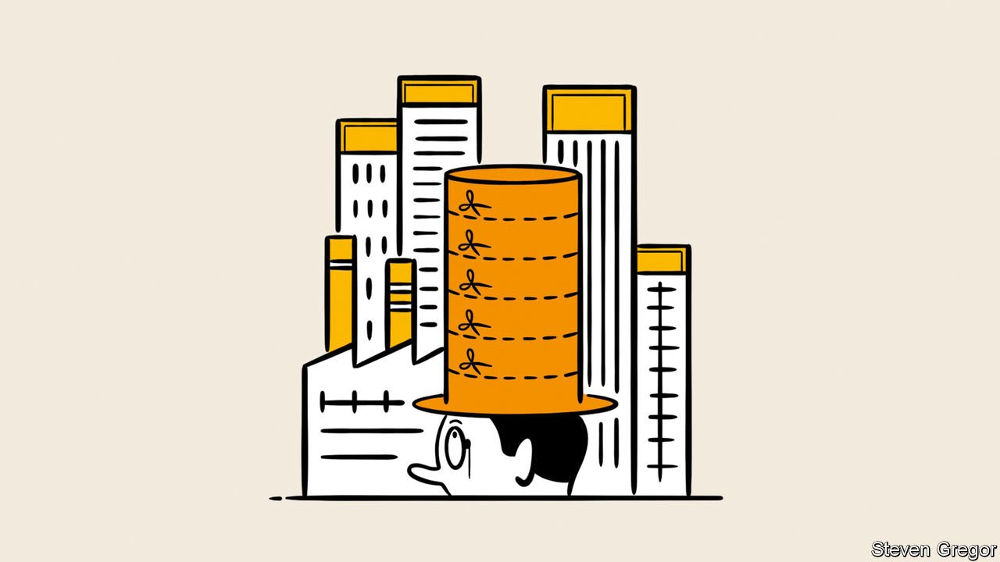

###### Competition policy

# The growing demand for more vigorous antitrust action 

##### Greater concentration of market power is leading to a trustbusting revival 

 

> Jan 10th 2022 

OBSERVERS OF CHINA’S rise have grown used to seeing old edifices bulldozed to make way for the new. As with bricks and mortar, so with intellectual constructs. In just 12 months President Xi Jinping has replaced a “cautious and tolerant” approach to the private sector with something much less so. Nowhere has the shift towards tougher rules and enforcement been more striking than in competition policy.

A year ago the Communist Party’s body for political and legal affairs vowed to take trustbusting more seriously. Within months China revised its antitrust law of 2008, increasing sanctions and agencies’ discretion. The State Administration for Market Regulation (SAMR), the antitrust watchdog, has blocked mergers and, says Angela Zhang of Hong Kong University, levied fines totalling $3.7bn on tech giants for sins ranging from price discrimination to merchant abuse. The agency’s antitrust bureau is more than doubling in size, from 40 to 100 officials, and it plans to expand to 150.


Chinese bureaucrats have used state media to arouse outrage against firms’ abuse of market power, enough to clobber a miscreant’s sales and share price. Despite having no overt antitrust role, the People’s Bank of China uses financial regulation and its bully pulpit to cow payments firms. Tencent and Alibaba, two tech titans with a payments duopoly, are being forced to drop the model in which shopping and payments are exclusive to one platform. In moves ostensibly aimed at curbing big tech, the National Press and Publication Administration has prohibited children from playing more than three hours of video games a week most of the year. Another agency barred Didi Global from Chinese app stores for data violations, days after the ride-hailing firm went public in New York before later shifting to Hong Kong.


Such actions mark a departure from the antitrust philosophy that has dominated regulatory thinking and judicial decisions in the past half-century. Associated with Robert Bork, an American judge from the late 1970s, it held that consumer welfare and the protection of competition, rather than of particular competitors, should be the only goals of antitrust law. Business practices were deemed fine so long as they did not result in harm to consumers from excessive prices. Most mergers were either competitively neutral or enhanced efficiency, even if they led to oligopoly; only those creating a dominant firm or monopoly were likely to be bad for consumers.

Bork’s work was itself a reaction to an earlier approach linked to Louis Brandeis, a former US Supreme Court justice. Brandeis believed that size was nefarious in itself. Curbing market power was a tool to fight other ills, such as mistreatment of workers, the stiffing of suppliers or even threats to democracy. This may have led to some perverse outcomes. In one notorious example in 1966, the Supreme Court blocked a merger between two grocers in Los Angeles with a combined market share of 8%.

Chinese trustbusters are now the most enthusiastic in disavowing the price-centricity of Bork’s “consumer-welfare standard”. But it has fallen out of favour everywhere, gradually in Europe and now, tentatively, in America. One reason is a global trend towards greater corporate concentration, from medicines to manufacturing. According to The Economist’s calculations, two-thirds of 900-odd sectors covered by America’s economic census became more concentrated between 1997 and 2012. In half of these concentration has edged up further in the subsequent five years. In the two decades to 2017 the weighted average market share of the top four firms in each industry increased from 26% to 32%. The four biggest British firms accounted for a larger share of revenue in 2018 than a decade earlier in 58% of 600-odd subsectors. Concentration in the EU has been going in the same direction, albeit more slowly.

Another good reason to bin Bork was technological change. The world’s biggest tech giants charge consumers either nothing (Alphabet, Google’s parent company, and Meta, formerly Facebook) or as little as possible (Amazon). Critics say this does not stop them abusing their dominance. Amazon is attacked for its treatment of workers, suppliers and third-party sellers. Google and Apple are accused of monopolistic practices against developers in their app stores. Facebook is taken to task for “killer acquisitions” aimed at neutralising innovative challengers such as Instagram and WhatsApp. (All four companies deny all these claims.)

Choice and quality

“We need to push for a broader notion of consumer harm,” declares Margrethe Vestager, the EU’s competition commissioner. It is no excuse that “the econometrics of price may be more straightforward than the econometrics of quality and choice”, she adds. Britain’s Competition and Markets Authority (CMA) has made similar noises. Like China’s SAMR, it is staffing up fast, going from around 650 officials to 850 in the past five years, catching up with Ms Vestager’s directorate-general.

Antitrust voices in America go further, arguing that the consumer-welfare standard was never as scientific as its advocates claimed and that Brandeis’s vision deserves a second look. Mr Biden has installed “neo-Brandeisians” in senior trustbusting roles. Lina Khan, a 32-year-old academic, chairs the Federal Trade Commission (FTC). Jonathan Kanter, a long-time Google-basher, heads the Department of Justice (DoJ)’s antitrust division. Tim Wu, a law professor whose books include “The Curse of Bigness”, is the White House adviser on technology and competition. “The speed of the takeover by the neo-Brandeisians of the regulatory apparatus has been extraordinary,” says one big asset manager.

This new competition doctrine remains a work in progress. But its contours are becoming sharper. It expands the goals of antitrust policy in two main areas: merger control and business-model regulation. For most mergers and acquisitions (M&amp;A), regulators used to restrict scrutiny to a small number of “horizontal” deals between firms active in the same market that, if combined, could reduce competition and allow incumbents to raise prices. Today all these tenets are going out of the window.

Trustbusters now investigate “vertical” integrations between companies with separate lines of business, as well as horizontal ones with combined revenues that would not historically have warranted attention. A new procedure allows EU regulators to ask national authorities to submit deals that are potential killer acquisitions, particularly in the digital, pharma and biotech industries. They have used this to investigate Meta’s $1bn acquisition of Kustomer, an American business-software firm with low European sales, and the purchase by Illumina, a gene-sequencing giant, of Grail, a developer of diagnostic tests that does no business in the EU. Germany’s competition authority has been pushing cases like Illumina “to test its jurisdiction”, says an EU official. Britain’s CMA has demanded that Meta undo its recent takeover of Giphy, a database of animated GIF files.

In America the FTC and DoJ are making merger guidelines more stringent. M&amp;A lawyers say the agencies are asking more questions, including about the impact of deals on the labour market. They already look beyond direct pecuniary harm to consumers. The FTC is backing a suit that seeks to break up Meta into Facebook, Instagram and WhatsApp, even though earlier regulators waved these takeovers through. Justifying its challenge to a merger between Simon &amp; Schuster and Penguin Random House, the Do J said it would give the new entity “outsized influence over who and what is published, and how much authors are paid for their work”. Ms Khan is expected to oppose Amazon’s $8.5bn purchase of MGM Studios, arguing that it would further strengthen the e-empire’s online hegemony. The fact that the entertainment market is fragmented and Amazon lets Prime-subscription customers binge-watch its videos for a fixed fee is, on this expansive view of antitrust, beside the point.

The second avenue of antitrust expansion—dictating what dominant businesses can and can’t do—is more inchoate than tougher merger control. But it could prove more consequential. Especially for America’s trillion-dollar tech giants it would be the first serious constraints on their activities since the internet made them the world’s most valuable companies.

Some edicts come from regulatory agencies. White House staff look on antitrust as a “Swiss-army knife”: a tool to fix lots of different problems, including such ills as inflation. It is early in Mr Biden’s term and they are still revving up, says one lobbyist. But “once they start going, they will be pretty muscular.” Last July Mr Biden issued an executive order, written by Mr Wu, instructing more than a dozen agencies vigorously to curb anticompetitive behaviour across the economy. It encourages agencies to create rules from weeding out “unfair methods of competition on internet marketplaces” to requiring railway owners “to provide rights of way to passenger rail”. In a memo outlining her priorities, Ms Khan declared that she would look into whether private-equity firms contribute to extractive business models in which companies raise prices or muscle out rivals.

The 107-year-old FTC Act grants Ms Khan wide latitude, so long as her rules are designed to forestall “conduct that is unfair or deceptive”. Congress may grant her even more power. Several proposals would outlaw practices deemed anticompetitive. One would treat Amazon’s marketplace or Google’s search engine as essential to commerce, rather like a dominant railway operator, prohibiting them from favouring their own products over others. Another would force Apple and Google to open up their app stores to alternative in-app payment methods and search results. A third would shift the burden of proof from regulators to dominant companies, which would need to show that any merger or acquisition does not hurt competition, rather than the other way around. All three have Democratic and Republican co-sponsors.

Other places are further along the regulatory route. The EU is preparing to adopt two laws, the Digital Markets Act and the Digital Services Act. South Korea has enacted one that eliminates app stores’ monopoly on payments. Britain is considering new rules, including on self-preferencing by large platform companies.

If in doubt, litigate

Unlike their Chinese counterparts, Western businesses will not take this lying down, let alone vow “comprehensive self-examination and rectification”, as Meituan, a food-delivery giant, did after being fined $530m by SAMR in October. America’s tech giants are deploying high-powered lobbyists to scupper or water down rules before they see the light of day. In November the US Chamber of Commerce sent three strongly worded letters to the FTC accusing Ms Khan of overstepping her brief and dismantling procedural safeguards at the agency. It will be “active in litigating”, vows Mr Bradley, its policy chief.

Meta, Illumina and Penguin Random House are fighting regulators in court. Judges used to the consumer-welfare standard may resist attempts to redefine it. Corporate lawyers will remind them that, by prioritising outcomes other than price, the neo-Brandeisians “want people to pay for [their] policy preferences”, as the chief counsel at a big tech firm puts it.

Big firms argue that, as they expand into adjacent markets, they increasingly compete with one another. This is especially true of big tech, whose rise has fuelled the Brandeisian revival. Amazon is the third-biggest online advertiser behind Alphabet and Meta. Apple is building a search engine to challenge Google. Google’s cloud-computing division is taking on Amazon Web Services and Microsoft’s Azure. Meta is getting into e-commerce. The research papers cited in Mr Biden’s executive order date back half a decade. Concentration in America may since have plateaued.

This resistance ensures that the competition authorities’ multipronged assault on big business will take time to play out. The new trustbusting zeal also rubs up against a rekindled affection for national champions, which are by definition big and powerful. European bosses urge Ms Vestager to take into account how competitive global markets are, not just the EU’s, when deciding on mergers. The single-market commissioner, Mr Breton, is receptive to such ideas. Even Ms Vestager, who ignored Franco-German calls to permit the creation of the Alstom-Siemens rail champion, now speaks warmly of the battery consortium.

That may be why, for all the antitrust commotion, M&amp;A activity remains strong in Europe and America, as companies take advantage of cheap capital and a surfeit of pandemic-distressed targets. Chinese tech titans have shed a collective $1.4trn in stockmarket value since China started turning the screws on them in earnest last February. America’s five biggest tech firms have added $2.1trn in the same period. The neo-Brandeisians may have “achieved political success prematurely”, suggests Mr Furman from Harvard.

Yet bosses, lobbyists and corporate lawyers acknowledge that a chill has descended as regulators test their powers. The dealmaking frenzy may partly reflect a desire to get in under the wire. Without clear rules, companies no longer know when to notify regulators about a deal and must think about competition from the outset. One lobbyist claims that clients with deals pending at the FTC are not getting answers. They may face an investigation halfway through a deal or even after it closes—and in a growing number of jurisdictions. Just one hold-out can put paid to a merger. In March 2021 Applied Materials, an American semiconductor company, scrapped its acquisition of a Japanese rival, which had been approved in America, Europe and Japan, but not in China. Boeing got clearance to merge parts of its business with Embraer, a Brazilian planemaker, everywhere except Europe.

The uncertainty over mergers and rules that might curtail certain practices adds hassle, risk and cost to potential deals. Some business decisions that might once have been made will now never be considered. Value not created as a result is impossible to quantify, but it is surely there. ■

