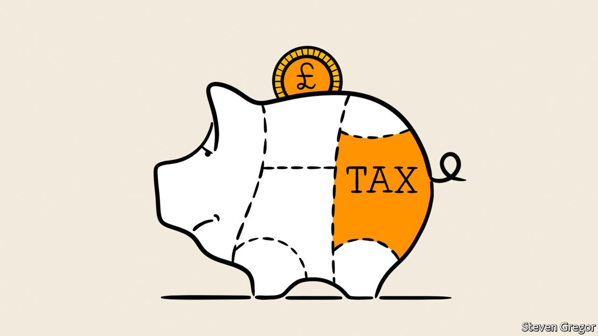
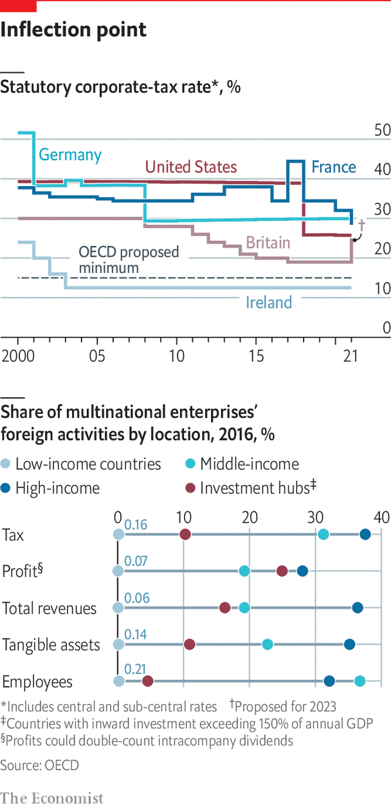

###### Corporate taxes

# The long trend of falling corporate taxes is being reversed 

##### After falling for decades, taxes on companies are rising again 

 

> Jan 10th 2022 

FOR WORLD peace, the League of Nations was an abject failure. For companies, it has proved a great success. In the 1920s it set a basis for corporate taxation that has endured ever since. Recognising that taxing profits in different places can hurt trade and growth, rights to tax were allocated first where profits are generated and only second where a company sites its headquarters.

This principle has now been enshrined in bilateral tax treaties—with unintended consequences. Governments have realised they can lure investment with lower tax rates. Between 1985 and 2018 the average corporate-tax rate fell from 49% to 24%. Many tax havens charge zero. The idea has grown that collecting taxes from rapidly growing, efficient firms is “whipping the fast ox”.


Companies have also learned to pay less tax by shifting reported earnings, which is easier with the rise of intangible assets such as brands. Although only 5% of American multinationals’ foreign staff work in tax havens, they book nearly two-thirds of foreign profits there, twice as much as in 2000. In 2016 around $1trn of global profits were booked in “investment hubs” such as the Cayman Islands, Ireland and Singapore, whose average effective tax rate on profits is 5%. According to an OECD study in 2015, this robbed public coffers of $100bn-240bn a year, equivalent to 4-10% of global corporate-tax revenues.

 


Some action to improve and simplify corporate taxation was long overdue. But with business fast going from sacred ox to whipping boy, governments have become less concerned with creating a better system and more with just getting firms to pay more tax. Britain has decided to raise its corporate-tax rate from 19% to 25%, becoming only the second OECD country to do so since 2000 (the first, Chile, has reversed its decision). In America moderate Democrats stopped Joe Biden undoing his predecessor’s tax reform, which cut the corporate-tax rate from 35% to 21%. But his Build Back Better bill floated a tax on share buybacks and an excise tax of 95% on sales of drugs for which drug firms refused to negotiate prices with the Medicare system.

The bill would also have raised the minimum rate that American multinationals pay on global profits from 10.5% to 15%. This could have raised an extra $30bn a year. It would also have aligned America with a new tax pact negotiated through the OECD. Fully 136 countries have signed up to a 15% global minimum rate, and allocated more taxing rights from where companies book profits to where they make sales. The OECD hopes to get this deal into force in 2023. Mr Furman, the former economic adviser to Barack Obama, calls it “a real sea change” in how companies are taxed. Others throw around terms like “once in a century” and “revolution”.

The reallocation of taxing rights will apply only to companies with global turnover above €20bn ($24bn), and only on pre-tax profits exceeding 10% of revenues. It is likely to raise a “modest amount”, thinks Michael Devereux of Oxford University’s Said Business School. Some estimates put it at a trifling $5bn-12bn a year worldwide. Mr Devereux reckons the global minimum may raise an extra 4-5% on top of what companies already pay, or around $100bn annually.

Yet this underplays the significance of the shift. The reallocation affects some 110 multinational groups says David Bradbury of the OECD. Most are American. They probably include the usual suspects such as Apple and Amazon, which have perfected the art of tax optimisation. These firms face a costly and tedious unwinding of their tax arrangements—and a higher overall bill. As for the global minimum, Mr Bradbury expects countries and companies to alter their behaviour. Switzerland, which supports the pact, is murmuring about new tax incentives to remain attractive. “It will be messy,” sums up an executive at one American multinational.

Companies might once have kicked up a fuss over the OECD deal. They have thought better of it, given intensifying anti-business sentiment. Some have even praised the harmonisation effort. In private, though, executives grumble that the OECD plan is “a convenient vehicle” to raise taxes at home. That, says one tech boss, is what Mr Biden is doing. Neil Bradley of the US Chamber of Commerce warns of moving from a race to the bottom to “a race to the top”. If tax authorities believe they will avoid leakage, he says, they may conclude “We can tax as much as we want.” Mr Devereux would not be surprised if corporate taxes creep up.

There may be more unintended consequences. One mysterious feature of the 40-year slide in corporate-tax rates has been that companies’ contribution to public coffers has remained flat in rich countries, at about one-tenth of the tax take, or 2-3% of GDP. In poorer ones the figures are slightly higher but equally steady. Analysts put this down to more firms paying tax, corporate profits growing and wealthy individuals using companies to reclassify highly taxed personal income as lower-taxed corporate income.

The base of payers looks unlikely to dwindle. Once known to taxmen, firms rarely extricate themselves from their grasp. How the changes affect profits is harder to judge. Experts do not expect the overhaul to dampen pre-tax profits, though that could happen if higher rates discouraged investment. Some signatories to the deal may retain their edge with offsetting sweeteners such as lower taxes on individuals or property.

There are also unknown unknowns which may become clearer only once firms have adjusted. Two things can be predicted. A bonanza awaits tax lawyers and accountants. And the new equilibrium will be less favourable to companies. One boss of a big multinational company suggests that the tax system is the ultimate test of what countries care about. The implication is that they care less than before about keeping business happy. ■

