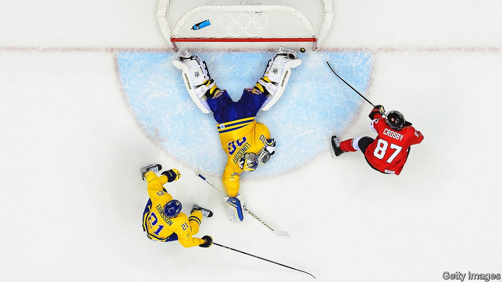

###### A puck in the teeth

# Canada’s best ice-hockey players cannot go to the Olympics 

##### The National Hockey League may be betting on anti-China sentiment 

 

> Jan 13th 2022 

ICE HOCKEY matters in Canada. It is the official winter sport and national pastime. Canada has won more Olympic medals for it than any other country. Fully half of Canadians tuned in to watch their team win gold in the men’s ice hockey final at the winter Olympics in Vancouver in 2010, making it the most-watched broadcast television programme in the country’s history.

But the chances that a Canadian team will win at the games in Beijing, which start on February 4th, are looking dismal. Similarly the United States, the sport’s other powerhouse, looks unlikely to win gold, despite the two countries hosting the National Hockey League (NHL) in which 32 teams of the world’s best players do battle every week. This year the league bosses have forbidden players from competing in China.


The NHL blames the disruption wrought by covid-19. Indeed, the pandemic has meant that the league has postponed more than 100 games this season, which started in October. Before Christmas more than 15% of players (or 119 people) were out for the count because of the virus.

Some fans cry foul, however. The league also pulled out in 2018, after a dispute with the International Olympic Committee (IOC) over who should pay for players’ travel, accommodation and insurance. The NHL loses money from lending out its players, so it has few incentives to do so. It also cannot use footage from the games for its ads.

In 2020 players negotiated to go to the Olympics as part of their collective-bargaining agreement with the league. But even before the Omicron variant, few thought the NHL would stick to its word. “I think they would have looked high and low for an excuse to not send them,” says Ryan Lambert, a hockey writer.

Canada and the United States now have just a few weeks to scrape together teams from junior leagues and college players. Russia’s men, who won the gold medal in 2018, are almost certain to do so again (though under the Olympic flag, rather than their own, because of a doping ban). China’s team, which qualified for the first time this year and faced potential humiliation at the skates of Canada and the United States, may be spared some blushes.

The league is betting that fans care more about their home-city teams. Past Olympic glories have not translated into ratings bumps for the NHL. Its decision to miss the previous games did little to hurt the league’s popularity in North America, according to Cliff Grevler of the Boston Consulting Group. Gary Bettman, the NHL’s commissioner, has suggested that ice hockey be moved to the summer games, during the league’s off-season, but the IOC put his idea on ice.

The NHL may feel it is tapping into a larger feeling in Canada. The Canadian government has been one of the loudest proponents of the diplomatic boycott of the Olympics. The most recent Pew global attitudes survey, from 2020, showed 73% of Canadians had a frosty view of China, a historic high.

