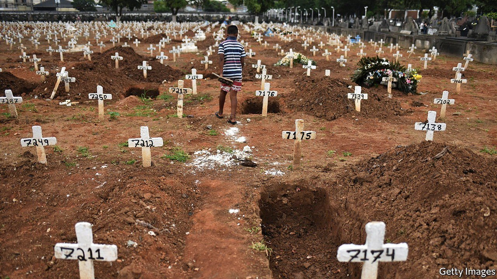

###### Poor figures

# Jair Bolsonaro’s scorn for data leaves Brazil in the dark 

##### The president often prefers inaccurate statistics, or none at all 

 

> Jan 15th 2022 

AS THE OMICRON variant sweeps the globe, scientists cannot accurately track its impact in Brazil. In early December the government’s main system for counting cases and deaths was hacked in a ransomware attack. Since then, the site has been down. On January 7th more than 63,000 cases were registered in 24 hours, the most since September. The actual number is probably higher. Yet the health minister shrugged off concerns about the lack of statistics as “narratives”.

All this is part of an unprecedented decline in data collection, claims Paulo Jannuzzi, a professor at the National School of Statistical Sciences in Rio de Janeiro. This is partly because under Jair Bolsonaro, the president elected in 2018, data-collecting institutions have taken a battering.


Six months after taking office Mr Bolsonaro called a spike in deforestation in the Amazon “a lie” and fired the head of the National Institute for Space Research (INPE), the agency that monitors it. More recently the negative attitude to number-crunching has intensified. Late last year the government held back data showing record tree-clearing until after the UN climate talks in Glasgow. On January 6th the government announced that INPE will no longer monitor deforestation in a savannah in central Brazil that is under threat.

Some problems predate Mr Bolsonaro. A recession between 2014 and 2016 strained budgets. In 2018 officials from the statistics agency warned that cash shortages would affect the census planned for 2020. It was postponed twice. It will at last go ahead this year, but with fewer questions. Wonks are few and far between: according to a study in 2020 only a small proportion of civil servants always use scientific evidence to guide policy decisions.

Previous governments were sometimes keen on data. In 2004 Brazil launched an online database of official statistics. Under a law passed in 2011, anyone can request such numbers and (supposedly) hear back within 30 days. The government now flatly rejects a third of requests, the shabbiest performance of any administration since the law came into effect.

Covid-19 has made things worse. Over the past two years the government has twice tried to change the methodology for disclosing data, at one point by emphasising the number of “recovered” patients rather than cases or deaths. After a public outcry, that decision was reversed.

Other attempts to manipulate data are being investigated. Last year testimony during a Senate probe into the government’s handling of the pandemic accused some of Mr Bolsonaro’s advisers of instructing a private health-care provider to alter death certificates so as not to register covid-related ones as such. They deny it. A state-level probe continues.

In a Facebook Live event last year the president cited a report, supposedly by the federal oversight agency, that falsely stated that 50% of covid-19 deaths in Brazil in 2020 were due to other causes. The agency denied the existence of the report. An internal investigation found that a draft was produced by a staff member who said it was edited without his consent.

Mr Bolsonaro has clearly learned the trick, popular with certain other world leaders, of claiming that any facts he doesn’t like are “fake news”. But his disregard for data will have repercussions, not least by depriving Brazil’s government of an accurate view of reality. And there is one statistic the president cannot fudge. Since the pandemic has worn on, killing around 700,000, and his cash handouts have ended, his average approval rating has fallen from 37% to 23%. ■

