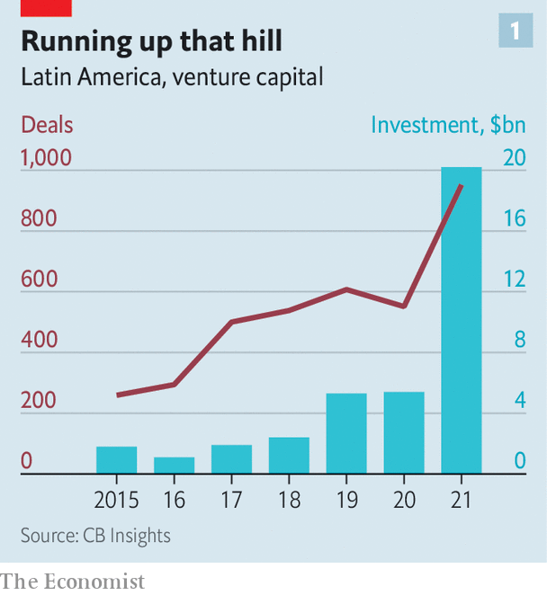
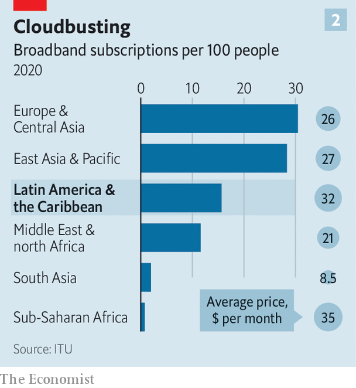

###### Silicon linings

# The pandemic has accelerated Latin America’s startup boom 

##### Many businesses are ripe for disruption 

 

> Jan 15th 2022 

WHEN THREE young entrepreneurs decided to start an online marketplace in Argentina in 1999, their chances seemed slim. Only a select few had access to the internet and money was scarce. “There were no local venture-capital firms, and international ones wouldn’t even look at Latin America,” says Marcos Galperin, one of the founders. In 2001 the trio met an investor in Silicon Valley who looked at their sales and asked if the figures were in “millions or billions”. They were in thousands.

Two decades later, during the pandemic, their online shop, MercadoLibre (“free market”), became the highest-valued company in Latin America, surpassing Petro bras, Brazil’s state oil firm, and Vale, a mining giant. Although it has since fallen behind both, MercadoLibre remains the region’s startup success story, valued at $59bn. It was big before covid-19, but as people stayed at home it got a boost: in some countries new orders more than doubled between 2019 and 2020.


It is part of a broader trend. According to CB Insights, a data provider, over $20bn of venture capital went into 952 deals in Latin America in 2021, nearly four times as much as in 2019 (see chart 1). The region is catching up from a low base, and quickly: investment since 2015 has grown over ten-fold, speedier than in Asia, Europe or the United States. It now has 27 unicorns—privately held startups valued at over $1bn—up from four in 2018.

 


The past two years have been grim in Latin America. According to The Economist’s excess-deaths tracker, it has lost a higher share of its people to covid than any other region. Long lockdowns have scarred its economies. But the pandemic has also created opportunities. Disruption has accelerated. More startups are likely to emerge, if governments let them.

Some of the boom reflects a global surge in investment in startups. Venture funding worldwide reached $621bn in 2021, a record. But some investors are particularly bullish about Latin America’s potential. The total market capitalisation of tech firms as a proportion of GDP is still just under 4%, compared with 14% in India and 30% in China. The Inter-American Development Bank (IDB) reckons that the value of the tech sector in the region grew from $7bn in 2010 to $221bn in 2020.

Most of the innovation so far has been in fintech. Latin America’s banking sector is the most profitable in the world, with an estimated return on equity of 13-15%, much higher than in most developed regions. Fat margins are not the result of efficiency. Operating expenses, relative to assets, are higher than in other parts of the world. Interest rates are, too. The difference (or spread) between the rates that banks pay depositors and charge borrowers was 7% compared with a global norm of 5% in 2018 (the latest available data from the World Bank). Although several factors contribute to this, critics blame a lack of competition.

In Brazil five banks control over 80% of the market. Archaic rules in some countries, such as insisting that people turn up in person to make changes to their accounts, mean that many go without them at all. In Mexico, where there are 13 bank branches per 100,000 people, compared with 30 in the United States, half the population is unbanked. The unmet demand for credit for small- and medium-sized enterprises is more than $650bn in Brazil and $160bn in Mexico.

The most successful fintech is Nubank, a Brazilian startup which listed in New York in December. With almost 50m users, it has become the world’s biggest digital bank, valued at over $40bn. Others are catching up. Creditjusto, a Mexican lender, has disbursed some $600m to businesses since 2015 and recently bought a conventional bank to expand its lending capacity.

Another Mexican startup, Konfio, became a unicorn in September. It uses credit-rating algorithms based on big data to give out loans to small businesses more cheaply than regular banks. Pierpaolo Barbieri, the founder of Ualá, an Argentine fintech valued at $2.5bn, claims that two-thirds of its customers had no credit history before downloading its app.

Latin American fintech received 40% of venture funding in 2020. It helps that in several countries, covid-19 stimulus money was disbursed digitally. This meant that an estimated 40m unbanked people signed up for traditional and digital accounts in Brazil, Colombia and Argentina.

Other businesses, such as health care, education and infrastructure, are also ripe for disruption. Most of these sectors are dominated by a few firms that behave like “clubs”, says Cristóbal Undurraga, who used to direct InnovaChile, a government-backed accelerator. For example, around a third of Latin Americans are uninsured, largely because premiums are high. “Insurance is where fintech was several years ago,” says Ana Cristina Gadala-Maria of QED, an American VC firm.

Innovation is fizzing in all sorts of areas. NotCo, a Chilean unicorn that produces plant-based foods, has developed an algorithm that identifies fruits and vegetables with the most similar molecular composition to animal-based products. During the pandemic many millennials went to live with their parents and nudged them out of their meaty comfort zone, thinks Matías Muchnick, its CEO. Jeff Bezos, the founder of Amazon, has invested in it, his first venture in South America.

The main action in the startup craze is in Argentina, Brazil and Mexico, but some smaller economies have seen drama, too. Uruguay has become one of the world's biggest exporters of software, per person. The IDB thinks Peru and Guatemala also have a lot of potential.

 


Challenges remain. Crucial skills are in short supply. Latin American universities train around 40,000 software developers a year. That is far fewer than the 100,000 that General Atlantic, an American private-equity firm, estimates the tech sector needs annually. Internet provision is patchy and pricey (see chart 2). Argentina, with a population of 45m, has only 30,000 square metres of data-centre space in operation—the same as Austin, Texas, which has just 2m inhabitants.

Political uncertainty does not help. Chile, which has one of the highest numbers of startups per person in the region, recently elected Gabriel Boric, a 35-year-old president with ties to the Communist Party. Many left-wingers are also involved in the drafting of a new Chilean constitution. Cristóbal Silva, the co-founder of Fen Ventures, an early-stage VC fund, thinks it could become trickier to invest there.

Andrés Manuel López Obrador, the president of Mexico, has made life hard for many private firms. Digital investors are unlikely to be immune. The president appears somewhat out of date. When talking about video games, he refers to “the Nintendo”, as if the market were still dominated by one company, as in the 1980s.

Some governments have tried to make life easier for startups. In 2020 Brazil’s central bank introduced a series of rules to foster transparency and competition in finance. Customers can now compare services and transfer more easily between providers. It also launched Pix, an instant payment system. Colombia’s government has also made it easier for fintechs to get going without meeting the full requirements of a financial-service licence.

A Mexican law in 2018 purported to simplify the rules for fintech. However, it is confusing, says Leila Search of the International Finance Corporation, the private lending arm of the World Bank. She estimates that it takes a year and half for fintechs to start operating in Mexico.

Many investors seem undeterred. SoftBank, a Japanese conglomerate, recently announced that it will invest another $3bn in Latin America, on top of a regional fund it founded in 2019 worth $5bn. Marcelo Claure, the firm’s Bolivian-born chief operating officer, has said he expects at least eight Latin American firms, backed by SoftBank, to list publicly this year. Tencent, a Chinese tech giant, recently co-led a funding round for Ualá.

Hernán Kazah, one of the founders of MercadoLibre, doubts that political upheaval will hurt startups much. He notes that MercadoLibre survived the meltdown of Argentina’s economy in 2001 and the Brazilian recession of 2014-16. It helps that the company is legally domiciled in Delaware. Indeed, of the 11 Argentine tech companies with billion-dollar valuations, ten are incorporated abroad.

Many uncertainties remain, not least over inflation. But there is a hunger for innovation in the region. Lots of people shopped online for the first time during lockdowns. Others signed up for small loans. For good as well as ill, the pandemic will leave its mark on Latin America. ■

